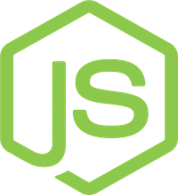

# Try the Openfin Workspace right now

```sh
$ npm install && npm start
```

## What is the OpenFin Workspace?

The OpenFin Workspace is an environment designed for getting work done by connecting a lot of disconneted applications and information together through intuitive flows and intelligent connections.

The workspace comes with **Home**, **Browser**, and **Notification Center** built-in and ready to talk to the rest of the tools you use to get work done.

## What you can do with this repository

1. [Learn how to open your application in Browser](./how-to/1--add-an-application-to-browser)
2. [Learn how to make content searchable in Home](./how-to/2--add-searchable-content-in-home)
3. [Learn how to create action items in the Notification Center](/how-to/3--create-a-new-notification)

## What you need to get started

OpenFin Workspace is currently **only supported on Windows**, and you'll need a recent version of Node installed to launch the examples included this repository.

- [Windows](https://www.microsoft.com/en-us/windows/) 
- [Node](https://nodejs.org/en/) 
