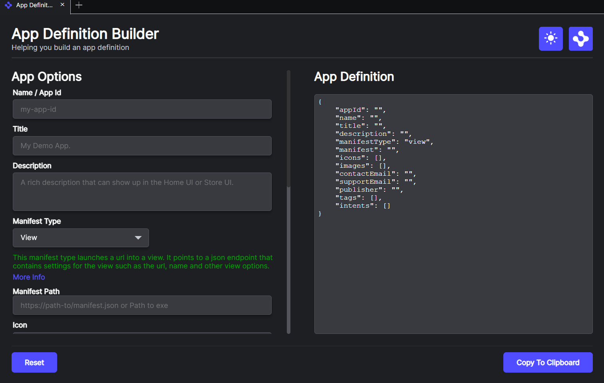

# App Definition Builder

This view lets you create an app definition that can be added to the apps.json file in your the public folder of a sample or to the [common apps.json](../../apps.json) file.

This view can be customized by specifying customData in the [app-definition-builder-view.json](app-definition-builder-view.json) manifest.

- **onlySupportedManifestTypes** - set to true. This means the view will check the parent app's manifest for customSettings.appProvider.manifestTypes for a list of manifest types supported by the parent application.

- **intents** - A url to a JSON file that contains a list of intents you wish to make available to the App Definition Builder.

- **manifestTypes** - A url to a JSON file that contains a list of the manifest types you wish to make available to the App Definition Builder.

