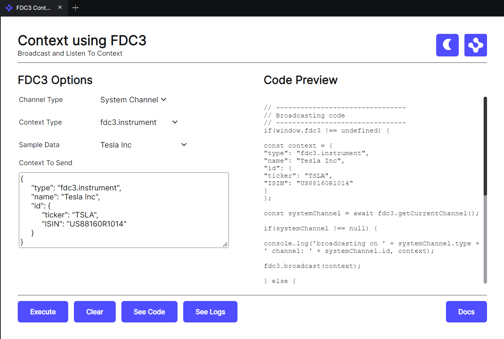

# Context Using FDC3

This view lets you create, listen to and broadcast contextual messages. It also gives you a preview of the code needed to achieve this.

It covers the types supported by the FDC3 standard and lets you use System Channels or App Channels. You also have the option of specifying a custom contextual object if you are not using one of the FDC3 types.

This view can be customized by specifying customData in the [fdc3-broadcast-view.json](fdc3-broadcast-view.json) manifest.

- **contextData** - An object that contains entries for each contextual type you wish to support alongside an array of sample data entries for that contextual type. A default is provided using [fdc3-data.js](../fdc3-data.js).

- **customChannel** - We come up with a default customChannel name but you may wish to change it to something else.

