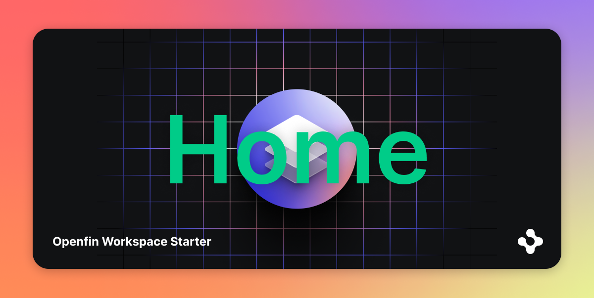

# Add Searchable Content to Home in OpenFin Workspace

Home uses a **search provider service** configured using the [OpenFin Search API](https://www.npmjs.com/package/@openfin/search-api) to understand the Apps and content it can interact with.

This micro application is a simple example of plugging your own content or app.

## Getting Started

1. Install dependencies.

```bash
$ npm install
```

2. Build the project.

```bash
$ npm run build
```

3. Start the sample application.

```bash
$ npm run start
```

4. Start Home and Browser application. (If it is not running on your machine already)

```bash
$ npm run start:hb
```

## Documentation

All of the Search API types are documented, so feel free to click into the types for further clarity on Search API objects and functions.

You can also refer to the [NPM page](https://www.npmjs.com/package/@openfin/search-api) for the Search API reference and more examples.
