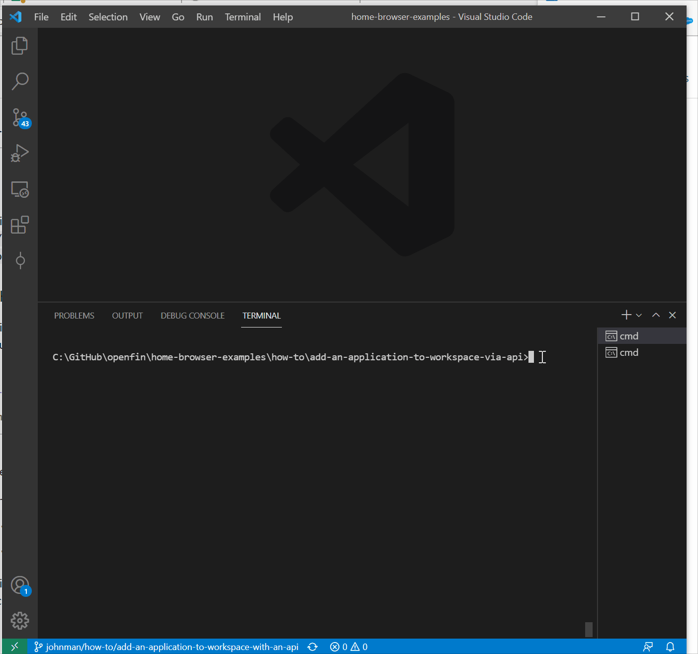
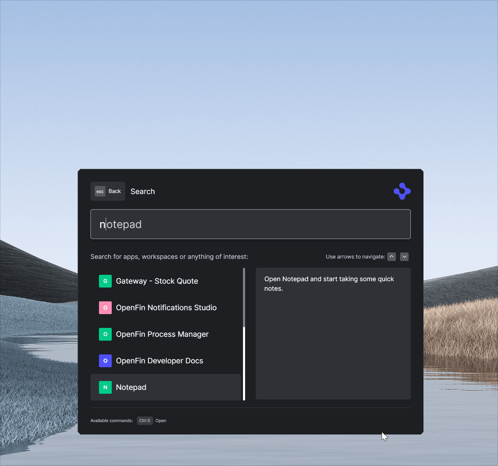

OpenFin Workspace is currently **only supported on Windows**.

# Add your content to OpenFin Workspace (Storefront, Home and Browser)

OpenFin Workspace empowers you to feed content & apps to OpenFin Home via our API. This gives you the choice of fetching your list of applications from a *Content Discovery Service* or somewhere else. You can re-use this data source to also populate OpenFin Storefront. OpenFin StoreFront lets you discover and launch your content.

This application you are about to install is an example of plugging in your own content or app via code and using configuration and rest services to determine the data to show and how it should be structured. This example assumes you have already [set up your development environment](https://developers.openfin.co/of-docs/docs/set-up-your-dev-environment)

## Getting Started

1. Install dependencies. Note that these examples assume you are in the sub-directory for the example.

```bash
$ npm install
```

2. Build the project.

```bash
$ npm run build
```

3. Set Windows registry key for [Desktop Owner Settings](https://developers.openfin.co/docs/desktop-owner-settings).
   This example includes a utility (`desktop-owner-settings.bat`) that adds the Windows registry key for you, pointing to a local desktop owner 
   settings file so you can test these settings. If you already have a desktop owner settings file, this script prompts to overwrite the location. Be sure to capture the existing location so you can update the key when you are done using this example.

   (**WARNING**: This script kills all open OpenFin processes. **This is not something you should do in production to close apps as force killing processes could kill an application while it's trying to save state/perform an action**)

```bash
$ npm run dos
```

4. Start the test server in a new window.

```bash
$ start npm run start
```

5. Start Your Workspace Platform (this starts Workspace if it isn't already running).

```bash
$ npm run client
```

6. Type any character into the search box to show the default list of Applications.
   The [apps](public/apps.json) are displayed as described in their respective files (OpenFin Home is not reading this rest point directly it is being read by the Workspace Platform app and passed to Home via our API).



6. Click the Storefront button on Home to launch the Store and see your applications listed.
   The [apps](public/apps.json) are displayed as described in their respective files alongside a Store configuration setting defined in your [manifest](public/manifest.fin.json).

## How it works

The Server in this example provides two sets of content over HTTP GET.

- [A Desktop Owner Settings file](public/dos.json)
- [A list of applications](public/apps.json)
- Examples of View and Snapshot Manifest Types

When Home starts, it first looks at the Desktop Owner Settings file, configured in step 3, for a overridden `logo`, and `appDirectoryUrl`.

In this example, the [Desktop Owner Settings file](public/dos.json) has its `appDirectoryUrl` configured to an [empty list of applications](public/empty-apps.json). The reason for this is to avoid loading the default set of OpenFin applications (we will be providing the apps through our API).

### List of Applications

The [list of applications](public/apps.json) contains a number of examples:

* Load views into OpenFin Browser
* Launch an OpenFin Application using it's manifest file
* Launch a native application
* Launch a page using the snapshot manifest type

These applications are read and transformed in order to be sent to our API.

---
**NOTE ABOUT THE APP**

This is a headless application. If you wish to debug it then you can update the [manifest file](public/manifest.fin.json) and set platform.autoShow to **true**. Otherwise you can use Process Manager (which is included in your list of apps).

---
### How this example works

You have your own [Workspace Platform](public/manifest.fin.json) that is defined through a manifest. It is headless and it starts up a [custom platform provider](public/platform/provider.html). It is launched by the following command (step 5 above):

```bash
$ npm run client
```

The custom platform provider [provider.ts](client/src/provider.ts) imports the [platform.ts](client/src/platform.ts) and initializes the platform. Once initialized the bootstrapper (that was also imported) is called [bootstrapper](client/src/bootstrapper.ts). 

The bootstrapper has two main responsibilities:

1. Import [settings.ts](client/src/settings.ts) to see what should be bootstrapped (Should it setup Store and Home).
3. Import [workspace.ts](client/src/workspace.ts) and ensure that OpenFin Workspace is running.
4. Import [search.ts](client/src/search.ts) and ensure that a search provider is registered against home in order to provide a list of applications (if enabled).
5. Import [store.ts](client/src/store.ts) and ensure that a store provider is registered if store is enabled.

The **search provider**([search.ts](client/src/search.ts)) imports [OpenFin's Search NPM Module](https://www.npmjs.com/package/@openfin/search-api) to have access to the relevant functions, [workspace.ts](client/src/workspace.ts) for getting the right UUID to register the search provider against, [settings.ts](client/src/settings.ts) to read settings (such as the name, title and topics to use), [apps.ts](client/src/apps.ts) to fetch a list of applications (the search provider maps these into search results) and [launch.ts](client/src/launch.ts) to launch the entry the user selects from OpenFin Home.

The **store provider**([store.ts](client/src/store.ts)) imports [OpenFin's Workspace NPM Module](https://www.npmjs.com/package/@openfin/workspace) to have access to the relevant functions, [settings.ts](client/src/settings.ts) to read settings (such as the how to configure the store), [apps.ts](client/src/apps.ts) to fetch a list of applications when searching and to provide a filtered set of applications for specific store sections and [launch.ts](client/src/launch.ts) to launch the entry the user selects from OpenFin Store.

The [settings.ts](client/src/settings.ts) file reads the customSettings section of your [manifest file](public/manifest.fin.json):

```javascript
   "customSettings": {
    "bootstrap": {
      "search": true,
      "store": true
    },
    "appProvider": {
      "appsSourceUrl": "http://localhost:8080/apps.json",
      "includeCredentialOnSourceRequest": "include",
      "cacheDurationInMinutes": 1,
      "appAssetTag": "appasset"
    },
    "searchProvider": {
      "name": "cds-directory",
      "title": "CDS Directory",
      "topics": ["all", "apps"],
      "defaultAction": "open",
      "queryMinLength": 3
    },
    "storefrontProvider": {
      "id": "sample-store-front",
      "title": "Custom Storefront",
      "landingPage": {
        "hero": {
          "title": "Custom Hero Title",
          "description": "This is a demonstration of the hero section that you can configure for your store.",
          "cta": {
            "title": "Hero Apps!",
            "tags": ["hero"]
          },
          "image": {
            "src": "http://localhost:8080/images/superhero-unsplash.jpg"
          }
        },
        "topRow": {
          "title": "Custom Top Row Content",
          "items": [
            {
              "title": "Expero",
              "description": "A collection of example views from Expero showing the power of interop and context sharing.",
              "image": {
                "src": "http://localhost:8080/images/coding-1-unsplash.jpg"
              },
              "tags": ["expero"]
            },
            {
              "title": "Dev Tools",
              "description": "A collection of developer tools that can aid with building and debugging OpenFin applications.",
              "image": {
                "src": "http://localhost:8080/images/coding-2-unsplash.jpg"
              },
              "tags": ["dev-tools"]
            },
            {
              "title": "Learning Resource",
              "description": "A collection of developer documents that can aid with building and debugging OpenFin applications.",
              "image": {
                "src": "http://localhost:8080/images/coding-3-unsplash.jpg"
              },
              "tags": ["dev-content"]
            }
          ]
        },
        "middleRow": {
          "title": "A collection of simple views that show how to share context using the FDC3 or Interop APIs.",
          "tags": ["context"]
        },
        "bottomRow": {
          "title": "Quick Access",
          "items": [
            {
              "title": "Views",
              "description": "A collection of views made available through our catalog.",
              "image": {
                "src": "http://localhost:8080/images/coding-4-unsplash.jpg"
              },
              "tags": ["view"]
            },
            {
              "title": "Web Apps",
              "description": "A collection of web apps built using OpenFin.",
              "image": {
                "src": "http://localhost:8080/images/coding-5-unsplash.jpg"
              },
              "tags": ["manifest"]
            },
            {
              "title": "Native Apps",
              "description": "A collection of native apps made available through our catalog.",
              "image": {
                "src": "http://localhost:8080/images/coding-6-unsplash.jpg"
              },
              "tags": ["native"]
            }
          ]
        }
      },
      "navigation": [
        {
          "title": "Applications",
          "items": [
            {
              "title": "All Apps",
              "tags": ["all"]
            },
            { "title": "Views", "tags": ["view"] },
            { "title": "Pages", "tags": ["page"] },
            {
              "title": "Manifest",
              "tags": ["manifest"]
            },
            {
              "title": "Native",
              "tags": ["native"]
            }
          ]
        },
        {
          "title": "Context Sharing",
          "items": [
            {
              "title": "FDC3 API",
              "tags": ["fdc3"]
            },
            {
              "title": "Interop API",
              "tags": ["interop"]
            }
          ]
        }
      ],
      "footer": {
        "logo": { "src": "http://localhost:8080/favicon.ico", "size": "32" },
        "text": "Welcome to the OpenFin Sample Footer",
        "links": [
          {
            "title": "Github",
            "url": "https://github.com/openfin/workspace-starter"
          },
          {
            "title": "YouTube",
            "url": "https://www.youtube.com/user/OpenFinTech"
          }
        ]
      }
    }
  }
```

| Property | Description |
| --- | --- |
| **bootstrap** | Config related to the bootstrapping process |
| search | Should we use home and register a search provider to feed apps into Home and Browser |
| store | Should we use store and register a store provider to display apps |
| **appProvider** | Config related to where the apps should be fetched from |
| appsSourceUrl | Where should we fetch the apps from |
| includeCredentialOnSourceRequest | Should we include credentials when doing the search request. Options:  "omit", "same-origin", "include"|
| cacheDurationInMinutes | How many minutes should we wait before refreshing the list from the server? |
| appAssetTag | If including app assets in your manifest, what tag in the app definition will highlight this manifestType:"external" is actually an app asset and shouldn't be run from a path? If undefined then appasset is assumed |
| **searchProvider** | Config related to the search provider setup to list things in Home and the Browser Add New View |
| name | What your search provider should be called |
| title | The title that should be given (if these are displayed) |
| topics | What topics should we register against? If undefined then we assume all (the main Home Search UI) and apps (to register in OpenFin Browser's Add New Search).  |
| defaultAction | What text should be shown as a possible action of clicking on a result? |
| queryMinLength | How many characters should be typed before filtering the list? |
| **storefrontProvider** | Config settings that are used by the sample code to configure the store using the workspace APIs |
| id | Unique ID for your store |
| title | The name for your store that will be shown in the store selection dropdown |
| landingPage | The structure of the main page the user will be presented with when they visit your store |
| landingPage.hero | Optional. Do you want a hero section on the main page. |
| landingPage.topRow | What do you want this row to be called and how many sections do you want (use tags to determine what apps are included in this section). Limit of 4 sections. |
| landingPage.middleRow | What do you want this row to be called and what apps do you want to show in the middle (use tags to determine what apps are included in this row). Limit of 6 apps. |
| landingPage.bottomRow | What do you want this row to be called and how many sections do you want (use tags to determine what apps are included in this section). There is a limit of 3 sections.  |
| navigation | How many navigation sections do you want on the left hand menu? Limit of 2. |
| navigation[i].title | What do you want as a title for these set of links? |
| navigation[i].items | How many links do you want to show (limit of 5) and what apps do you want a link to display (use tags to select apps) |
| footer | What do you want to show in the store footer |
| footer.logo | The logo to show in the footer |
| footer.text | The text to show in the footer |
| footer.links | What links do you want to show in the footer (opens up using the default web browser. |

---
**NOTE ABOUT THE CONFIG**

This is a demo application for learning and is not meant for production use. Please use this as a way of seeing how you might approach configuring your Store.

The config for the storefront does not include an "id" for the cta, items and navigation sections. 

This is to reduce noise of the config and to prevent issues if an item/section is copy/pasted. The code has a fallback that uses the title or title + tags to form an id. This works for the demo as the manifest file is storing the config. If the config was ever fetched from a server then you would want to have a unique (e.g. GUID) and idempotent ID returned. 

This is because the id represents the route that the user navigates to. So if an id for a navigation item was "x" and the user clicked on the link then the store would call the getNavigation or getLandingPage function you defined and look for a matching id of "x". If you regenerate the id for a navigation item e.g. it becomes "y" then the store will not be able to render your page as there are no items with the id of "x". 

---


These are settings you can experiment with (e.g. if you already have your own CDS for apps you can update the url and restart the Workspace Platform).

The search provider will ask the [apps.ts](client/src/apps.ts) file for a list of applications and it will read the apps directory rest endpoint and return it. The search provider then maps the apps to an array of SearchResult objects. The apps file will check to see if it has permission to launch external processes or download app assets and filter out entries as appropriate (it will log a warning of the apps filtered out and in a real app you could move this logic to the launch action to then notify the user they can't launch that app on this machine).

When a user selects a result in OpenFin Home, it is returned to the search provider and the search provider uses [launch.ts](client/src/launch.ts) to launch the result.

The [launch.ts](client/src/launch.ts) file imports [OpenFin's Workspace NPM Module](https://www.npmjs.com/package/@openfin/workspace). It checks the passed app. If the passed app is a Native Application (manifestType: "external") that requires launch external process permissions then it is up to the **Platform Workspace** to call fin.System.launchExternalProcess and have the relevant permission (for now apps.ts filters unsuitable apps out). For any other type of app/manifestType then the entry is passed to the launchApp function provided by the OpenFin workspace module.



The [store.ts](client/src/store.ts) file is driven by the config in the manifest file and takes advantage of the building blocks provided in [OpenFin's Workspace NPM Module](https://www.npmjs.com/package/@openfin/workspace) to build the OpenFin Store. It uses [apps.ts](client/src/apps.ts) to use the same source data as the search provider. This way adding a single entry in the [apps.json](public/apps.json) file (simulating your server) will populate both.


### A note about this example

This is an example of how to use our APIs to configure OpenFin Workspace. It's purpose is to provide an example and provide suggestions. This is not a production application and shouldn't be treated as such. Please use this as a guide and provide feedback. Thanks!

---
**FAQ**

- The store isn't launching or the store button isn't showing on the home ui?
  
  - ensure that you have run the dos command and killed all OpenFin applications before launching the UI (the flag enabling the store might not be set).
 
   - It might be that the config defining the store is invalid. Open up the dev tools for the headless app and check the console log messages.
   - Ensure that the bootstrap section in the customSettings of the manifest has store set to true.

---

### Read more about [working with Workspace](https://developers.openfin.co/of-docs/docs/workspace-overview). 
