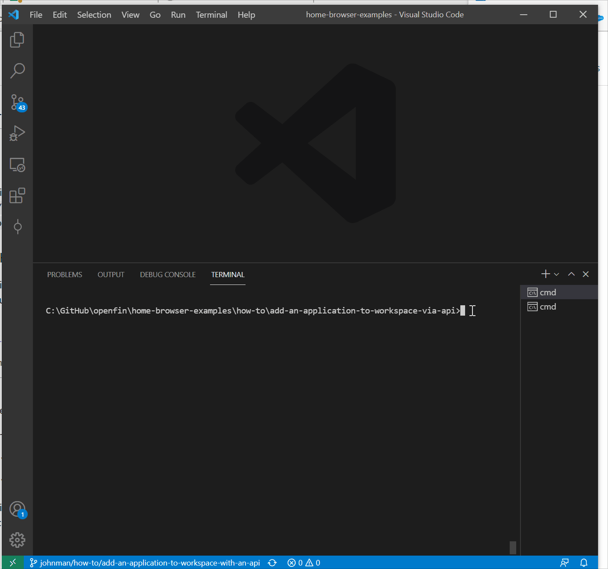

OpenFin Workspace is currently **only supported on Windows**.

# Launch your Content in OpenFin Workspace

OpenFin Workspace empowers you to feed content & apps to OpenFin Home via our API. This gives you the choice of fetching your list of applications from a *Content Discovery Service* or somewhere else.

This application you are about to install is a simple example of plugging in your own content or app. This example assumes you have already [set up your development environment](https://developers.openfin.co/of-docs/docs/set-up-your-dev-environment)

## Getting Started

1. Install dependencies. Note that these examples assume you are in the sub-directory for the example.

```bash
$ npm install
```

2. Build the project.

```bash
$ npm run build
```

3. Set Windows registry key for [Desktop Owner Settings](https://developers.openfin.co/docs/desktop-owner-settings).
   This example includes a utility (`desktop-owner-settings.bat`) that adds the Windows registry key for you, pointing to a local desktop owner 
   settings file so you can test these settings. If you already have a desktop owner settings file, this script prompts to overwrite the location. Be sure to capture the existing location so you can update the key when you are done using this example.

   (WARNING: This script kills all open OpenFin processes.)

```bash
$ npm run dos
```

4. Start the test server in a new window.

```bash
$ start npm run start
```

5. Start Your Workspace Platform (this starts Workspace if it isn't already running).

```bash
$ npm run client
```

6. Type any character into the search box to show the default list of Applications.
   The [apps](public/apps.json) are displayed as described in their respective files (OpenFin Home is not reading this rest point directly it is being read by the Workspace Platform app and passed to Home via our API).



## How it works

The Server in this example provides two sets of content over HTTP GET.

- [A Desktop Owner Settings file](public/dos.json)
- [A list of applications](public/apps.json)
- Examples of View and Snapshot Manifest Types

When Home starts, it first looks at the Desktop Owner Settings file, configured in step 3, for a overridden `logo`, and `appDirectoryUrl`.

In this example, the [Desktop Owner Settings file](public/dos.json) has its `appDirectoryUrl` configured to an [empty list of applications](public/empty-apps.json). The reason for this is to avoid loading the default set of OpenFin applications (we will be providing the apps through our API).

### List of Applications

The [list of applications](public/apps.json) contains a number of examples:

* Load views into OpenFin Browser
* Launch an OpenFin Application using it's manifest file
* Launch a native application
* Launch a page using the snapshot manifest type

These applications are read and transformed in order to be sent to our API.

### How this example works

You have your own [Workspace Platform](public/manifest.fin.json) that is defined through a manifest. It is headless and it starts up a [custom platform provider](public/platform/provider.html). It is launched by the following command (step 5 above):

```bash
$ npm run client
```

The custom platform provider [provider.ts](client/src/provider.ts) imports the [platform.ts](client/src/platform.ts) and initializes the platform. Once initialized the bootstrapper (that was also imported) is called [bootstrapper](client/src/bootstrapper.ts). 

The bootstrapper has two main responsibilities:

1. Import [workspace.ts](client/src/workspace.ts) and ensure that OpenFin Workspace is running
2. Import [search.ts](client/src/search.ts) and ensure that a search provider is registered against home in order to provide a list of applications.

The **search provider**([search.ts](client/src/search.ts)) imports [OpenFin's Search NPM Module](https://www.npmjs.com/package/@openfin/search-api) to have access to the relevant functions, [workspace.ts](client/src/workspace.ts) for getting the right UUID to register the search provider against, [settings.ts](client/src/settings.ts) to read settings (such as the name, title and topics to use), [apps.ts](client/src/apps.ts) to fetch a list of applications (the search provider maps these into search results) and [launch.ts](client/src/launch.ts) to launch the entry the user selects from OpenFin Home.

The [settings.ts](client/src/settings.ts) file reads the customSettings section of your [manifest file](public/manifest.fin.json):

```javascript
 "customSettings": {
        "appProvider": {
            "appsSourceUrl": "http://localhost:8080/apps.json",
            "includeCredentialOnSourceRequest": "include"
        },
        "searchProvider": {
            "name":"cds-directory",
            "title":"CDS Directory",
            "topics":["all","apps"],
            "defaultAction": "open",
            "queryMinLength": 3
        }
    }
```
These are settings you can experiment with (e.g. if you already have your own CDS for apps you can update the url and restart the Workspace Platform).

The search provider will ask the [apps.ts](client/src/apps.ts) file for a list of applications and it will read the apps directory rest endpoint and return it. The search provider then maps the apps to an array of SearchResult objects.

When a user selects a result in OpenFin Home, it is returned to the search provider and the search provider uses [launch.ts](client/src/launch.ts) to launch the result.

The [launch.ts](client/src/launch.ts) file imports [OpenFin's Workspace NPM Module](https://www.npmjs.com/package/@openfin/workspace). It checks the passed app. If the passed app is a Native Application (manifestType: "external") that requires launch external process permissions then it is up to the **Platform Workspace** to call fin.System.launchExternalProcess and have the relevant permission. For any other type of app/manifestType then the entry is passed to the launchApp function provided by the OpenFin workspace module.


### Read more about [working with Workspace](https://developers.openfin.co/of-docs/docs/workspace-overview). 
