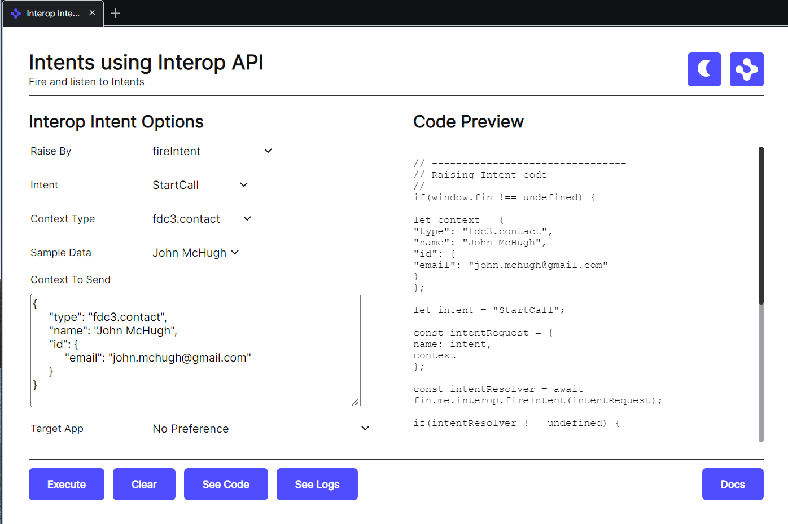

# Intents Using Interop API

This view lets you fire and listen to intents. It also gives you a preview of the code needed to achieve this.

It covers the intent types supported by the FDC3 standard as well as sample contextual objects supported by FDC3. You also have the option of specifying a custom intent and contextual object if you are not using one of the FDC3 types (although the platform hosting this view will need to support that intent type if you wish to see something happen).

This view can be customized by specifying customData in the [interop-intent-view.json](interop-intent-view.json) manifest.

- **contextData** - An object that contains entries for each contextual type you wish to support alongside an array of sample data entries for that contextual type. A default is provided using [fdc3-data.js](../../fdc3/fdc3-data.js).

- **intentData** - An object that contains entries for each intent type you wish to support alongside an array of contextual types supported by that intent. A default is provided using [fdc3-data.js](../../fdc3/fdc3-data.js).

