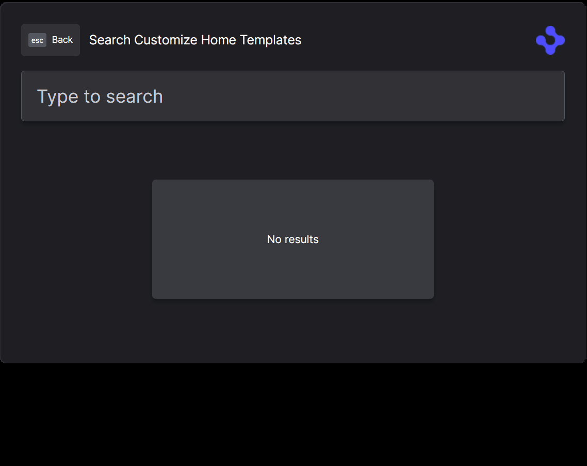
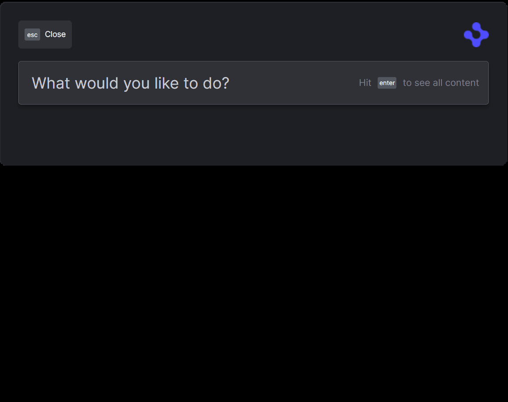
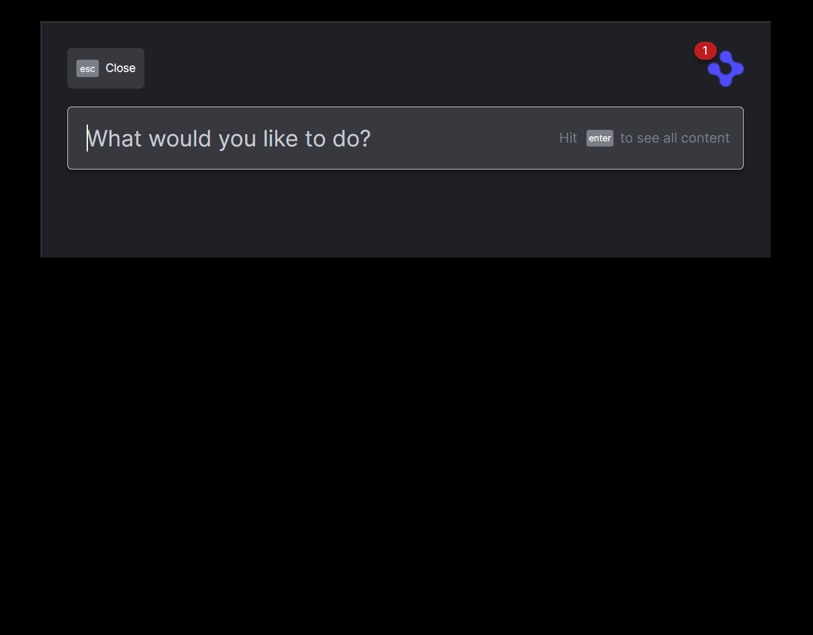
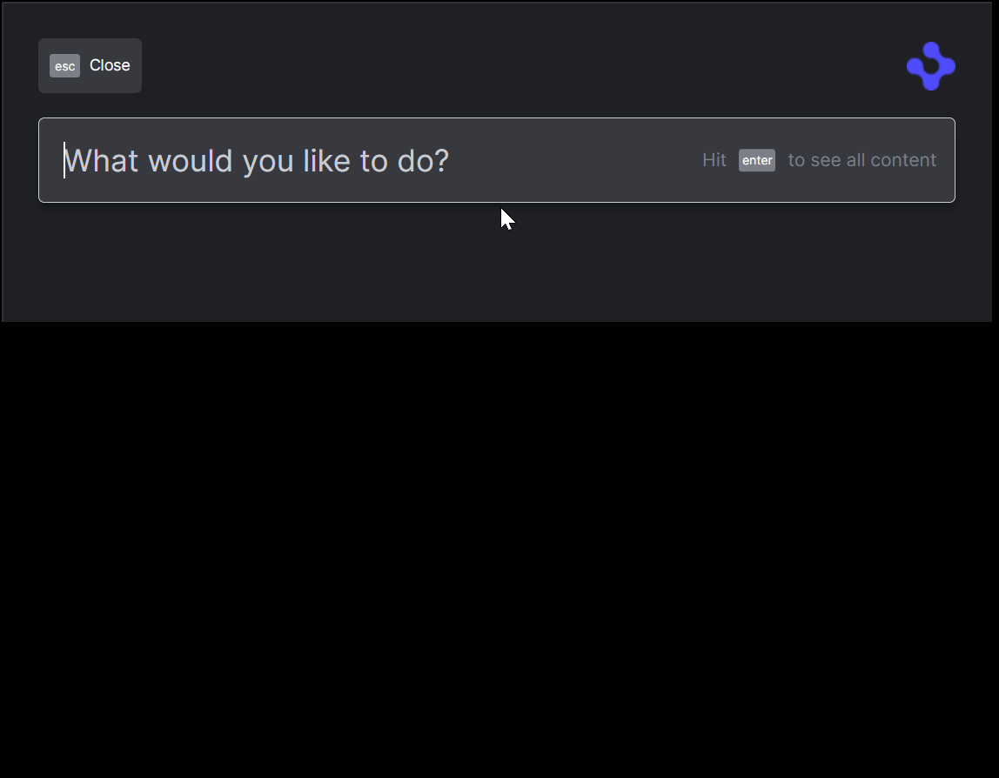
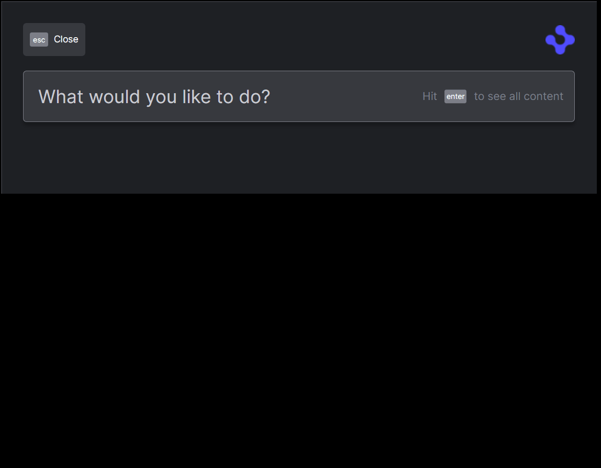

> **_:information_source: OpenFin Workspace:_** [OpenFin Workspace](https://www.openfin.co/workspace/) is a commercial product and this repo is for evaluation purposes (See [LICENSE.MD](LICENSE.MD)). Use of the OpenFin Container and OpenFin Workspace components is only granted pursuant to a license from OpenFin (see [manifest](public/manifest.fin.json)). Please [**contact us**](https://www.openfin.co/workspace/poc/) if you would like to request a developer evaluation key or to discuss a production license.
> OpenFin Workspace is currently **only supported on Windows** although you can run the sample on a Mac for development purposes.

# Customize Home Templates

OpenFin Workspace empowers you to feed content & apps to OpenFin Home via our API. This gives you the choice of fetching your list of applications from a _Content Discovery Service_ or somewhere else.

This application you are about to install is a simple example of plugging in your own content or app. This example assumes you have already [set up your development environment](https://developers.openfin.co/of-docs/docs/set-up-your-dev-environment)

## Running the Sample

To run this sample you can:

- Clone this repo and follow the instructions below. This will let you customize the sample to learn more about our APIs.
- Launch the Github hosted version of this sample to interact with it by going to the following link:

[Github Workspace Starter Customize Home Templates](https://start.openfin.co/?manifest=https%3A%2F%2Fbuilt-on-openfin.github.io%2Fworkspace-starter%2Fworkspace%2Fv14.0.0%2Fcustomize-home-templates%2Fmanifest.fin.json)

## Getting Started

1. Install dependencies and do the initial build. Note that these examples assume you are in the sub-directory for the example.

```shell
npm run setup
```

2. Optional (if you wish to pin the version of OpenFin Workspace to version 14.0.19 and you are on Windows) - Set Windows registry key for [Desktop Owner Settings](https://developers.openfin.co/docs/desktop-owner-settings).
   This example runs a utility [dos.mjs](./scripts/dos.mjs) that adds the Windows registry key for you, pointing to a local desktop owner
   settings file so you can test these settings. If you already have a desktop owner settings file, this script prompts to overwrite the location. Be sure to capture the existing location so you can update the key when you are done using this example.

   (**WARNING**: This script kills all open OpenFin processes. **This is not something you should do in production to close apps as force killing processes could kill an application while it's trying to save state/perform an action**).

```shell
npm run dos
```

3. Start the test server in a new window.

```shell
npm run start
```

4. Start Your Workspace Platform (this starts Workspace if it isn't already running).

```shell
npm run client
```

5. Type any character into the search box to show the default list of Applications.
   You can now use the custom commands e.g. `/price MSFT.

6. If you modify the project and wish to rebuild you can run setup again or the build command below:

```shell
npm run build
```

### Note About The App

This is a headless application. If you wish to debug it then you can update the [manifest file](public/manifest.fin.json) and set platform.autoShow to **true**. Otherwise you can use Process Manager (which is included in your list of apps).

## How it works

The Server in this example serves the sample and serves files from the [common](./public/common/) folder.

- [A Desktop Owner Settings file to pin the version of OpenFin Workspace (Optional)](./public/common/dos.json)
- Sample data required by the sample

### How this example works

This example is based on the [Register With Home](../register-with-home/) example, for full details on how registering with home works you can find more details there.

The additional commands are added through [home.ts](client/src/home.ts) and custom templates for the commands are defined in [templates.ts](client/src/templates.ts).

The commands implemented are:

```shell
? - which displays a list of all the commands with help
/quote <symbol>
/emoji <code>
/contacts <contact name>
/contacts-sync <contact name>
/contacts-partial <contact name>
/tree-inline
/tree-query
/loading
/error
```

The **/quote** command demonstrates a template that is built dynamically with a graph image.

The **/emoji** command demonstrates performing a search and returning multiple results with custom actions.

The contacts commands demonstrate different approaches to retrieving data.

- **/contacts-sync** - Retrieves the contact list and all the contact details in one go, which ends up with a noticeable delay in the UI
- **/contacts-partial** - Retrieves the contact list asynchronously and then retrieves all the contact details in the background, updating the results when it has the detailed data
- **/contacts** - Retrieves the contact list asynchronously and then only retrieves the details for an item when they are selected, using the additional `Loading` template as a placeholder while the data is loaded. Also by searching for a contact starting with the letter E it will initially show the `Error` template, the contact will work when selecting reload.

- **/tree-inline** and **/tree-query** The tree commands do not actually perform any function other than showing the help. To search for tree structured use a query such as `Acme`, `Bee`, `Chad`, `Dock`. This then demonstrates how to navigate through a tree like data structure and back up.

- **/loading** Demonstrates how to use the built-in loading template to show a busy spinner, and then replace the result when it is no longer needed.

- **/error** Demonstrates how to use the built-in error template to show an error result with a reload button, and then replace the result when it is no longer needed or reloaded.

e.g.

```shell
/emoji man
/quote MSFT
/quote APPL
/contacts john
/contacts emma
/contacts-sync john
/contacts-partial john
acme
bee
chad
dock
/loading
/error
```



e.g.

```shell
/emoji man
/emoji coffee
```



e.g.

```shell
Acme
Bee
Chad
Dock
```



e.g.

```shell
/loading
```



e.g.

```shell
/error
```



### Contact data

The contact details in the sample are random generated from <https://www.mockaroo.com/>

### Note About This Example

This is an example of how to use our APIs to configure OpenFin Workspace. It's purpose is to provide an example and provide suggestions. This is not a production application and shouldn't be treated as such. Please use this as a guide and provide feedback. Thanks!

---

### Read more about [working with Workspace](https://developers.openfin.co/of-docs/docs/overview-of-workspace)
