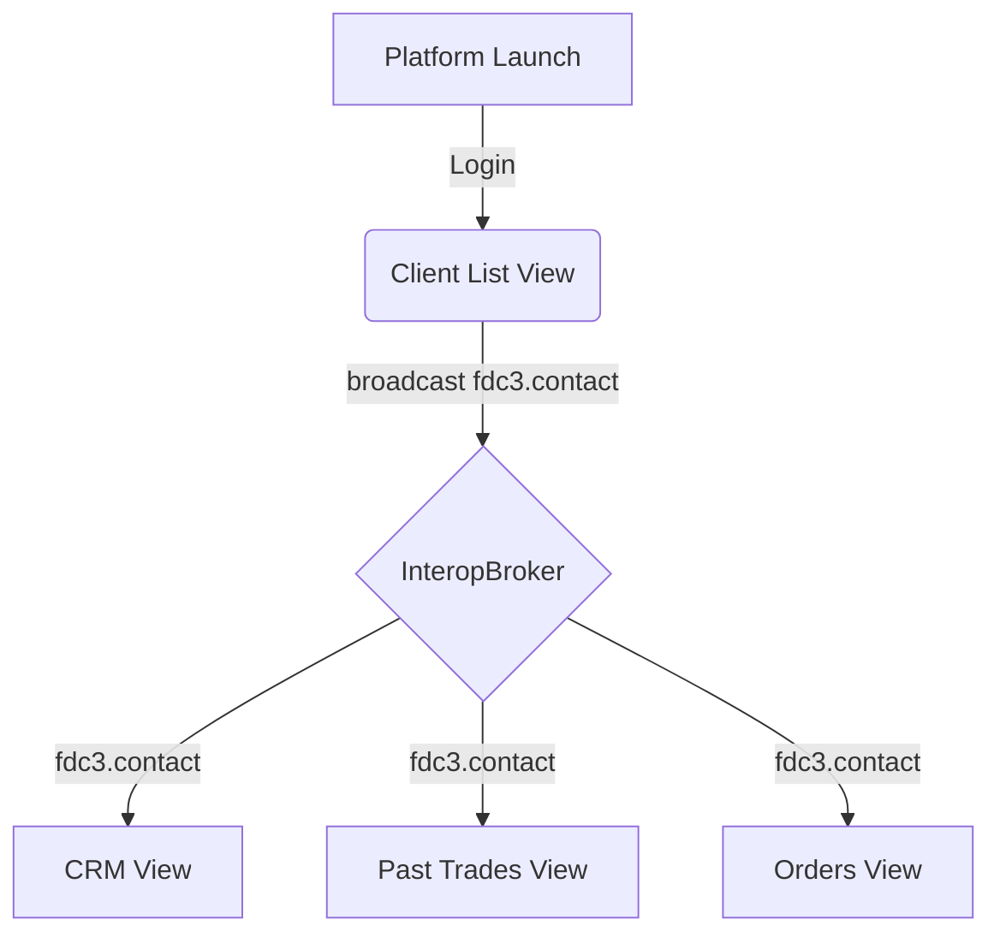
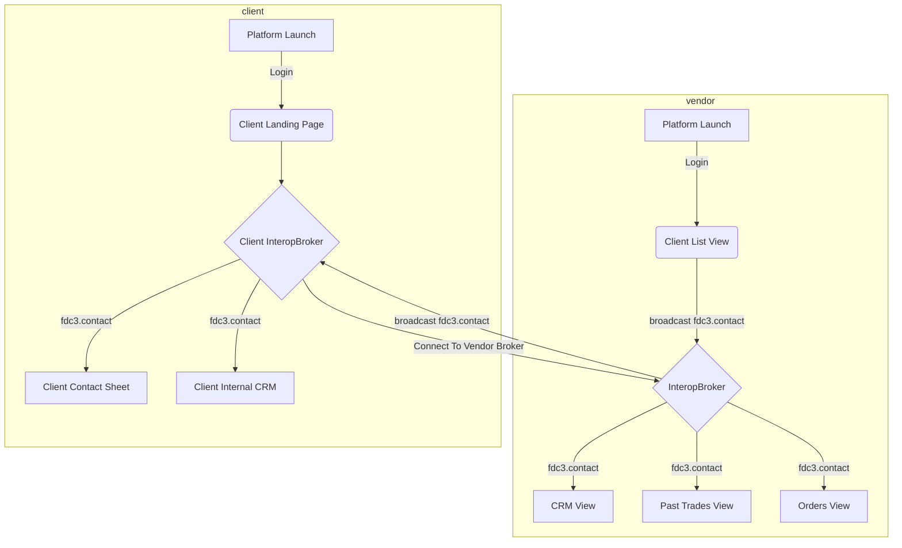
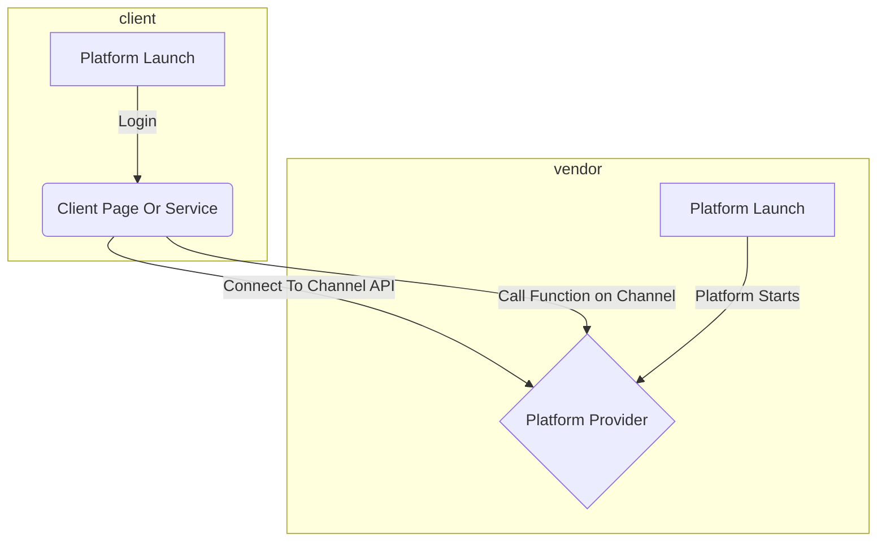

> **_:information_source: OpenFin Workspace:_** [OpenFin Workspace](https://www.openfin.co/workspace/) is a commercial product and this repo is for evaluation purposes (See [LICENSE.MD](../LICENSE.MD)). Use of the OpenFin Container and OpenFin Workspace components is only granted pursuant to a license from OpenFin (see [manifest](../public/manifest.fin.json)). Please [**contact us**](https://www.openfin.co/workspace/poc/) if you would like to request a developer evaluation key or to discuss a production license.
> OpenFin Workspace is currently **only supported on Windows** although you can run the sample on a Mac for development purposes.

[<- Back to Table Of Contents](../README.md)

# Persona - A Vendor?

A vendor is an organization that provides OpenFin enabled content, data or services that a client organization can benefit from.

## How can a Vendor start with OpenFin?

Just as web developers use to start off as mobile first and then build from there, a vendor can build using a workspace native/workspace first approach (starting small and layering on extended capability):

### Content

The first step is to think of your content. You are going to have some content that will be loaded into your platform and then used by your clients.
This can be any standard html page (client or server rendered) but there are some things to consider:

- Is your content supposed to be rendered in a classic window or a view (we recommend views as it gives you additional options and means your content can be easily laid out and benefit from the layout management capabilities offered by OpenFin Browser)?
- Is your content responsive? Views can be arranged with different widths and heights so having a responsive layout will mean it can provide your end user with more options with regards to how it can be arranged.
- Is there an easy way to hide (or not load) content that isn't needed (big header, footer or side panels)? You want your content to take center stage.
- Can your content be broken into smaller views so that an end user can load just what they need and arrange it alongside the way they want?
  - This isn't something that is mandatory but the flexibility of allowing a user to pick just the content they need is very empowering an opens up the possibility of streamlined workflows.
  - If you want a single connection to your back-end then you might consider a [shared web worker](https://developer.mozilla.org/en-US/docs/Web/API/SharedWorker) or launching a background window with autoshow false (OpenFin Window) to establish the connection and share messages to your children views using the OpenFin Interop/Channel APIs or something like the [browser broadcast channel API](https://developer.mozilla.org/en-US/docs/Web/API/Broadcast_Channel_API). **Note that Shared Web Workers and Broadcast Channel API is restricted to views from the same domain whereas the OpenFin APIs are not.**

---

### Discoverability

The content you created can be launched in your platform but you want to structure it in a way that doesn't tightly couple your content to your platform (if you go back to the concepts section we cover the idea of Content Provider Personas and Platform Personas).

#### View Description

A platform can launch views using the following options:

- Just the url of your page: this is easy but then you have no standard way of suggesting how the entry should be described or what options it should be launched with (e.g. fdc3 version or customData).
- You can have a json file that represents your view. This would be populated with OpenFin view options: A json file containing the url alongside other view options for your content: [View Options](https://developer.openfin.co/docs/javascript/stable/View.html#~options).
- To add additional meta data for your content such as a title, description, images, icons, intent support etc then you can create an app definition for your content. See how to define apps in [Platform Format](./how-to-define-apps.md), [FDC3 1.2 Format](./how-to-define-apps-fdc3-1-2.md) or [FDC3 2.0 Format](./how-to-define-apps-fdc3-2-0.md)

#### Platform Description

OpenFin Platforms are launched via a [manifest](https://developers.openfin.co/of-docs/docs/application-configuration). This manifest can contain information related to your platform and you can also provide information on your site. You might also want to create an app definition that wouldn't be used in your platform (as you are the platform) but would allow clients to add your platform to their directory. This definition could be done in a [Platform Format](./how-to-define-apps.md), [FDC3 1.2 Format](./how-to-define-apps-fdc3-1-2.md) or [FDC3 2.0 Format](./how-to-define-apps-fdc3-2-0.md) and the definition would include the link to your platform's manifest. When it comes to deployment please look at our [How to deploy](./how-to-deploy-your-platform.md) page for further links. |

---

### Context Aware

#### Sharing Context Within Your Platform

You have content that is beneficial to your client. While working with your platform they be selecting a contact, an organization, a portfolio or an instrument in one of your views. Other views within your application can react to that selection. This might be using our Interop or FDC3 APIs - see [what is FDC3](./what-is-fdc3.md).

#### Sharing Context With Others

Sharing context with your content is really useful and opens up the option for you to share this context with a client's platform or to be driven by a client's platform. You can extend your platform to offer the following:

- **Client Platforms connect to your platform** (you can decide whether to allow a connection and whether the connection requires a token for validation purposes). By default a platform allows connections but you can override the **isConnectionAuthorized** function to provide your own logic. We have a pattern in customize workspace called connectionProvider where you can determine what should be allowed to connect to your broker and if a payload onconnection should be validated. See [How to manage connections to your platform](./how-to-manage-connections-to-your-platform.md). A client can then listen to your user channels (green, blue, etc) and react when you publish an object. They might also publish a context to your channels from their platform so that your application reacts. If you want to restrict possible actions and you have your own broker there is a function you can override: **isActionAuthorized**. The connectionProvider doesn't expose this yet so please talk to us if you have a use case. A discussion with the client is **necessary** to cover points such as:

  - Connection requirements.
  - What types do you both agree to listen to.
  - What types can you publish to each other.
  - Are there channels that should not be used.

- **Your Platform can connect to a client's platform**. Just like a client can connect to you, you in turn can connect to a client's platform in order to listen to the context they broadcast on user channels and react by broadcasting that within your platform through your InteropBroker. You can also publish your own context onto a matching channel on your client's platform (if they permit it). A discussion with the client is **necessary** to cover points such as:

  - Connection requirements.
  - What types do you both agree to listen to.
  - What types can you publish to each other.
  - Are there channels that should not be used.

  This option isn't currently supported in our customize example via configuration but we are interested in exploring your use case and we do have examples of broker to broker communications in our [container starter](https://github.com/built-on-openfin/container-starter/tree/main/how-to/use-interop/setup-multi-platform-interop).

#### Context Sharing Within A Platform

#### Client Platform Connects To Vendor Platform For Context

The vendor connecting to the client would be similar to the above diagram but the vendor would be doing the connection.

---

### Services (SDKs)

If there are specific APIs and functions you want to expose to clients then you might want to use our [Channel API](https://developers.openfin.co/of-docs/docs/channels) so that you can build a specific API that your clients can connect to.
The Channel API is a low level (the Interop and FDC3 APIs are built on top of it) that lets you have granular control over the exposed functions and who is allowed to connect via the **onConnection** function (similar to how InteopBrokers validate connections).

#### SDK Options

To expose your functionality you have the following options:

- **Client connects to your service using the Channel API** - You could provide clients with details about your Service:

  - The name of the channel to connect to.
  - The payload shape required when connecting.
  - The names of the functions they can call.
  - What objects your are expecting and the objects you will return.

  We don't recommend this approach as it involves the client using hardcoded strings for the channel name, function names and they will have no type definitions for the request/response objects. This can make upgrades harder as it will require more work from your clients.

- **Client connects to your service using an SDK you provide**. You can provide a .NET nuget package or npm package that can be used by your clients that would provide a friendly API to:

  - Connect to your service.
  - Call actions as they would be strongly typed.
  - See intellisense and comments while working with your API.
  - Know when updates are available via the NPM or Nuget Registry.

  This approach would let you change your Channel API name or behavior or even move away from the Channel API without breaking the contract with your clients.

#### Client Platform Connects To Vendor Platform For Services

Once connected the client can call functions exposed by the Vendor's service and optionally the Vendor can call functions on the client connection on the Client's platform if they implement an agreed function. This flow can be using OpenFin APIs directly or it can be through a Vendor SDK.

---

### Layouts

A client might be launching your platform from their platform, they might be sharing context and calling specific services exposed by your platform as well. They may wish to take things a step further if they have the ability to save their platform's layout/workspace.
You might want to expose the ability for another platform to get a representation of **your** layout when someone calls save on their platform.

This is an advanced feature. This is enabled by adding [snapshot source support](https://developer.openfin.co/docs/javascript/stable/SnapshotSource.html). Right now the [connectionProvider](./how-to-manage-connections-to-your-platform.md) supports apps registering against your platform as a snapshot source but not the other way around. If you have a use case please let us know.

---

### Workspace Components

One of the benefits of being a Workspace Platform is that you can take advantage of our Workspace components. This means you can provide your clients with:

- An easy way to search your content through Home.
- An easy way to list all your content through Store.
- An easy way to provide a configurable list of frequently launched apps through dock.
- An easy way to see the notifications you have raised through our notification center.

If your client's also use OpenFin Workspace then you will plug into the existing instances of these Workspace components alongside the Client's platform and the users will already be familiar with how to interact with your platform. To find out what the Workspace Components are capable of please go back to the main index to continue learning about Workspace and how it can be configured.

[<- Back to Table Of Contents](../README.md)
