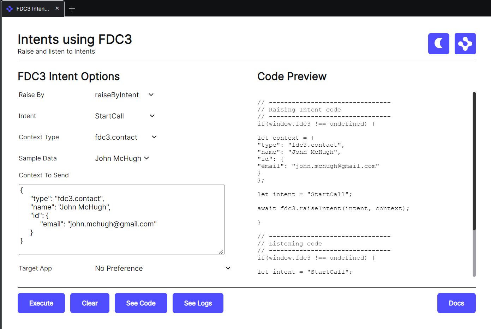

> **_:information_source: OpenFin Workspace:_** [OpenFin Workspace](https://www.openfin.co/workspace/) is a commercial product and this repo is for evaluation purposes (See [LICENSE.MD](../LICENSE.MD)). Use of the OpenFin Container and OpenFin Workspace components is only granted pursuant to a license from OpenFin (see [manifest](../public/manifest.fin.json)). Please [**contact us**](https://www.openfin.co/workspace/poc/) if you would like to request a developer evaluation key or to discuss a production license.
> OpenFin Workspace is currently **only supported on Windows** although you can run the sample on a Mac for development purposes.

[<- Back to Table Of Contents](../README.md)

# How To Add Intent Support To Your App

If you have added a view (url based app) to an app directory/source (see [How To Define Apps](./how-to-define-apps.md)) you may want it to be able to trigger a workflow/intent or to support one.

The first thing your app should do is to highlight that it supports the FDC3 standard by opting into the api through it's settings (this can either be inline e.g. manifestType inline-view or a json file manifestType: view). E.g.:

```json
{
    "url": "https://fdc3.finos.org/toolbox/fdc3-workbench/",
    "fdc3InteropApi": "1.2"
},
```

## Do I Need To Reference An Npm Module

You don't need to reference an npm module for the API as we inject the API into your document. If you want to access the TypeScript types then you can reference the official FinOS types package: [FDC3 Types NPM Package](https://www.npmjs.com/package/@finos/fdc3/v/1.2.0)

## How Do I Raise An Intent?

In your app would check for the fdc3 api and then trigger a workflow by raising the intent as follows:

```javascript
// --------------------------------
// Raising Intent code
// --------------------------------
if (window.fdc3 !== undefined) {
  const context = {
    type: 'fdc3.contact',
    name: 'John McHugh',
    id: {
      email: 'john.mchugh@gmail.com'
    }
  };
  const intent = 'StartCall';
  await fdc3.raiseIntent(intent, context);
}
```

## How do I Listen for Intents?

```javascript
// --------------------------------
// Listening code
// --------------------------------
if (window.fdc3 !== undefined) {
  const intent = 'StartCall';
  fdc3.addIntentListener(intent, (ctx) => {
    console.log('Received Context For Intent: ' + intent, ctx);
  });
}
```

## How Do I Raise An Intent By Context?

If you have a contextual object and you just want to raise the dialog to empower the user to make a decision on what supported workflow they want to action then you can do the following:

```javascript
// --------------------------------
// Raising Intent code
// --------------------------------
if (window.fdc3 !== undefined) {
  const context = {
    type: 'fdc3.contact',
    name: 'John McHugh',
    id: {
      email: 'john.mchugh@gmail.com'
    }
  };
  await fdc3.raiseIntentForContext(context);
}
```

## How Do I Listen For Intents Triggered By raiseIntentForcontext?

The code is the same as listening for intents triggered by raiseIntent as it ends up resolving to a selected intent.

```javascript
// --------------------------------
// Listening code
// --------------------------------
if (window.fdc3 !== undefined) {
  const intent = 'StartCall';
  fdc3.addIntentListener(intent, (ctx) => {
    console.log('Received Context For Intent: ' + intent, ctx);
  });
}
```

## How Do I Flag What Intents My App Supports?

This would be done in your app definition. See [how to define an app](./how-to-define-apps.md). An app definition supports an array of intents and our App Definition Builder helps you select from the official list of intents when defining your app.

## Test Harnesses

It is useful to be able to test your app against something. When you reference the common apps feed in your instance of customize workspace you get a number of useful utilities. We provide two entries related to intent raising in FDC3:

### Intents Using FDC3

This app supports FDC3 raiseIntent and raiseIntentByContext, it lists all the supported intent and context types and generates a code preview for you to copy or simply test against. We provide a similar tool for our Interop API which is compatible with the FDC3 API as well:



### FDC3 Workbench

This is the FinOS test harness to show our compatibility:


## More Resources

- Please use our OpenFin Website for more information related to FDC3 and interop: [OpenFin FDC3 support](https://developers.openfin.co/of-docs/docs/fdc3-support-in-openfin)

[<- Back to Table Of Contents](../README.md)
