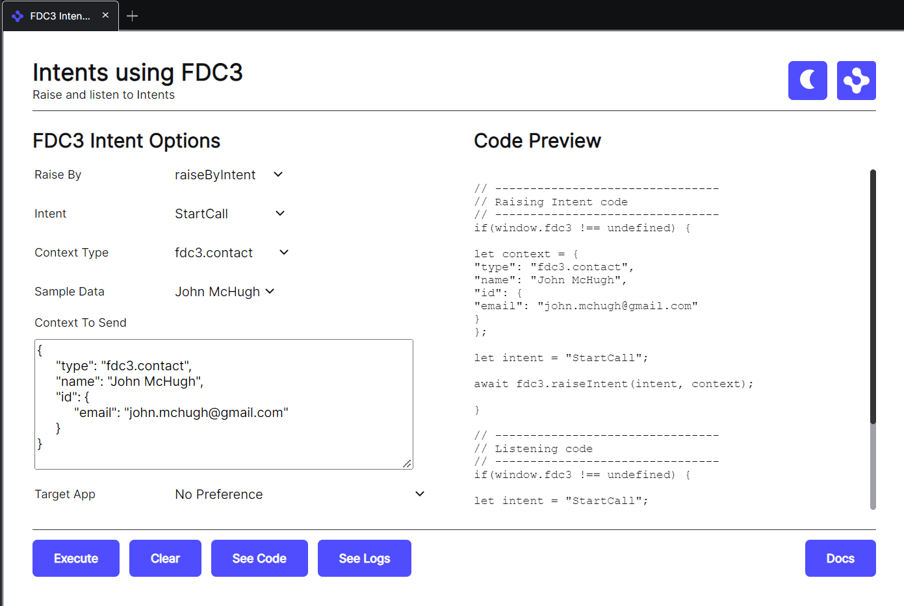

> **_:information_source: OpenFin Workspace:_** [OpenFin Workspace](https://www.openfin.co/workspace/) is a commercial product and this repo is for evaluation purposes (See [LICENSE.MD](../LICENSE.MD)). Use of the OpenFin Container and OpenFin Workspace components is only granted pursuant to a license from OpenFin (see [manifest](../public/manifest.fin.json)). Please [**contact us**](https://www.openfin.co/workspace/poc/) if you would like to request a developer evaluation key or to discuss a production license.
> OpenFin Workspace is currently **only supported on Windows** although you can run the sample on a Mac for development purposes.

[<- Back to Table Of Contents](../README.md)

# How To Add FDC3 Open Support To Your App

If you have added a view (url based app) to an app directory/source (see [How To Define Apps](./how-to-define-apps.md)) you may want it to be opened easily with the option of receiving some contextual data.

The first thing your app should do is to highlight that it supports the FDC3 standard by opting into the api through it's settings (this can either be inline e.g. manifestType inline-view or a json file manifestType: view). E.g.:

```json
{
    "url": "https://fdc3.finos.org/toolbox/fdc3-workbench/",
    "fdc3InteropApi": "1.2"
},
```

## Do I Need To Reference An Npm Module

You don't need to reference an npm module for the API as we inject the API into your document. If you want to access the TypeScript types then you can reference the official FinOS types package: [FDC3 Types NPM Package](https://www.npmjs.com/package/@finos/fdc3/v/1.2.0)

## How Do I Open An App?

Now a note on the fdc3.open API as this platform does have an opinionated implementation.

These are two quotes from the official FDC3 site:

"Generally, it should be used when the target application is known but there is no specific intent."

This could be interpreted as you want to be able to launch an app easily without having to know about the intent name (the given example is that a search result might just want to launch an app).

```javascript
// --------------------------------
// Opening an app
// --------------------------------
if (window.fdc3 !== undefined) {
  const app = 'call-app';
  // optional context
  const context = {
    type: 'fdc3.contact',
    name: 'John McHugh',
    id: {
      email: 'john.mchugh@gmail.com'
    }
  };

  await fdc3.open('call-app', context);
}
```

Is a bit simpler than:

```javascript
// --------------------------------
// Raising Intent code
// --------------------------------
if (window.fdc3 !== undefined) {
  const app = 'call-app';
  const context = {
    type: 'fdc3.contact',
    name: 'John McHugh',
    id: {
      email: 'john.mchugh@gmail.com'
    }
  };
  const intent = 'StartCall';
  await fdc3.raiseIntent(intent, context, app);
}
```

There is another note on the FDC3 website:

"Note, if both the intent and target app name are known, it is recommended to instead use raiseIntent with the app argument."

This seems to indicate that intents are preferred and here are some of the advantages intents have over open.

### Intents give the following advantages

- An app has to opt into an intent (what if an app doesn't mind being opened by Home or via the Store or Dock but doesn't want another app to be able to open it). fdc3.open can be interpreted as it allows the opening of anything in the app directory which might not be what every app owner wants.
- If context is provided then the app has opted into that specific context. The app will add an intent listener and specify that specific intent name. When context comes through it knows why it received it. The fdc3.open api says that context can be passed but it is passed to the contextListener. When you have an app (e.g. a view) that might be a multi instance or single instance view, it might be pre-bound to a system channel (e.g. green) or a system channel (green) may have been selected by the user. The targeted app may have already received a general context (fdc3.contact) that it has synced with all the other views that are also on the green channel. If the app is launched and passed a new context that isn't through broadcast then it may cause confusion.
- There is an api to easily find the apps that are happy to support an intent and if there is a context object you can find all the intents that support that context object.

### Why has the advantages of Intents been raised?

We know that the convenience of fdc3.open is good and we want to expose that, but we also want to retain the advantages listed above. So our implementation is opinionated when it comes to having your app indicate it's support for fdc3.open (rather than not having a choice).

## How do I Listen for Context Passed by fdc3.open?

Adding a contextListener will receive context that is broadcast but it will not receive context passed by fdc3.open in our implementation. For this implementation you need to register an intentListener for a specific intent: **OpenApp**. If your view is opened in multiple platforms with differing implementations then you can still have a context listener that receives **broadcast** and **open** based context and add an intent listener for **OpenApp** that will not be called by other platforms unless you indicate support for the intent **OpenApp** on that platform through your app meta data.

The code would be as follows (and would allow you to differentiate between broadcast and open calls):

```javascript
// --------------------------------
// Listening code
// --------------------------------
if (window.fdc3 !== undefined) {
  const intent = 'OpenApp';
  fdc3.addIntentListener(intent, (ctx) => {
    console.log('Received Context For Intent: ' + intent, ctx);
  });
}
```

## How Do I Flag that My App Supports fdc3.open?

This would be done in your app definition. See [how to define an app](./how-to-define-apps.md). An app definition supports an array of intents and our App Definition Builder helps you select from the official list of intents when defining your app. As this is a custom intent you would need to add the intent name of **OpenApp** and then list the contexts that you support if any.

## Test Harnesses

It is useful to be able to test your app against something. When you reference the common apps feed in your instance of customize workspace you get a number of useful utilities. We provide two entries related to intent raising in FDC3 (which can also be used to test fdc3.open support):

### Intents Using FDC3

This app supports FDC3 raiseIntent and raiseIntentByContext, it lists all the supported intent and context types and generates a code preview for you to copy or simply test against. We provide a similar tool for our Interop API which is compatible with the FDC3 API as well. In this case you would raise a custom intent and specify the intent name: **OpenApp** (or you can use fdc3.open from the console. We may introduce an test harness that just lets you launch apps that support the intent OpenApp using the fdc3.open API if there is interest):



### FDC3 Workbench

This is the FinOS test harness to show our compatibility. It doesn't have an fdc3.open button (at the time of this writing) but you can use raiseIntent **OpenApp** as well:


## More Resources

- Please use our OpenFin Website for more information related to FDC3 and interop: [OpenFin FDC3 support](https://developers.openfin.co/of-docs/docs/fdc3-support-in-openfin)

[<- Back to Table Of Contents](../README.md)
