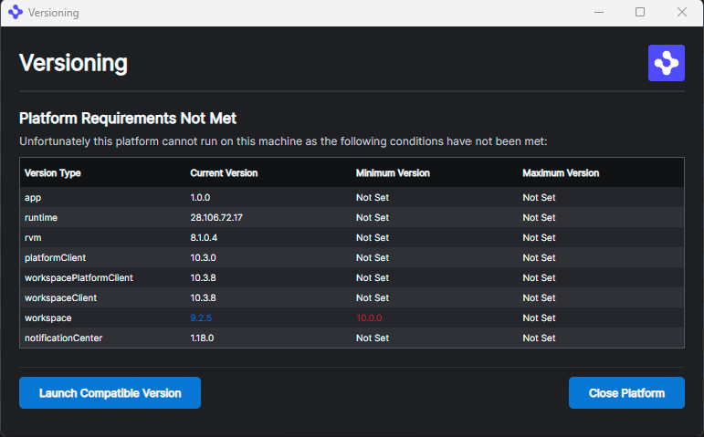

> **_:information_source: OpenFin Workspace:_** [OpenFin Workspace](https://www.openfin.co/workspace/) is a commercial product and this repo is for evaluation purposes (See [LICENSE.MD](../LICENSE.MD)). Use of the OpenFin Container and OpenFin Workspace components is only granted pursuant to a license from OpenFin (see [manifest](../public/manifest.fin.json)). Please [**contact us**](https://www.openfin.co/workspace/poc/) if you would like to request a developer evaluation key or to discuss a production license.
> OpenFin Workspace is currently **only supported on Windows** although you can run the sample on a Mac for development purposes.

[<- Back to Table Of Contents](../README.md)

# How To Add Versioning Support ?

Through configuration you can add the version of your application e.g. 1.0.0. Additional versioning information is also provided and made available to modules through the module helpers and a getVersionInfo function. These are the following version types:

## Version Types

- app (the version of the app provided through settings)
- platformClient (the platform code configured through the manifest/settings)
- workspacePlatformClient (the version of the @openfin/workspace-platform npm package)
- workspaceClient (the version of the @openfin/workspace npm package)
- workspace (the version of the OpenFin Workspace Components your platform has registered against)
- notificationCenter (the version of the Notification Center that is running)
- runtime
- rvm

## Tip

If you are looking for just the code related to getting versioning information then we have taken examples from our versioning implementation and added it as a hints and tips entry: [Version Info](../../hints-and-tips/docs/version-info.md)

## Configuration

By default the Version Provider will initialize even without configuration but you can specify some settings to control what your supported versions are and whether you should stop the platform and show a version message.

```json
"versionProvider": {
   "appVersion": "1.0.0",
   "minimumVersion": {
    "workspace": "12.6.0"
   },
   "maximumVersion": {
   },
   "versionWindow": {
    "name": "versioning",
    "url": "http://localhost:8080/windows/version/version.html"
   }
  }
```

### Endpoint Ids

This configuration object supports specifying a custom endpoint Id which must exist in the endpoints array. See endpointId below and [How To Define Endpoints](./how-to-define-endpoints.md).

### Full Version Provider Options

```javascript
{
 /** The version of the the instance of this platform */
 appVersion?: string;

 /** You can specify if the platform should stop initializing if the version is less than any of the specified minimum versions */
 minVersion?: MinimumVersion;

 /** You can specify if the platform should stop initializing if the version is more than any of the specified maximum versions */
 maxVersion?: MaximumVersion;

 /**
  * This window will be shown if an endpointId is not specified and min and max criteria has been specified and has not been met.
  * This window will be shown to the user and the bootstrapping process will be stopped.
  */
 versionWindow?: Partial<OpenFin.WindowOptions>;

 /**
  * If you specify an endpoint then you are telling the platform to send information to this endpoint.
  * The information sent will be the VersionRequest object.
  * If you provide minimumVersion and maximumVersion information in the settings then the
  * platform will use those to calculate what has failed validation (minimum and/or maximum) and pass
  * those onto the endpoint.
  *
  * The endpoint then returns an object with status (this returns the version info you sent, the min/max rules and what has failed. The failures indicate the state of the platform.).
  * If the status indicates that things need to be managed and should not proceed they will have a windowOptions property. This should be launched and that window will be built to
  * support what should happen next.
  * - Should the window tell the user that the setup isn't compatible and offer to shut down the platform?
  * - Should it try to close the platform and launch a compatible manifest?
  * - Should it notify the user that a newer version of the app is available and that they should restart?
  * On the initial request while the platform is running an invalid status will result in the bootstrapping stopping.
  */
 endpointId?: string;

 /**
  * If an endpoint is specified and an interval is specified then you want the platform to call this endpoint on an
  * interval to see if an update of your application is available.
  */
 versionCheckIntervalInSeconds?: number;
}
```

### Version Request if Endpoint Id is specified

```javascript
export interface VersionRequest {
  /** The collection version information */
  versionInfo: VersionInfo;
  /** The configured minimum limits */
  minVersion?: MinimumVersion;
  /** The configured maximum limits */
  maxVersion?: MaximumVersion;
  /** The version type that failed the minimum requirements */
  minFail?: VersionType[];
  /** The version type that failed the maximum requirements */
  maxFail?: VersionType[];
}
```

### Expected Version Response if Endpoint Id is specified

```javascript
/** If an endpoint has been used to get dynamic criteria what if anything has been the response. */
export interface VersionResponse {
  windowOptions?: OpenFin.WindowOptions;
  status: 'compatible' | 'incompatible' | 'upgradeable';
}
```

### Version

## Min and Max Limits

Minimum and Maximum thresholds can be specified through the minimum and maximum setting by specifying the version type and the full version number (x.x.x.x for runtime and rvm and x.x.x for everything else).

The logic starts from the major version and works down but stops on the first violation of the limit.

## Version Window

The Version Window is the window to show when a validation check fails. If it is specified then it means your intention is that the platform should stop initializing, any registrations against Workspace should be undone and the Version Window should be presented to the user.

The settings here are your standard OpenFin Window Options. We pass additional data to the window through customData:

```typescript
export interface VersionWindowCustomData {
  /** The collection version information */
  versionInfo: VersionInfo;
  /** The configured minimum limits */
  minVersion: MinimumVersion;
  /** The configured maximum limits */
  maxVersion: MaximumVersion;
  /** The version type that failed the minimum requirements */
  minFail: string[];
  /** The version type that failed the maximum requirements */
  maxFail: string[];
}
```



## Source Reference

- [version.ts](../client/src/framework/version.ts)
- [version-shapes.ts](../client/src/framework/shapes/version-shapes.ts)
- [Sample Version Window](../public/windows/version)

[<- Back to Table Of Contents](../README.md)
