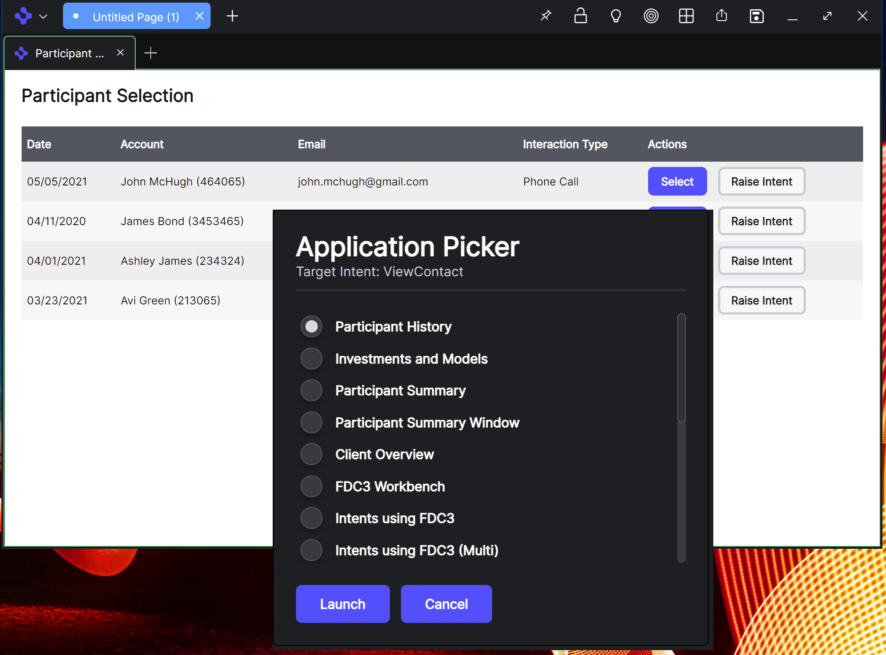

> **_:information_source: OpenFin Workspace:_** [OpenFin Workspace](https://www.openfin.co/workspace/) is a commercial product and this repo is for evaluation purposes (See [LICENSE.MD](../LICENSE.MD)). Use of the OpenFin Container and OpenFin Workspace components is only granted pursuant to a license from OpenFin (see [manifest](../public/manifest.fin.json)). Please [**contact us**](https://www.openfin.co/workspace/poc/) if you would like to request a developer evaluation key or to discuss a production license.
> OpenFin Workspace is currently **only supported on Windows** although you can run the sample on a Mac for development purposes.

[<- Back to Table Of Contents](../README.md)

# How to see Intents in action

If you Live Launch (see [main page](../README.md)) or run either the first or second manifest locally (see [setup](./how-to-setup-customize-workspace.md)) then you should be able to launch a view called **Participant Selection** from the Home UI and when that is launched you can click on one of the **Raise Intent** buttons. This should present you with an Intent Picker UI:



# How to configure Intents for your Workspace Platform

You can register applications (see [how to define apps](./how-to-define-apps.md)) that support specific intents. The platform will then check to see if any applications support a specific intent raised by applications (see [how to add intent support to your app](./how-to-add-intent-support-to-your-app.md)). When there is more than one application that supports an intent then customize workspace shows a UI so the user can make a selection.

You can override the window that is presented to the user and here is how:

## PlatformProvider

We have a platform provider defined in the settings and it contains some information specific to intent handling:

```json
"platformProvider": {
   ...,
   "intentPicker": {
    "url": "http://localhost:8080/common/windows/intents/picker.html",
    "height": 400,
    "width": 400
   }
  },

```

The url will be a window that you can design.

### How will my custom window receive data?

The window will be passed a list of applications and an intent or a list of intents (if raise intent by context is triggered).

```javascript
const data = await fin.me.getOptions();

if (data.customData !== undefined) {
  apps = data.customData.apps;
  intent = data.customData.intent;
  intents = data.customData.intents;
}
```

Your window can then use this information to build a list for your user to engage with.

### How can I tell the platform that a user has selected an application or cancelled the selection?

Your window needs to expose a function that can be called by the platform:

```javascript
// this function is called by the interopbroker.ts file in the src directory so that it waits to see whether the end user has made a selection or cancelled the intent request.
window['getIntentSelection'] = async () => {
  return new Promise((resolve, reject) => {
    // resolveAppSelection and rejectAppSelection can be called anything. They just represent the function names
    // used in the default intent picker
    resolveAppSelection = resolve;
    rejectAppSelection = reject;
  });
};
```

## Source reference

- [picker.html](../../common/public/windows/intents/picker.html)
- [picker.js](../../common/public/windows/intents/picker.js)
