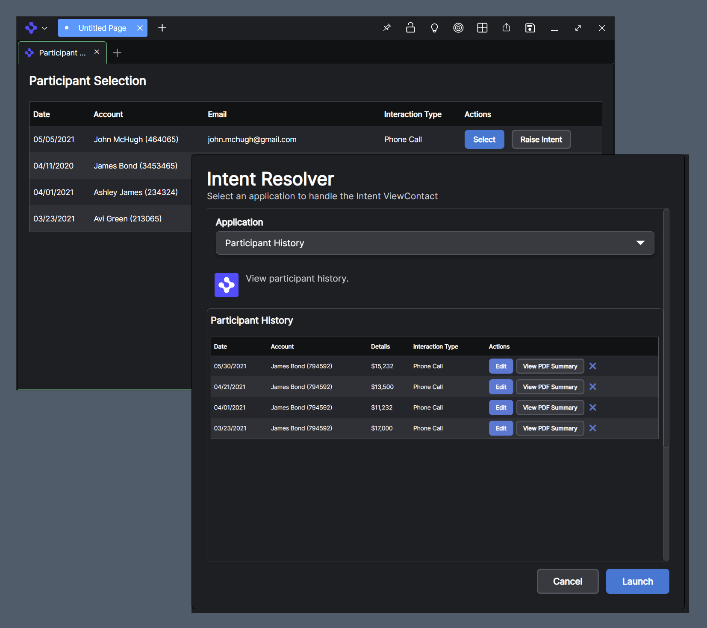

> **_:information_source: OpenFin Workspace:_** [OpenFin Workspace](https://www.openfin.co/workspace/) is a commercial product and this repo is for evaluation purposes (See [LICENSE.MD](../LICENSE.MD)). Use of the OpenFin Container and OpenFin Workspace components is only granted pursuant to a license from OpenFin (see [manifest](../public/manifest.fin.json)). Please [**contact us**](https://www.openfin.co/workspace/poc/) if you would like to request a developer evaluation key or to discuss a production license.
> OpenFin Workspace is currently **only supported on Windows** although you can run the sample on a Mac for development purposes.

[<- Back to Table Of Contents](../README.md)

# How To See Intents In Action

If you Live Launch (see [main page](../README.md)) or run either the first or second manifest locally (see [How To Setup Customize Workspace](./how-to-setup-customize-workspace.md)) then you should be able to launch a view called **Participant Selection** from the Home UI and when that is launched you can click on one of the **Raise Intent** buttons. This should present you with an Intent Resolver UI:

## Default Instance Intent Resolver



## Default Basic Intent Resolver


# How To Configure Intents For Your Workspace Platform

You can register applications (see [How To Define Apps](./how-to-define-apps.md)) that support specific intents. The platform will then check to see if any applications support a specific intent raised by applications (see [How To Add Intent Support To Your App](./how-to-add-intent-support-to-your-app.md)). When there is more than one application that supports an intent then customize workspace shows a UI so the user can make a selection.

You can override the window that is presented to the user and here is how:

## PlatformProvider

We have a platform provider defined in the settings and it contains some information specific to intent handling:

```json
"platformProvider": {
   ...,
   "interop": {
    "intentResolver": {
     "url": "http://localhost:8080/common/windows/intents/instance-picker.html",
     "height": 715,
     "width": 665,
     "fdc3InteropApi": "2.0"
    }
   }
  },

```

The url will be a window that you can design.

### How Will My Custom Window Receive Data?

The window will be passed a list of applications and an intent or a list of intents (if raise intent by context is triggered).

```javascript
const data = await fin.me.getOptions();

if (data.customData !== undefined) {
  apps = data.customData.apps;
  intent = data.customData.intent;
  intents = data.customData.intents;
  // used if the picker supports instances not linked to a specific app but a fallback app has been
  // provided. Do not provide an option of launching a new instance as there is no app to launch
  // simply show existing instances
  unregisteredAppId = data.customData.unregisteredAppId;
  if (data.customData.title !== undefined) {
    // use the passed title
  }
}
```

Your window can then use this information to build a list for your user to engage with.

### How Can I Tell The Platform That A User Has Selected An Application Or Cancelled The Selection?

Your window needs to expose a function that can be called by the platform:

```javascript
// this function is called by the interopbroker.ts file in the src directory so that it waits to see whether the end user has made a selection or cancelled the intent request.
window['getIntentSelection'] = async () => {
  return new Promise((resolve, reject) => {
    // resolveAppSelection and rejectAppSelection can be called anything. They just represent the function names
    // used in the default intent picker
    resolveAppSelection = resolve;
    rejectAppSelection = reject;
  });
};
```

## Source Reference

### Simple Intent Resolver

- [picker.html](../../common/public/windows/intents/picker.html)
- [picker.js](../../common/public/windows/intents/picker.js)

### Advanced Intent Resolver

- [instance-picker.html](../../common/public/windows/intents/instance-picker.html)
- [instance-picker.js](../../common/public/windows/intents/instance-picker.js)

[<- Back to Table Of Contents](../README.md)
