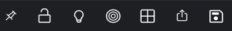

> **_:information_source: OpenFin Workspace:_** [OpenFin Workspace](https://www.openfin.co/workspace/) is a commercial product and this repo is for evaluation purposes (See [LICENSE.MD](../LICENSE.MD)). Use of the OpenFin Container and OpenFin Workspace components is only granted pursuant to a license from OpenFin (see [manifest](../public/manifest.fin.json)). Please [**contact us**](https://www.openfin.co/workspace/poc/) if you would like to request a developer evaluation key or to discuss a production license.
> OpenFin Workspace is currently **only supported on Windows** although you can run the sample on a Mac for development purposes.

[<- Back to Table Of Contents](../README.md)

# How To Customize Browser Buttons

The toolbar buttons on the browser window can be configured in the customize example.



The list of buttons to display is configured in the manifest as an array.

For each button you must specify an `id`, a flag `include` which determines if it should be shown and the `button` definition. Optional properties are `themes` which allows you to override the icon displayed for specific theme and `conditions` which also determines if the button should be shown based on additional logic.

```json
"browserProvider": {
    "toolbarButtons": [
        {
            "include": true,
            "id": "home-show",
            "button": {
                "type": "Custom",
                "tooltip": "Show Home",
                "iconUrl": "http://localhost:8080/common/icons/search.svg",
                "action": {
                    "id": "home-show",
                    "customData": {}
                }
            },
            "themes": {
                "dark": "http://localhost:8080/common/icons/search-dark.svg"
            },
            "conditions": [
                "authenticated"
            ]
        }
    }]
}
```

The `themes` icons act as an override to the default `iconUrl` in the button definition. The keys used in the `themes` should match the `label` of the configured themes, see [How to Theme Your Platform](./how-to-theme-your-platform.md).

For more information on conditions see [How to Add Conditions](./how-to-add-conditions.md).

## Button definition

The button definitions can specify one of the built-in button types or a custom button.

The built-in types are one of the following:

- ShowHideTabs
- ColorLinking
- PresetLayouts
- LockUnlockPage
- SaveMenu
- SavePage

They can be used without any additional configuration as follows:

```json
"browserProvider": {
    "toolbarButtons": [
        {
            "include": true,
            "id": "save-menu",
            "button": {
                "type": "SaveMenu"
            }
        }
    }]
}
```

For a custom button you need to define additional data for the button, the `iconUrl` to display an image on the button, the `tooltip` to display when hovering over the button and an `action` which contains both an `id` and optional `customData` to pass to the action.

When the custom button is clicked the `id` is used to look up one of the platform actions, and the `customData` is passed to it. For more information on actions see [How To Add Custom Actions For Menus and Buttons](./how-to-add-custom-actions-for-menus-and-buttons.md).

```json
"browserProvider": {
    "toolbarButtons": [
        {
            "include": true,
            "id": "my-operation-button",
            "button": {
                "type": "Custom",
                "tooltip": "My Operation",
                "iconUrl": "http://localhost:8080/common/icons/my-operation.svg",
                "action": {
                    "id": "my-operation",
                    "customData": {
                        "foo": true
                    }
                }
            }
        }
    }]
}
```

## Source reference

- [buttons.ts](../client/src/framework/buttons.ts)
- [actions.ts](../client/src/framework/actions.ts)
- [conditions.ts](../client/src/framework/conditions.ts)
