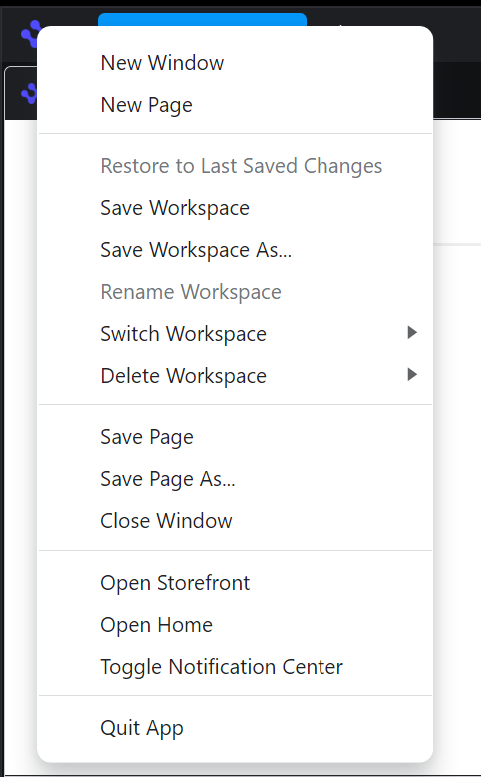
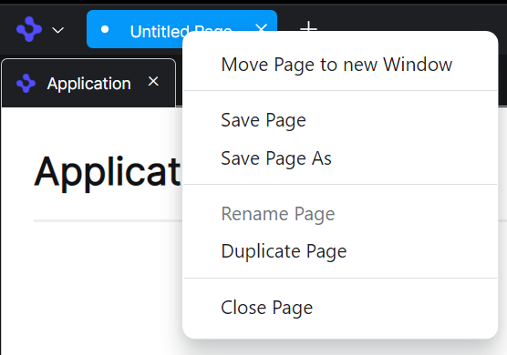
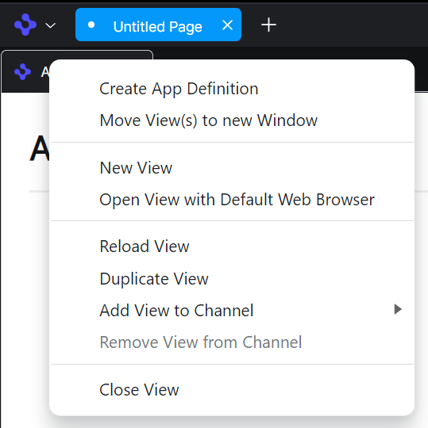

> **_:information_source: OpenFin Workspace:_** [OpenFin Workspace](https://www.openfin.co/workspace/) is a commercial product and this repo is for evaluation purposes (See [LICENSE.MD](../LICENSE.MD)). Use of the OpenFin Container and OpenFin Workspace components is only granted pursuant to a license from OpenFin (see [manifest](../public/manifest.fin.json)). Please [**contact us**](https://www.openfin.co/workspace/poc/) if you would like to request a developer evaluation key or to discuss a production license.
> OpenFin Workspace is currently **only supported on Windows** although you can run the sample on a Mac for development purposes.

[<- Back to Table Of Contents](../README.md)

# How To Customize Browser Menus

There are 3 menus that can be configured in the customize example.

The global menu, displayed when clicking the browser top left icon:



The page menu, displayed when clicking the page tab:



The view menu, displayed when clicking the view tab:



The customization process for all 3 types of menu follows the same pattern. The entries are configured through the following settings in the manifest.

```json
"browserProvider": {
    ...
    "globalMenu": [
        ...
    ],
    "pageMenu": [
        ...
    ],
    "viewMenu": [
        ...
    ]
}
```

## Configuring The Menu Entries

There is a standard set of menu entries for each of the menu types. You can add/remove or change all the menu entries.

Each entry must specify `id` to identify the menu entry, `include` which determines if the entry should be displayed, `label` for the text to be displayed for the entry, `data` for the information specific to the menu entry and which action to perform, `position` which can determine where the menu entry should appear in relation to other menu entries. There is optional parameters of `separator` which can add a menu separator adjacent to the new entry and `conditions` which can provide more dynamic logic as to its visibility.

An example menu entry might look something like:

```json
"browserProvider": {
    "globalMenu": [
        {
            "include": true,
            "label": "Log Out and Quit App",
            "data": {
                "type": "Custom",
                "action": {
                    "id": "logout-and-quit"
                }
            },
            "position": {
                "type": "Quit",
                "operation": "after"
            },
            "separator": "before",
            "conditions": ["authenticated"],
        }
    ]
}
```

The `data.type` field can specify one of the standard built-in menu items, which will trigger the default action associated with that id.

Global menu `NewWindow`, `NewPage`, `SavePage`, `SavePageAs`, `CloseWindow`, `RestoreChanges`, `SaveWorkspace`, `SaveWorkspaceAs`, `RenameWorkspace`, `SwitchWorkspace`, `DeleteWorkspace`, `OpenStorefront`, `Quit`

Page menu `Close`, `Duplicate`, `Rename`, `Save`, `SaveAs`

View menu `NewView`, `DuplicateViews`, `OpenWithDefaultBrowser`, `ReloadViews`, `CloseViews`, `AddToChannel`, `RemoveFromChannel`

Or you can specify `Custom` as the `data.type`, in this case the `data` will also need to contain an `action` with an `id` and `customData` which is passed to the action.

When the custom menu entry is clicked the `id` is used to look up one of the platform actions, and the `customData` is passed to it. For more information on actions see [How To Add Custom Actions For Menus and Buttons](./how-to-add-custom-actions-for-menus-and-buttons.md).

The `position` properties determine where in the menu the item is located. The following operations are possible.

- `start` - Positions as the first menu entry
- `end` - Positions as the last menu entry
- `before` - Positions before the item specified by `type`
- `after` - Positions after the item specified by `type`
- `replaceLabel` - Changes the label of the item specified by `type`
- `delete` - Deletes the item specified by `type`

The `separator` property is optional and can be used to add a menu separator either `before` or `after` the menu entry.

Conditions can be used to provided a more dynamic approach to decide if the menu entry should be visible, the menu is constructed on each click. For more information on conditions see [How to Add Conditions](./how-to-add-conditions.md).

The following example create a menu entry to display the Notification Center with a custom action, it is positioned after the Storefront menu entry.

```json
"browserProvider": {
    "globalMenu": [
        {
            "include": true,
            "label": "Toggle Notification Center",
            "data": {
                "type": "Custom",
                "action": {
                    "id": "notification-toggle"
                }
            },
            "position": {
                "type": "OpenStorefront",
                "operation": "after"
            }
        },
    ]
}
```

## Source Reference

- [menu.ts](../client/src/framework/menu.ts)
- [actions.ts](../client/src/framework/actions.ts)
- [conditions.ts](../client/src/framework/conditions.ts)
