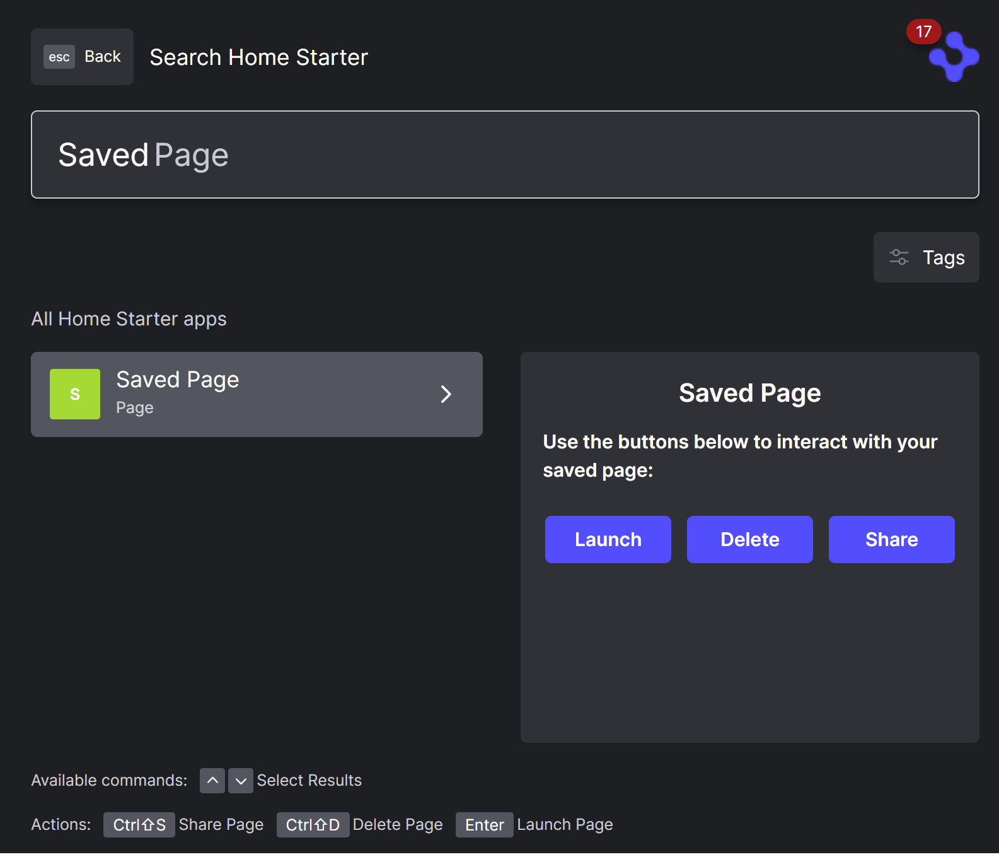

> **_:information_source: OpenFin Workspace:_** [OpenFin Workspace](https://www.openfin.co/workspace/) is a commercial product and this repo is for evaluation purposes (See [LICENSE.MD](../LICENSE.MD)). Use of the OpenFin Container and OpenFin Workspace components is only granted pursuant to a license from OpenFin (see [manifest](../public/manifest.fin.json)). Please [**contact us**](https://www.openfin.co/workspace/poc/) if you would like to request a developer evaluation key or to discuss a production license.
> OpenFin Workspace is currently **only supported on Windows** although you can run the sample on a Mac for development purposes.

[<- Back to Table Of Contents](../README.md)

# What Is Browser Page Management

By default you get the ability to save, rename and delete pages in [Workspace Browser](./how-to-customize-browser.md).

When you **save** a Page it captures the layout (which views are present and how they are laid out) within the page. If your views have created customData this will be included in the layout data of the page (which is what we call the JSON representation of all of this data).

This lets you easily layout arrangements and the applications you work with an assign it a name.

## Where Are Pages Saved?

By default this json data is saved to [IndexedDB](https://developer.mozilla.org/en-US/docs/Web/API/IndexedDB_API). This lets you get up and running without any server requirement for the storage of this data.

## What If I Want To Change Where This Information Is Stored?

A workspace platform lets you override the platform implementation so you can come up with your own function implementations for the saving and fetching of pages. This is called a platform override and the customize workspace implementation exists here: [platform-override.ts](../client/src/framework/platform/platform-override.ts).

Instead of modifying this file directly we allow you to specify the destination and source of pages through config and the definition of [endpoints](./how-to-define-endpoints.md).

Endpoints support an action and request/response function (see [How To Defined Endpoints](./how-to-define-endpoints.md)). Customize workspace checks to see if you have specified the following endpoints:

- page-get
- page-set
- page-remove

We also have some additional endpoints that provide supporting information when a page is saved (such as the height/width and position of the window the page resided in at the point of save):

- page-bounds-get
- page-bounds-set
- page-bounds-remove

If you provide endpoints with these ids then customize workspace will use them instead of the default indexedDB implementation and in the case of the page-bounds endpoints it will capture additional supporting information if these endpoints are defined.

This frees you up to fetch and save your pages from/to anywhere in any way that works for you.

Endpoints have a default **fetch** implementation where you can just point to rest endpoints but you could also have a custom module (see [How To Add A Module](./how-to-add-a-module.md) that implements your own logic.

## Do You Have An Example Of A Custom Implementation?

Our default example manifest ([manifest.fin.json](../public/manifest.fin.json)) doesn't override the default behavior. Our second manifest ([second.manifest.fin.json](../public/second.manifest.fin.json)) loads configuration through a rest endpoint (see [settings.json](../public/settings.json)) and that defines the endpoints listed above in the **endpointProvider** definition.

```json
 "endpointProvider": {
  "modules": [
   {
    "enabled": true,
    "id": "local-storage",
    "url": "http://localhost:8080/js/modules/endpoints/local-storage.bundle.js"
   }
  ],
  "endpoints": [
   {
    "id": "page-get",
    "type": "module",
    "typeId": "local-storage",
    "options": {
     "method": "GET",
     "dataType": "page"
    }
   },
   {
    "id": "page-set",
    "type": "module",
    "typeId": "local-storage",
    "options": {
     "method": "SET",
     "dataType": "page"
    }
   },
   {
    "id": "page-remove",
    "type": "module",
    "typeId": "local-storage",
    "options": {
     "method": "REMOVE",
     "dataType": "page"
    }
   },
   {
    "id": "page-bounds-get",
    "type": "module",
    "typeId": "local-storage",
    "options": {
     "method": "GET",
     "dataType": "page-bounds"
    }
   },
   {
    "id": "page-bounds-set",
    "type": "module",
    "typeId": "local-storage",
    "options": {
     "method": "SET",
     "dataType": "page-bounds"
    }
   },
   {
    "id": "page-bounds-remove",
    "type": "module",
    "typeId": "local-storage",
    "options": {
     "method": "REMOVE",
     "dataType": "page-bounds"
    }
   }
  ]
 },
```

As you can see from the configuration above:

1. A custom endpoint module is defined that saves/gets data and uses localstorage as the source.
2. Each endpoint definition references that module using type and typeId and passes options specific to the particular endpoint.

If you use the live launch section on the [Main Page](../README.md) and launch the second example and save a page you will be able to use dev tools to see that it is saved to localstorage instead of indexedDB. You can then create your own endpoints with custom logic or use our fetch builtin implementation to save and fetch your pages.

## Can I Manage Pages From Home?

We include support for doing page management from home in customize workspace. It is enabled by default as an integration provider.



### I See A Sharing Button, How Is That Configured?

Please see [How To Customize Workspace And Browser Page Sharing](./how-to-customize-workspace-browser-page-sharing.md).

## Source Reference

- [platform-override.ts](../client/src/framework/platform/platform-override.ts)
- [platform-local-storage.ts](../client/src/modules/endpoints/local-storage/platform-local-storage.ts)

[<- Back to Table Of Contents](../README.md)
