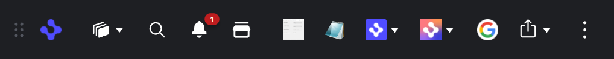

> **_:information_source: OpenFin Workspace:_** [OpenFin Workspace](https://www.openfin.co/workspace/) is a commercial product and this repo is for evaluation purposes (See [LICENSE.MD](../LICENSE.MD)). Use of the OpenFin Container and OpenFin Workspace components is only granted pursuant to a license from OpenFin (see [manifest](../public/manifest.fin.json)). Please [**contact us**](https://www.openfin.co/workspace/poc/) if you would like to request a developer evaluation key or to discuss a production license.
> OpenFin Workspace is currently **only supported on Windows** although you can run the sample on a Mac for development purposes.

[<- Back to Table Of Contents](../README.md)

# How to customize dock ?

The dock component is one of the standard parts of OpenFin workspace, for an in depth look at the component see [Dock Overview](https://developers.openfin.co/of-docs/docs/dock-overview).



The code for the dock can be found in [../client/src/framework/workspace/dock.ts](../client/src/framework/workspace/dock.ts), `register` is called as part of the app bootstrap process and `deregister` during the app closedown. The `show` and `minimize` methods as you would expect change the visibility of the dock on the desktop.

## Enabling the dock

To enable the dock component the following settings in the manifest must be set.

```json
"bootstrap": {
    "dock": true
}
```

You can also add `dock` to `bootstrap:autoShow` to make the dock appear when the app launches.

For more details on the bootstrapping process see [./how-to-customize-the-bootstrapping-process.md](./how-to-customize-the-bootstrapping-process.md)

## Configuring the dock

All of the dock specific configuration options are stored in `dockProvider`

As with the other workspace components you can set the `id`, `title` and `icon` used when the platform launches the dock e.g.

```json
"dockProvider": {
    "id": "customize-workspace",
    "title": "Home Starter",
    "icon": "http://localhost:8080/favicon.ico"
}
```

The dock component has some built in buttons for `Home`, `Workspaces`, `Notification Center` and `Storefront`, they can be shown/hidden with the following options.

```json
"dockProvider": {
    "workspaceComponents": {
        "hideHomeButton": false,
        "hideWorkspacesButton": false,
        "hideNotificationsButton": false,
        "hideStorefrontButton": false
    }
}
```

The rest of the elements shown on the dock are configured in one of two sections, `apps` or `buttons`.

## App entries

The `apps` can be used to show dock entries based on `apps` configured from your app provider (see [./how-to-define-apps.md](./how-to-define-apps.md)). This provides a convenient shortcut with minimum configuration to launch apps that you have already provided from your app source.

The dock can display either single buttons, or a drop down menu. You can override the icon and tooltip for the buttons, but by default they will use the metadata from the app definition. Each entry can pull apps from multiple tagged items.

To add single buttons for all apps tagged with `dock` you would add the following configuration.

```json
"dockProvider": {
    "apps": [
        {
            "display": "individual",
            "tags": ["dock"]
        }
    ]
}
```

To add a drop down containing all the apps tagged with `fdc3` you would add the following configuration. If you don't specify an `iconUrl` or `tooltip` for a group it will default to using the values from the first entry in the group, in this example we override the `tooltip`.

```json
"dockProvider": {
    "apps": [
        {
            "display": "group",
            "tooltip": "FDC3",
            "tags": ["fdc3"]
        }
    ]
}
```

In this second group example we override both the `tooltip` and `iconUrl` and it also uses the apps tagged with either `manager` or `feedback`.

```json
"dockProvider": {
    "apps": [
        {
            "display": "group",
            "tooltip": "Manager",
            "iconUrl": "http://localhost:8080/common/images/icon-gradient.png",
            "tags": ["manager", "feedback"]
        }
    ]
}
```

## Button entries

The `buttons` provide more flexibility than the `apps` and can be used to show dock entries which can launch apps or custom actions.

If you specify an `appId` it is looked up from your apps provider and is launched on the button click.

```json
"dockProvider": {
    "buttons": [
        {
            "tooltip": "My App",
            "iconUrl": "http://localhost:8080/favicon.ico",
            "appId": "my-app"
        }
    ]
}
```

To launch a custom action you instead specify its `id`, and the `customData` specific to that action. For more information on custom actions see [How to add custom actions](./how-to-add-custom-actions-for-menus-and-buttons.md).

```json
"dockProvider": {
    "buttons": [
        {
            "tooltip": "Google",
            "iconUrl": "https://www.google.com/favicon.ico",
            "action": {
                "id": "launch-view",
                "customData": {
                    "url": "https://www.google.com"
                }
            }
        }
    ]
}
```

If you want to configure a drop down menu instead of a single button you can use the following pattern. Where each of the options is configured with either `appId` or `action` in the same way as the single button elements above. The `tooltip` and `iconUrl` must be specified for a drop down.

```json
"dockProvider": {
    "buttons": [
        {
            "tooltip": "Social",
            "iconUrl": "http://localhost:8080/common/icons/share.svg",
            "options": [
                {
                    "tooltip": "Twitter",
                    "action": {
                        "id": "launch-view",
                        "customData": {
                            "url": "https://twitter.com/openfintech"
                        }
                    }
                },
                {
                    "tooltip": "YouTube",
                    "action": {
                        "id": "launch-view",
                        "customData": {
                            "url": "https://www.youtube.com/user/OpenFinTech"
                        }
                    }
                }
            ]
        }
    ]
}
```
