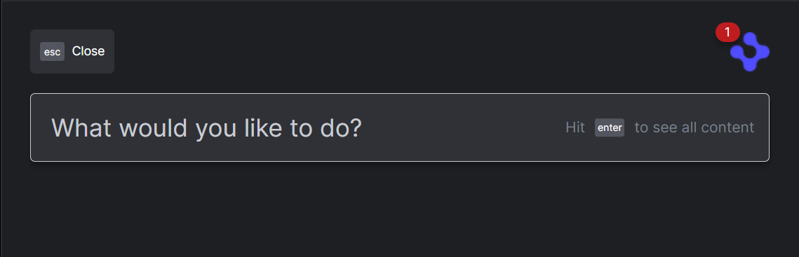
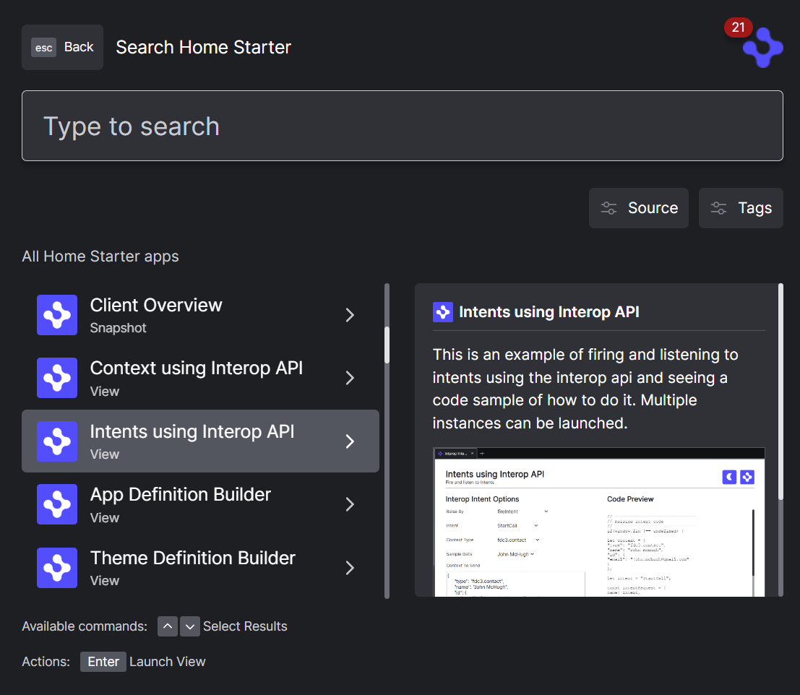
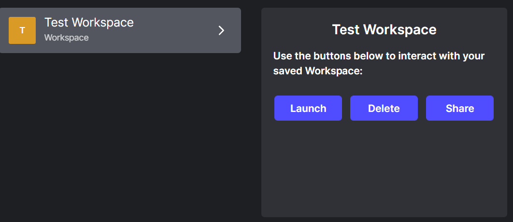
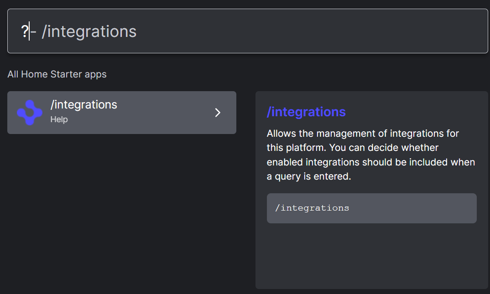
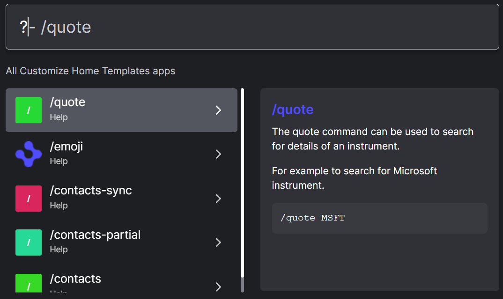

> **_:information_source: OpenFin Workspace:_** [OpenFin Workspace](https://www.openfin.co/workspace/) is a commercial product and this repo is for evaluation purposes (See [LICENSE.MD](../LICENSE.MD)). Use of the OpenFin Container and OpenFin Workspace components is only granted pursuant to a license from OpenFin (see [manifest](../public/manifest.fin.json)). Please [**contact us**](https://www.openfin.co/workspace/poc/) if you would like to request a developer evaluation key or to discuss a production license.
> OpenFin Workspace is currently **only supported on Windows** although you can run the sample on a Mac for development purposes.

[<- Back to Table Of Contents](../README.md)

# How to customize home ?

The home component is one of the standard components of OpenFin workspace, for an in depth look at the component see [Home Overview](https://developers.openfin.co/of-docs/docs/cli-providers).



The code for the home can be found in [../client/src/framework/workspace/home.ts](../client/src/framework/workspace/home.ts), `register` is called as part of the app bootstrap process and `deregister` during the app closedown. The `show` and `hide` methods as you would expect change the visibility of the home on the desktop.

## Enabling home

To enable the home component the following settings in the manifest must be set.

```json
"bootstrap": {
    "home": true
}
```

You can also add `home` to `bootstrap:autoShow` to make the home appear when the app launches.

For more details on the bootstrapping process see [./how-to-customize-the-bootstrapping-process.md](./how-to-customize-the-bootstrapping-process.md)

## Configuring home

All of the home specific configuration options are stored in `homeProvider`

As with the other workspace components you can set the `id`, `title` and `icon` used when the platform launches home e.g.

```json
"homeProvider": {
    "id": "customize-workspace",
    "title": "Home Starter",
    "icon": "http://localhost:8080/favicon.ico"
}
```

There are additional options that can be set which are used when the user types in a query in the home component.

The `queryMinLength` setting determines the shortest input that will illicit a response from the result sources. The `queryAgainst` property specifies which properties of the source entries should be searched during matching.

For example, to only show results after a minimum of 3 characters have been entered, and to only search in the `title` field of the sources, we could use the following configuration.

```json
"homeProvider": {
    ...
    "queryMinLength": 3,
    "queryAgainst": ["title"]
}
```

There are some additional flags in the home configuration which can be used to turn on and off specific features.

`enablePageIntegration` will enable listing, launching, deleting and sharing commands for interacting with Pages.
`enableWorkspaceIntegration` will enable listing, launching, deleting and sharing commands for interacting with Workspaces and also the ability to save the current layout as a workspace using the `/w` command.

Sharing for pages and workspaces will only be available if the `platformProvider.sharing` flag is enabled.

```json
"homeProvider": {
    ...
    "enablePageIntegration": true,
    "enableWorkspaceIntegration": true
}
```

## Sources and results

The sources that provide the results for the home components fall into 2 categories, `apps`, `commands` and `search` results.

- `Apps` are retrieved from the app sources configured for the platform, see [How To Define Apps](./how-to-define-apps.md)
- `Commands` are fixed entries, there are some built-in like `/dock`, `/store`, `/notifications`, but these can be extended using custom commands, see [How to Add Integrations to Home](./how-to-add-integrations-to-home.md)
- `Search` entries can be used to provide results from search and other endpoints, see [How to Add Integrations to Home](./how-to-add-integrations-to-home.md)

Apps use a fixed template for display as a search result:



Whereas commands and search entries can have custom templates with richer layouts:



## Integration management

The integrations for both `command` and `dynamic` results by default will start automatically if enabled in configuration. You can introduce finer grained control of this feature by enabling integration management. When this option is enabled you have the option to enable/disable integrations through home commands. The state of an integration is stored in local storage for the platform, so that when you restart the platform only the modules which are enabled will be initialized.

You can use the `/integrations` command to determine which modules are available.

```json
"homeProvider": {
    ...
   "isManagementEnabled": true,
   "command": "integrations",
   "commandDescription": "Allows the management of integrations for this platform. You can decide whether enabled integrations should be included when a query is entered.",
}
```



## Help query

Both `command` and `dynamic` integrations can additionally provide help entries, the help entries are retrieved from an integration when entering `?` into the query box.



## Source reference

- [home.ts](../client/src/framework/workspace/home.ts)
