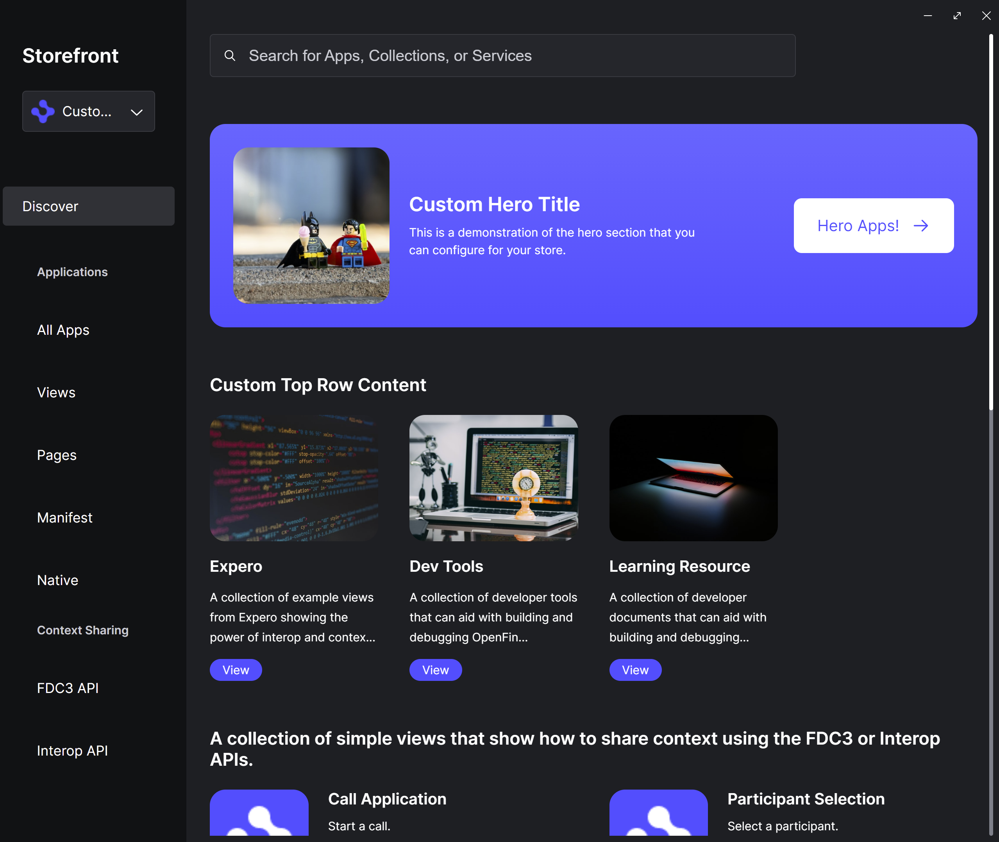

> **_:information_source: OpenFin Workspace:_** [OpenFin Workspace](https://www.openfin.co/workspace/) is a commercial product and this repo is for evaluation purposes (See [LICENSE.MD](../LICENSE.MD)). Use of the OpenFin Container and OpenFin Workspace components is only granted pursuant to a license from OpenFin (see [manifest](../public/manifest.fin.json)). Please [**contact us**](https://www.openfin.co/workspace/poc/) if you would like to request a developer evaluation key or to discuss a production license.
> OpenFin Workspace is currently **only supported on Windows** although you can run the sample on a Mac for development purposes.

[<- Back to Table Of Contents](../README.md)

# How To Customize Store

Customize workspace has a way of defining your store through configuration (**storefrontProvider**) that can either be inside of your manifest e.g. [manifest.fin.json](../public/manifest.fin.json) or within a JSON response returned by a server e.g. [settings.json](../public/settings.json).

The approach that we have taken is that you define your landing page properties (sections, titles, images) and rather than directly link specific applications you specify tags that will be used to pull in applications for each part of the store. You are then free to tag applications and have them automatically appear in relevant sections of the store.

## What Does The Storefront Configuration Look Like

```json
"storefrontProvider": {
   "id": "customize-workspace",
   "title": "Custom Storefront",
   "icon": "http://localhost:8080/favicon.ico",
   "landingPage": {
    "hero": {
     "title": "Custom Hero Title",
     "description": "This is a demonstration of the hero section that you can configure for your store.",
     "cta": {
      "title": "Hero Apps!",
      "tags": ["hero"]
     },
     "image": {
      "src": "http://localhost:8080/common/images/superhero-unsplash.jpg"
     }
    },
    "topRow": {
     "title": "Custom Top Row Content",
     "items": [
      {
       "title": "Expero",
       "description": "A collection of example views from Expero showing the power of interop and context sharing.",
       "image": {
        "src": "http://localhost:8080/common/images/coding-1-unsplash.jpg"
       },
       "tags": ["expero"]
      },
      {
       "title": "Dev Tools",
       "description": "A collection of developer tools that can aid with building and debugging OpenFin applications.",
       "image": {
        "src": "http://localhost:8080/common/images/coding-2-unsplash.jpg"
       },
       "tags": ["tools"]
      },
      {
       "title": "Learning Resource",
       "description": "A collection of developer documents that can aid with building and debugging OpenFin applications.",
       "image": {
        "src": "http://localhost:8080/common/images/coding-3-unsplash.jpg"
       },
       "tags": ["page"]
      }
     ]
    },
    "middleRow": {
     "title": "A collection of simple views that show how to share context using the FDC3 or Interop APIs.",
     "tags": ["fdc3", "interop"]
    },
    "bottomRow": {
     "title": "Quick Access",
     "items": [
      {
       "title": "Views",
       "description": "A collection of views made available through our catalog.",
       "image": {
        "src": "http://localhost:8080/common/images/coding-4-unsplash.jpg"
       },
       "tags": ["view"]
      },
      {
       "title": "Web Apps",
       "description": "A collection of web apps built using OpenFin.",
       "image": {
        "src": "http://localhost:8080/common/images/coding-5-unsplash.jpg"
       },
       "tags": ["manifest"]
      },
      {
       "title": "Native Apps",
       "description": "A collection of native apps made available through our catalog.",
       "image": {
        "src": "http://localhost:8080/common/images/coding-6-unsplash.jpg"
       },
       "tags": ["native"]
      }
     ]
    }
   },
   "navigation": [
    {
     "title": "Applications",
     "items": [
      {
       "title": "All Apps",
       "tags": ["view", "page", "manifest", "native"]
      },
      {
       "title": "Views",
       "tags": ["view"]
      },
      {
       "title": "Pages",
       "tags": ["page"]
      },
      {
       "title": "Manifest",
       "tags": ["manifest"]
      },
      {
       "title": "Native",
       "tags": ["native"]
      }
     ]
    },
    {
     "title": "Context Sharing",
     "items": [
      {
       "title": "FDC3 API",
       "tags": ["fdc3"]
      },
      {
       "title": "Interop API",
       "tags": ["interop"]
      }
     ]
    }
   ],
   "footer": {
    "logo": {
     "src": "http://localhost:8080/favicon.ico",
     "size": "32"
    },
    "text": "Welcome to the OpenFin Sample Footer",
    "links": [
     {
      "title": "Github",
      "url": "https://github.com/built-on-openfin/workspace-starter"
     },
     {
      "title": "YouTube",
      "url": "https://www.youtube.com/user/OpenFinTech"
     }
    ]
   }
  },
```

## What Does Store Look Like?



## What Are The Available Settings For The Store Provider

| Property                                   | Description                                                                                                                                                                                                                                          |
| ------------------------------------------ | ---------------------------------------------------------------------------------------------------------------------------------------------------------------------------------------------------------------------------------------------------- |
| **storefrontProvider**                     | Config settings that are used by the sample code to configure the store using the workspace APIs                                                                                                                                                     |
| id                                         | Unique ID for your store                                                                                                                                                                                                                             |
| title                                      | The name for your store that will be shown in the store selection dropdown                                                                                                                                                                           |
| icon                                       | The icon to show in the store selection dropdown                                                                                                                                                                                                     |
| landingPage                                | The structure of the main page the user will be presented with when they visit your store                                                                                                                                                            |
| landingPage.hero                           | Optional. Do you want a hero section on the main page.                                                                                                                                                                                               |
| landingPage.hero.title                     | Title to show on the hero section                                                                                                                                                                                                                    |
| landingPage.hero.description               | Description to show under the hero title                                                                                                                                                                                                             |
| landingPage.hero.image.src                 | The path to the image that should be shown in the hero section                                                                                                                                                                                       |
| landingPage.cta                            | Call to action configuration section                                                                                                                                                                                                                 |
| landingPage.cta.id                         | A unique id that represents the page id to render the available [apps](./how-to-define-apps.md) (if not filled the title is used to create a key)                                                                                                    |
| landingPage.cta.title                      | Text to display on the call to action button                                                                                                                                                                                                         |
| landingPage.cta.tags                       | Array of string tags that will be used to lookup and list applications with the same tag                                                                                                                                                             |
| landingPage.topRow                         | What do you want this row to be called and how many sections do you want (use tags to determine what [apps](./how-to-define-apps.md) are included in this section). Limit of 4 sections.                                                             |
| landingPage.topRow.title                   | Title for the top row.                                                                                                                                                                                                                               |
| landingPage.topRow.items[i].id             | A unique id that represents this page of items. This id should not change during a session. If not provided then the title is used.                                                                                                                  |
| landingPage.topRow.items[i].title          | Title for the section.                                                                                                                                                                                                                               |
| landingPage.topRow.items[i].description    | Description of the section.                                                                                                                                                                                                                          |
| landingPage.topRow.items[i].image.src      | The path to the image to display for this section.                                                                                                                                                                                                   |
| landingPage.topRow.items[i].tags           | An array of tags that will be matched against the returned [apps](./how-to-define-apps.md).                                                                                                                                                          |
| landingPage.middleRow                      | What do you want this row to be called and what [apps](./how-to-define-apps.md) do you want to show in the middle (use tags to determine what [apps](./how-to-define-apps.md) are included in this row). Limit of 6 [apps](./how-to-define-apps.md). |
| landingPage.middleRow.title                | The title to display for the middle row [apps](./how-to-define-apps.md).                                                                                                                                                                             |
| landingPage.middleRow.tags                 | An array of tags that will be used to fetch [apps](./how-to-define-apps.md) from the [apps](./how-to-define-apps.md) list. Only the first 6 will be used.                                                                                            |
| landingPage.bottomRow                      | What do you want this row to be called and how many sections do you want (use tags to determine what apps are included in this section). There is a limit of 3 sections.                                                                             |
| landingPage.bottomRow.title                | Title for the bottom row.                                                                                                                                                                                                                            |
| landingPage.bottomRow.items[i].id          | A unique id that represents this page of items. This id should not change during a session. If not provided then the title is used.                                                                                                                  |
| landingPage.bottomRow.items[i].title       | Title for the section.                                                                                                                                                                                                                               |
| landingPage.bottomRow.items[i].description | Description of the section.                                                                                                                                                                                                                          |
| landingPage.bottomRow.items[i].image.src   | The path to the image to display for this section.                                                                                                                                                                                                   |
| landingPage.bottomRow.items[i].tags        | An array of tags that will be matched against the returned [apps](./how-to-define-apps.md).                                                                                                                                                          |
| navigation                                 | How many navigation sections do you want on the left hand menu? Limit of 2.                                                                                                                                                                          |
| navigation[i].id                           | A unique id that represents the page that this link will point to. Should remain the same throughout the session. If not provided then the title is used to generate the id.                                                                         |
| navigation[i].title                        | What do you want as a title for these set of links?                                                                                                                                                                                                  |
| navigation[i].items                        | How many links do you want to show (limit of 5) and what [apps](./how-to-define-apps.md) do you want a link to display (use tags to select [apps](./how-to-define-apps.md))                                                                          |
| navigation[i].items[i].id                  | A unique id that represents the page that this link goes to. Title is used if not provided. This id should not change during a user session.                                                                                                         |
| navigation[i].items[i].title               | The title for this link entry.                                                                                                                                                                                                                       |
| navigation[i].items[i].tags                | An array of tags that will be mapped against the list of [apps](./how-to-define-apps.md) to determine what [apps](./how-to-define-apps.md) should show when a user clicks the link.                                                                  |
| footer                                     | What do you want to show in the store footer                                                                                                                                                                                                         |
| footer.logo                                | The logo to show in the footer                                                                                                                                                                                                                       |
| footer.text                                | The text to show in the footer                                                                                                                                                                                                                       |
| footer.links                               | What links do you want to show in the footer (opens up using the default web browser.                                                                                                                                                                |

## Where Does The Search Results In Store Come From?

It comes from the list of all the [applications](./how-to-define-apps.md) that the user is [entitled](./how-to-apply-entitlements.md) to.

## Anything Else?

The [manifest.fin.json](../public/manifest.fin.json)/[settings.json](../public/settings.json) configuration for the storefront does not include an `id` for the `cta`, `items` and `navigation` sections.

This is to reduce noise in the example manifest and to prevent issues if an item or section is copied and pasted. The code has a fallback that uses the title or title plus tags to form an `id`. This works for the demo, as the manifest file is storing the configuration. If the configuration were ever fetched from a server, then it should return a unique (e.g., GUID) and idempotent ID.

This is because the `id` represents the route that the user navigates to. So, if an `id` for a navigation item was "x" and the user clicked on the link, then the store would call the `getNavigation()` or `getLandingPage()` function and look for a matching `id` of "x". If you regenerate the `id` for a navigation item, e.g., it becomes "y", then the store would not be able to render your page, as there are no items with the `id` of "x".

## Source Reference

- [store.ts](../client/src/framework/workspace/store.ts)
- [framework-shapes.ts](../client/src/framework/shapes/framework-shapes.ts) - Contains store related shapes.

[<- Back to Table Of Contents](../README.md)
