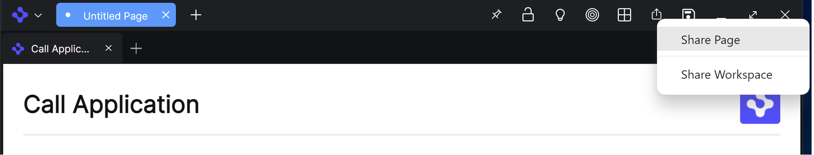
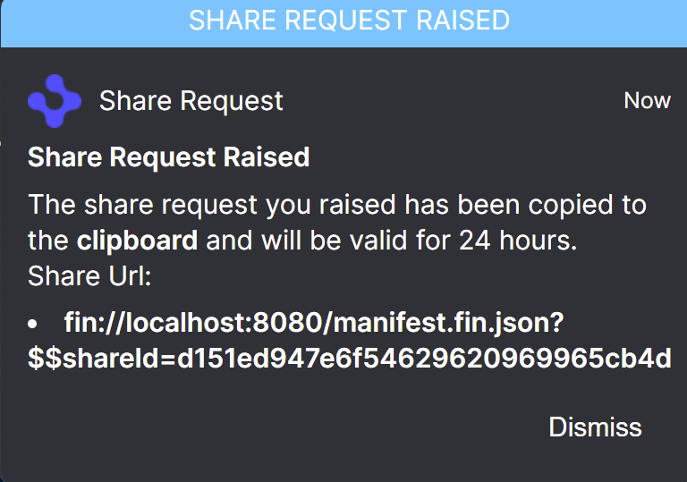
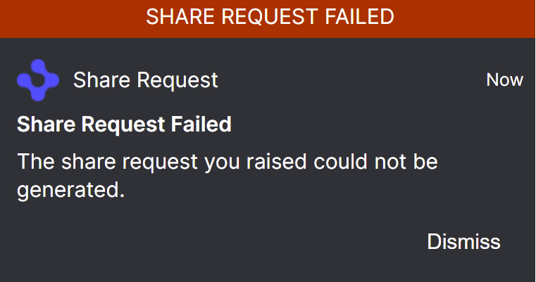
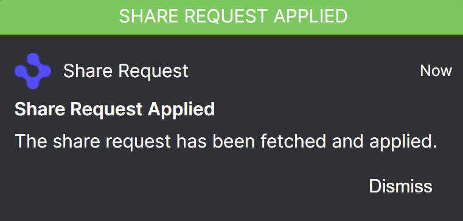
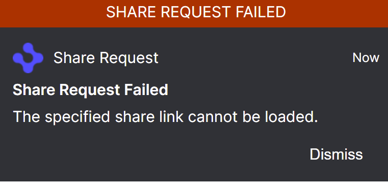

> **_:information_source: OpenFin Workspace:_** [OpenFin Workspace](https://www.openfin.co/workspace/) is a commercial product and this repo is for evaluation purposes (See [LICENSE.MD](../LICENSE.MD)). Use of the OpenFin Container and OpenFin Workspace components is only granted pursuant to a license from OpenFin (see [manifest](../public/manifest.fin.json)). Please [**contact us**](https://www.openfin.co/workspace/poc/) if you would like to request a developer evaluation key or to discuss a production license.
> OpenFin Workspace is currently **only supported on Windows** although you can run the sample on a Mac for development purposes.

[<- Back to Table Of Contents](../README.md)

# What Is Sharing?

Sharing is the ability for one user to generate a link that they can share with another user. On launching of the link then the workspace or page that was shared would be applied to the second user's desktop.

# How Can You Enable/Disable Sharing?

Sharing can be enabled/disabled through the platform provider configuration:

```json
"platformProvider": {
  ...
  "sharing": true,
  ...
},
```

# Where Is This Setting Used?

## As A Condition For A Sharing Button

It is used when you define a browser button (see [How To Customize Browser Buttons](./how-to-customize-browser-buttons.md)) to allow your users to share and use conditions:

```json
"browserProvider": {
  ...
  "toolbarButtons": [
   ...,
   {
    "include": true,
    "id": "share",
    "themes": {
     "Light": "http://localhost:8080/common/icons/share-dark.svg"
    },
    "button": {
     "type": "Custom",
     "tooltip": "Share",
     "disabled": false,
     "iconUrl": "http://localhost:8080/common/icons/share.svg",
     "action": {
      "id": "share",
      "customData": {}
     }
    },
    "conditions": ["sharing"]
   },
   ...
  ]
 },

```

Here you can see that you can change the icon and tooltip for the share button. You should however keep the action and the condition the same unless you want to replace it with your own implementation.

This would give you the following icon and menu in the browser:



## If You Have Opted Into Home Workspace Or Page Management

If you have enabled workspace management (see [How To Customize Workspace Management](./how-to-customize-workspace-management.md)) or page management (see [How To Customize Browser Page Management](./how-to-customize-browser-page-management.md)) through home then the template will check to see if it should provide the option of sharing the workspace/page.

# Where Are Shared Workspaces/Pages Saved?

By default in our two examples we save the json data to an OpenFin cloud service. This is because you need a server in order to be able to demonstrate this capability.

This service is not for production use and all saves are cleared after 24 hours. Please contact OpenFin if you would like to talk about this service.

The service is configured via endpoints (see [How To Define Endpoints](./how-to-define-endpoints.md)). The examples have the following defined:

```json
 "endpointProvider": {
  "modules": [

  ],
  "endpoints": [
   {
    "id": "share-get",
    "type": "fetch",
    "options": {
     "method": "GET",
     "url": "https://workspace.openfin.co/api/share/[id]"
    }
   },
   {
    "id": "share-save",
    "type": "fetch",
    "options": {
     "method": "POST",
     "url": "https://workspace.openfin.co/api/share"
    }
   }
  ]
 },

```

Endpoints support an action and request/response function (see [How To Define Endpoints](./how-to-define-endpoints.md)). Customize workspace checks to see if you have specified the following endpoints when implementing sharing:

- share-get
- share-save

You can see we are using the default built in fetch support and passing fetch options via config.

Endpoints have a default **fetch** implementation where you can just point to rest endpoints but you could also have a custom module (see [how to add a module](./how-to-add-a-module.md) that implements your own logic.

## What Would The Share-Save Endpoint Need To Support?

### Request To Your Endpoint For Sharing A Page

Layout would be an object representing the page layout. It has been omitted to keep the snippet small:

```json
{
  "type": "page",
  "data": {
    "page": {
      "pageId": "0054ed07-4558-4600-a3ad-ddd6861d5eb8",
      "title": "Untitled Page",
      "layout": {}
    },
    "bounds": {
      "bottom": 583,
      "height": 500,
      "left": 574,
      "right": 1374,
      "top": 83,
      "width": 800
    }
  }
}
```

### Request To Your Endpoint For Sharing A Workspace

The snapshot is a workspace platform snapshot. MonitorInfo and Window details have been omitted for brevity.

```json
{
    "type": "workspace",
    "data": {
        "snapshot": {
            "snapshotDetails": {
                "timestamp": "2022-09-21T19:16:59.461Z",
                "runtimeVersion": "26.102.71.7",
                "monitorInfo": { ... },
            "windows": [
                { ... }
            ],
            "interopSnapshotDetails": {
                "contextGroupStates": {
                    "green": {},
                    "purple": {},
                    "orange": {},
                    "red": {},
                    "pink": {},
                    "yellow": {}
                }
            }
        }
    }
}
```

### Response From Your Endpoint

Your server should return a response in the following format:

```json
{ "id": "UniqueIDRepresentingSavedShare" }
```

or

```json
{ "url": "https://workspace.openfin.co/api/share/UniqueIDRepresentingSavedShare" }
```

**Customize Workspace** will use the id if provided or will fall back to trimming the id from the returned **url**. The id will be passed to the endpoint that you have defined for **share-get**.

### What Would The User See After Raising A Share Request?

When a share is successful or fails we use notifications to let the user know.



The url copied to the clipboard would be the url for your platform (it is localhost here as that was the environment used for the screenshot).

If a share is unsuccessful the user will see a notification:



## What Would The Share-Get Endpoint Need To Support?

### Request To Your Endpoint For Getting Share Data

You can decide if this is going to be a get request or a post. The example we have configured as share-get swaps out [id] for the id passed via the fins link or you could create your own custom endpoint to take the id and apply it in any way you want.

```json
https://workspace.openfin.co/api/share/UniqueIDRepresentingSavedShare
```

### Response Expected From Customize Workspace For A Shared Page

Layout would be an object representing the page layout. It has been omitted to keep the snippet small:

```json
{
    "id": "UniqueIDRepresentingSavedShare",
    "createdAt": "2022-09-21T19:01:10.280Z",
    "type": "page",
    "data": {
        "page": {
            "pageId": "0054ed07-4558-4600-a3ad-ddd6861d5eb8",
            "title": "Untitled Page",
            "layout": { ... }
        },
        "bounds": {
            "bottom": 583,
            "height": 500,
            "left": 574,
            "right": 1374,
            "top": 83,
            "width": 800
        }
    }
}
```

Here you can see that the response is similar to the request to share. The id you provided and a createdAt entry is returned as well.

### Response Expected From Customize Workspace For A Shared Workspace

The snapshot is a workspace platform snapshot. MonitorInfo and Window details have been omitted for brevity.

```json
{
    "id": "UniqueIDRepresentingSavedShare",
    "createdAt": "2022-09-21T19:17:00.201Z",
    "type": "workspace",
    "data": {
        "snapshot": {
            "snapshotDetails": {
                "timestamp": "2022-09-21T19:16:59.461Z",
                "runtimeVersion": "26.102.71.7",
                "monitorInfo": { ... },
            },
            "windows": [
                { ... }
            ],
            "interopSnapshotDetails": {
                "contextGroupStates": {
                    "green": {},
                    "purple": {},
                    "orange": {},
                    "red": {},
                    "pink": {},
                    "yellow": {}
                }
            }
        }
    }
}
```

Here you can see that the response is similar to the request to share. The id you provided and a createdAt entry is returned as well.

### What Would The User See After Applying A Share Request Via The Fins Link?

If the share was applied successfully they would see the page/workspace launch and receive a notification:



If there is a problem fetching or applying the share then the user will be notified through a notification.



## Source Reference

- [share.ts](../client/src/framework/share.ts)

[<- Back to Table Of Contents](../README.md)
