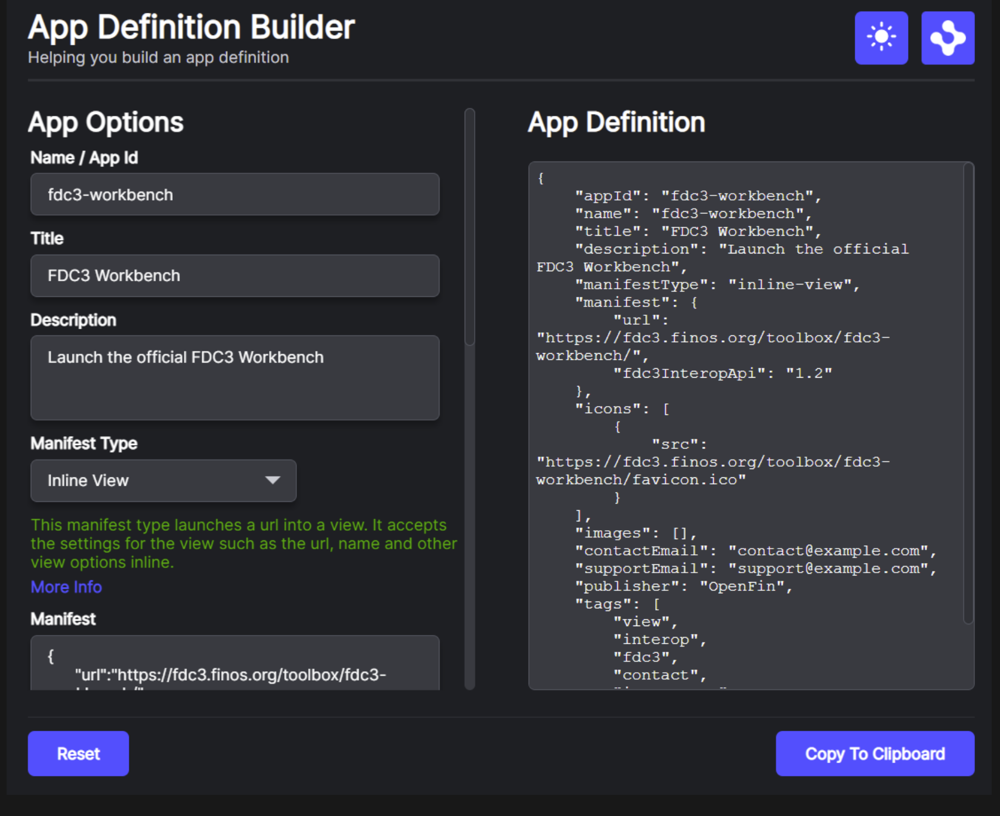

> **_:information_source: OpenFin Workspace:_** [OpenFin Workspace](https://www.openfin.co/workspace/) is a commercial product and this repo is for evaluation purposes (See [LICENSE.MD](../LICENSE.MD)). Use of the OpenFin Container and OpenFin Workspace components is only granted pursuant to a license from OpenFin (see [manifest](../public/manifest.fin.json)). Please [**contact us**](https://www.openfin.co/workspace/poc/) if you would like to request a developer evaluation key or to discuss a production license.
> OpenFin Workspace is currently **only supported on Windows** although you can run the sample on a Mac for development purposes.

[<- Back to Table Of Contents](../README.md)

# How To Define Apps

An App definition for a workspace platform is based on the FDC3 1.2 App definition with some additional extensions (such as tags).

Using customize workspace an app definition can easily be added to an [apps.json](../public/apps.json) file and it will be automatically picked up alongside a collection of [common apps](../../common/public/apps.json).

## What Does An App Definition Look Like?

```json
{
        "appId": "fdc3-workbench",
        "name": "fdc3-workbench",
        "title": "FDC3 Workbench",
        "description": "Launch the official FDC3 Workbench",
        "manifest": "http://localhost:8080/common/views/fdc3/workbench/fdc3-workbench-view.json",
        "manifestType": "view",
        "icons": [
            {
                "src": "https://fdc3.finos.org/toolbox/fdc3-workbench/favicon.ico"
            }
        ],
        "contactEmail": "contact@example.com",
        "supportEmail": "support@example.com",
        "publisher": "OpenFin",
        "intents": [
            {
                "name": "ViewContact",
                "displayName": "View Contact",
                "contexts": ["fdc3.contact"],
                "customConfig": {}
            },
            {
                "name": "ViewInstrument",
                "displayName": "View Instrument",
                "contexts": ["fdc3.instrument"],
                "customConfig": {}
            }
        ],
        "images": [
            {
                "src": "http://localhost:8080/common/images/previews/fdc3-workbench.png"
            }
        ],
        "tags": ["view", "interop", "fdc3", "contact", "instrument"]
    },
```

The following fields are mandatory:

- appId - helps identify the application in platform
- name - serves a similar purpose to appId
- title - used to identify the app when searching or browsing
- manifestType - what type of application is this (this can be extended by a platform and customize-workspace supports a number of manifestTypes)
- manifest - this can be a url to a json endpoint or it can be a JSON object. Customize uses the manifest type inline-\* to indicate when the intention is to pass the payload directly.

The rest of the fields are self explanatory but the intents array deserves more detail.

## Intents

An application can specify that it supports being launched to support certain workflows. These are defined as intents.

There are a number of intents supported by the FDC3 standard (ViewContact and ViewInstrument are shown in the example above) but you can also define custom intents for your organization. If your app meta data specifies that it supports an intent then it should listen for that intent and react to it. We cover more in the [How To Add Intent Support To Your App](./how-to-add-intent-support-to-your-app.md).

If a second application raises an intent then the workspace platform will check to see if any applications support the workflow. If only one app entry supports it then the platform will launch it. If there is more than one option then it will present the list of options to the end user. You can customize the UI presented to the user and we will cover that in the [How To Configure FDC3 Intents Page](./how-to-configure-fdc3-intents.md).

## How To Create An App Definition

### Manually

To create an app definition you could simply copy the json object above modify it and add it to [apps.json](../public/apps.json).

### Using The App Definition Builder

If you launch the default instance of customize-workspace either locally or from the live launch section of our main [README.md](../README.md) then you will be able to type App Definition Builder into home and you will be presented with a UI to help you build the JSON. You can also type Getting Started if you want to see App Definition Builder alongside other utility apps.



> **_:information_source: Manifest Types:_** If you use App Definition builder it will offer you a drop down of the manifest types supported (otherwise please see the list of supported manifest types below). If you are defining a view (url to load into browser) or a window (without the OpenFin Browser chrome) then there is the option of embedding the settings when you specify the manifest property. These would either be [Window Options](https://developer.openfin.co/docs/javascript/stable/Window.html#~options) or [View Options](https://developer.openfin.co/docs/javascript/stable/View.html#~options). If you are simply using window or view then the manifest setting should point to a url that provides the settings in JSON format.

### Manifest Types

Customize workspace supports the following manifest types (for the list in code please see [manifest-types.ts](../client/src/framework/manifest-types.ts)):

- **view** : This manifest type expects the manifest setting to be pointed to a json file that contains view options.
- **inline-view**: This manifest type expects the manifest setting to have the options inline rather than a url to a json file.
- **window**: This manifest type expects the manifest setting to point to a json file that contains classic window options.
- **inline-window**: This manifest type expects the manifest setting to have the classic window options inline rather than a url to a json file.
- **external**: This manifest type expects the manifest setting to point to an exe or an app asset name. This requires launch External Process permissions to be enabled see [How To Secure Your Platform](./how-to-secure-your-platform.md).
- **inline-external**: this manifest type expects the manifest setting to point to an exe or an app asset name using an inline launch external process request. This requires launch External Process permissions to be enabled see [How To Secure Your Platform](./how-to-secure-your-platform.md).
- **snapshot**: This manifest type expects the manifest setting to point to a json file that contains a snapshot (one or more windows)
- **manifest**: This manifest type expects the manifest setting to point to a json file that is an openfin manifest. An openfin app.
- **desktop-browser**: This manifest type expects the manifest setting to point to a url which will be launched in the default desktop browser.
- **endpoint**: An endpoint (see [How To Define Endpoints](./how-to-define-endpoints.md)) is a generic target that supports an action or a request/response. This custom endpoint will be passed the app definition to the action implementation. What happens after that point is down to your own implementation. It is one way of extending launch behavior should you need to.
- **connection**: A connected app (see [How To Manage Connections To Your Platform](./how-to-manage-connections-to-your-platform.md)) could have provided a list of child views that can be launched from home. If a selection is made against one of these entries then it will be sent to the connected app in order for it to launch the requested view.

## How To Configure The AppProvider For Your Platform

The app provider definition can either come from your manifest or from an external settings service (see [How To Apply Entitlements](./how-to-apply-entitlements.md) and an example is available via [second.manifest.fin.json](../public/second.manifest.fin.json) and [settings.json](../public/settings.json)). The available settings are as follows:

| Property                                  | Description                                                                                                                                                                                                                                                                                                                                                                                                                                                                                                                            |
| ----------------------------------------- | -------------------------------------------------------------------------------------------------------------------------------------------------------------------------------------------------------------------------------------------------------------------------------------------------------------------------------------------------------------------------------------------------------------------------------------------------------------------------------------------------------------------------------------- |
| **appProvider**                           | Config related to where the apps should be fetched from                                                                                                                                                                                                                                                                                                                                                                                                                                                                                |
| appsSourceUrl (legacy)                    | Where should we fetch the apps from. It is a url or an array of urls from which to get apps data from. If present it will be used instead of endpointIds (shown below).                                                                                                                                                                                                                                                                                                                                                                |
| includeCredentialOnSourceRequest (legacy) | Should we include credentials when doing the search request. Options: "omit", "same-origin", "include". Used when appsSourceUrl is specified.                                                                                                                                                                                                                                                                                                                                                                                          |
| endpointIds                               | An array of endpoint ids that should be used to request a list of apps (this replaces appsSourceUrl) or an object that provides an "inputId" and "outputId". If specified then the platform will fetch a response from an inputId endpoint and then pass it to the outputId endpoint which will return a list of Apps in the format we expect (this can be used to map app directories if the app directory supports a specific format e.g. fdc3 or custom and you decide to map that on the client side rather than the server side). |
| cacheDurationInMinutes                    | How many minutes should we wait before refreshing the list from the server? Can be used on it's own or with cacheDurationInSeconds.                                                                                                                                                                                                                                                                                                                                                                                                    |
| cacheDurationInSeconds                    | How many seconds should we wait before refreshing the list from the server? Can be used on it's own or with cacheDurationInMinutes.                                                                                                                                                                                                                                                                                                                                                                                                    |
| appAssetTag                               | If including app assets in your manifest, what tag in the app definition will highlight this manifestType:"external" is actually an app asset and shouldn't be run from a path? If undefined then appasset is assumed                                                                                                                                                                                                                                                                                                                  |
| manifestTypes                             | An array of the manifestTypes the app should support from the apps.json feed                                                                                                                                                                                                                                                                                                                                                                                                                                                           |

### An Example Of What These Settings Would Look Like (Taken From [manifest.fin.json](../public/manifest.fin.json))

```json
    "appProvider": {
            "endpointIds": ["apps-get", "common-apps-get"],
            "cacheDurationInSeconds": 10,
            "cacheDurationInMinutes": 0,
            "appAssetTag": "appasset",
            "manifestTypes": [
                "view",
                "snapshot",
                "manifest",
                "external",
                "inline-view",
                "window",
                "inline-window",
                "desktop-browser"
            ]
        },
```

The configuration above shows that it doesn't enable all of the manifest types that customize-workspace supports. It is also using endpoints (see [How To Define Endpoints](./how-to-define-endpoints.md)) and says it wants to source apps from the endpoints defined as apps-get and common-apps-get. Here is a snippet of what that looks like in the settings:

```json
"endpointProvider": {
    "modules": [
    ],
    "endpoints": [
        {
            "id": "apps-get",
            "type": "fetch",
            "options": {
                "method": "GET",
                "url": "http://localhost:8080/apps.json"
            }
        },
        {
            "id": "common-apps-get",
            "type": "fetch",
            "options": {
                "method": "GET",
                "url": "http://localhost:8080/common/apps.json"
            }
        }
    ]
},
```

These endpoints are using the built in fetch support and the options are passed to fetch options in order to get back the JSON list of app entries.

### Do I need a rest endpoint if I just want to add a few quick apps?

Our local setup provides an apps.json file for you to use but we also provide an endpoint (see [how to define endpoints](./how-to-define-endpoints.md)) module that lets you add inline apps via the manifest.

The endpoint module is called **inline-apps** and it lets you specify an array of apps via the endpoint options setting:

```json
"endpointProvider": {
    "modules": [
        {
            "enabled": true,
            "id": "inline-apps",
            "url": "http://localhost:8080/js/modules/endpoints/inline-apps.bundle.js"
        }
    ],
    "endpoints": [
        {
            "id": "inline-apps-get",
            "type": "module",
            "typeId": "inline-apps",
            "options": {
                "apps": [
                    {
                        "appId": "inline-app-example",
                        "name": "inline-app-example",
                        "title": "Inline App Example",
                        "description": "An application added via the manifest or a settings rest endpoint by using the inline-apps endpoint module.",
                        "manifest": {
                            "url": "https://www.openfin.co"
                        },
                        "manifestType": "inline-view",
                        "icons": [
                            {
                            "src": "http://localhost:8080/common/images/icon-blue.png"
                            }
                        ],
                        "contactEmail": "contact@example.com",
                        "supportEmail": "support@example.com",
                        "publisher": "OpenFin",
                        "intents": [],
                        "images": [],
                        "tags": ["inline-app-example", "view"]
                    }
                ]
            }
        }
    ]
},
```

In the above example we would have the following app endpointId definition:

```json
    "appProvider": {
            "endpointIds": ["inline-apps-get"],
            ...
        },
```

The inline-apps endpoint module can be seen [here](../client/src/modules/endpoints/inline-apps/endpoint.ts).

### How would I map a feed of custom or standard based apps?

**The first option to consider is whether you want to do a conversion server side.**

If you need to map an FDC3 1.2 / 2.0 App Entry so that it can be used by the platform then we have an endpoint module and a pattern to support it (module and endpoint ids can be anything you want).

You would define two endpoints. One endpoint takes the source apps and the second app transforms that into the platform App shape you have seen above.

```json
"endpointProvider": {
    "modules": [
        {
            "enabled": true,
            "id": "fdc3-app",
            "url": "http://localhost:8080/js/modules/endpoints/fdc3-app.bundle.js"
        }
    ],
    "endpoints": [
        {
            "id": "fdc3-in",
            "type": "fetch",
            "options": {
                "method": "GET",
                "url": "https://yourserver.com/fdc3/1.2/apps"
            }
        },
        {
            "id": "fdc3-out",
            "type": "module",
            "typeId": "fdc3-app",
            "options": {
                "fdc3Version": "1.2"
            }
        }
    ]
},
```

The fdc3Version setting supports "1.2" or "2.0".

In the above example we would have the following app endpointId definition (using an object instead of just a string id):

```json
    "appProvider": {
            "endpointIds": [{ "inputId": "fdc3-in", "outputId": "fdc3-out" }],
            ...
        },
```

If you wanted to consume a 1.2 and 2.0 directory you could add an additional endpoint entry to the appProvider endpointIds array and ensure you had the inputId and outputId entry points listed in the endpointProvider endpoints array.

If you had a custom format that you wanted to map you wouldn't need the inputId and outputId approach. You can either do the transformation server side or you can create you own custom endpoint module that takes in your custom format and returns platform Apps.

The fdc3 endpoint module can be seen [here](../client/src/modules/endpoints/fdc3-app/endpoint.ts) and you could use a similar approach.

## Where Are Apps Used?

Apps can come from many sources but the feed can be used by:

- Workspace Home - To present the user with a list of apps that they can filter and launch.
- Workspace Store - Apps can be used to populate sections of the store so people can browse in order to see what they are entitled to.
- Workspace Dock - Apps can be pinned to or listed from the Dock in order to give an easy way of launching common applications.
- The platform's Interop Broker for supporting the launching of Intents.

Our guides show how to:

- [Configure Dock](./how-to-customize-dock.md)
- [Configure Home](./how-to-customize-home.md)
- [Configure Store](./how-to-customize-store.md)

## Source Reference

- [apps.ts](../client/src/framework/apps.ts)
- [inline-apps/endpoint.ts](../client/src/modules/endpoints/inline-apps/endpoint.ts)
- [fdc3-app/endpoint.ts](../client/src/modules/endpoints/fdc3-app/endpoint.ts)

[<- Back to Table Of Contents](../README.md)
