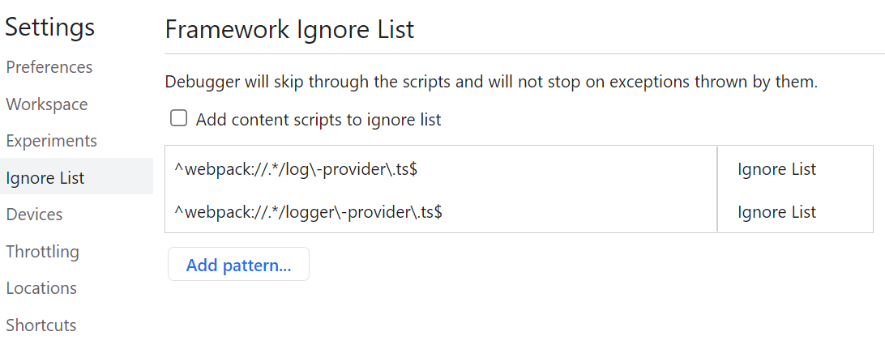

> **_:information_source: OpenFin Workspace:_** [OpenFin Workspace](https://www.openfin.co/workspace/) is a commercial product and this repo is for evaluation purposes (See [LICENSE.MD](../LICENSE.MD)). Use of the OpenFin Container and OpenFin Workspace components is only granted pursuant to a license from OpenFin (see [manifest](../public/manifest.fin.json)). Please [**contact us**](https://www.openfin.co/workspace/poc/) if you would like to request a developer evaluation key or to discuss a production license.
> OpenFin Workspace is currently **only supported on Windows** although you can run the sample on a Mac for development purposes.

[<- Back to Table Of Contents](../README.md)

# How To Support You Platform

When developing for any platform, the ability to debug and get logging information is critical to the process.

## DevTools

OpenFin behind the scenes is built on the Chromium engine so you still have full access to the familiar DevTools. By right clicking in your app you can launch the DevTool as you would normally from within a web browser.

## Process Manager

In addition to the Chromium DevTools we have our own OpenFin tool, Process Manager. This tool provides a holistic overview of the OpenFin ecosystem running on your desktop. You can access information such as applications, runtime versions, windows, manifests etc

For a detailed walk-through of process manager see [Process Manger](https://developers.openfin.co/of-docs/docs/process-manager).

## Crash Reporting And Runtime Logging

The manifest also has additional settings which can enable crash reporting and logging. These settings can help when debugging issues with the runtime. See [Debugging](https://developers.openfin.co/of-docs/docs/debugging) for more information.

## Application Logging

Although there is nothing to stop you from using the regular `console.log` mechanism, we instead recommend using the `createLogger` method exported from the `logger-provider`.

If you use the logger generated from `createLogger` your messages will be passed to all the configured log sinks configured in the platform. By default the platform is configured with a console sink, which enhances the display in the console, by grouping the messages by the name of the logger you create.

.

Unlike `console.log` the line at which the messages originated is lost in the display (above the entries all say `log-provider.ts`). This can be remedied by performing the following operations.

- Open DevTools
- Click the cog icon to open DevTools settings
- Select `Ignore list` on the left hand menu
- Click `Add Pattern`
- Enter `^webpack://.*/log\-provider\.ts$`
- Set `Behavior` to `Ignore List`
- Click `Add`
- Click `Add Pattern`
- Enter `^webpack://.*/logger\-provider\.ts$`
- Set `Behavior` to `Ignore List`
- Click `Add`

The result should look like this in Settings:

You can achieve the same by right clicking on any Source file and select `Add to ignore list`.

The result of adding the sources to the ignore list is that the console should now show the correct line from where the log was sent.

If you use the `createLogger` method to perform logging you can also create your own log sinks, so you could for example send the messages to a remote service. For more information on creating your own log sink see [How to Add Log Providers](./how-to-add-log-providers.md).
