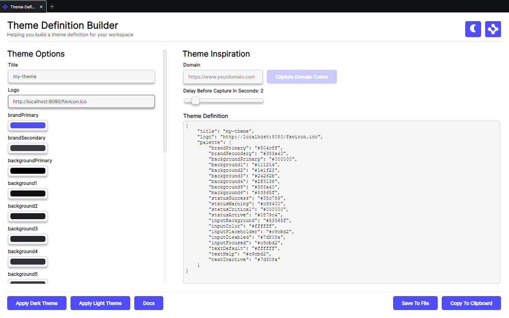

> **_:information_source: OpenFin Workspace:_** [OpenFin Workspace](https://www.openfin.co/workspace/) is a commercial product and this repo is for evaluation purposes (See [LICENSE.MD](../LICENSE.MD)). Use of the OpenFin Container and OpenFin Workspace components is only granted pursuant to a license from OpenFin (see [manifest](../public/manifest.fin.json)). Please [**contact us**](https://www.openfin.co/workspace/poc/) if you would like to request a developer evaluation key or to discuss a production license.
> OpenFin Workspace is currently **only supported on Windows** although you can run the sample on a Mac for development purposes.

[<- Back to Table Of Contents](../README.md)

# How To Theme Your Platform

All of the OpenFin Workspace support branding. This means you can provide a palette of colors and an icon that is used. The icon used by each component is specified when you register against the component (see [How To Customize Home](./how-to-customize-home.md), [How To Customize Store](./how-to-customize-store.md), [How To Customize Dock](./how-to-customize-dock.md), [How To Customize Notification Center](./how-to-customize-notification-center.md) and [How To Customize Browser](./how-to-customize-browser.md)).

The theme is defined in the themeProvider settings:

```json
   "themeProvider": {
        "themes": [
            {
                "label": "Dark",
                "logoUrl": "http://localhost:8080/favicon-32x32.png",
                "palette": {
                    "brandPrimary": "#504CFF",
                    "brandSecondary": "#383A40",
                    "backgroundPrimary": "#111214",
                    "functional1": null,
                    "functional2": null,
                    "functional3": null,
                    "functional4": null,
                    "functional5": null,
                    "functional6": null,
                    "functional7": null,
                    "functional8": null,
                    "functional9": null,
                    "functional10": null,
                    "statusSuccess": null,
                    "statusWarning": null,
                    "statusCritical": null,
                    "statusActive": null,
                    "inputBackground": null,
                    "inputColor": null,
                    "inputPlaceholder": null,
                    "inputDisabled": null,
                    "inputFocused": null,
                    "textDefault": null,
                    "textHelp": null,
                    "textInactive": null,
                    "background1": null,
                    "background2": null,
                    "background3": null,
                    "background4": null,
                    "background5": null,
                    "background6": null
                }
            },
            {
                "label": "Light",
                "logoUrl": "http://localhost:8080/favicon-32x32.png",
                "palette": {
                    "brandPrimary": "#399BB8",
                    "brandSecondary": null,
                    "backgroundPrimary": "#111214",
                    "functional1": null,
                    "functional2": null,
                    "functional3": null,
                    "functional4": null,
                    "functional5": null,
                    "functional6": null,
                    "functional7": null,
                    "functional8": null,
                    "functional9": null,
                    "functional10": null,
                    "statusSuccess": null,
                    "statusWarning": null,
                    "statusCritical": null,
                    "statusActive": "#399BB8",
                    "inputBackground": "#ECEEF1",
                    "inputColor": "#1E1F23",
                    "inputPlaceholder": "#7D808A",
                    "inputDisabled": null,
                    "inputFocused": "#C9CBD2",
                    "textDefault": "#1E1F23",
                    "textHelp": "#111214",
                    "textInactive": null,
                    "background1": "#ECEEF1",
                    "background2": "#FAFBFE",
                    "background3": "#ECEEF1",
                    "background4": "#ECEEF1",
                    "background5": "#DDDFE4",
                    "background6": "#ffffff"
                }
            }
        ]
    },
```

Null can be used to show the palette setting in config but to opt out of overriding it (the framework excludes nulls). The following conditions apply:

- If one theme is specified then it is used
- The framework will check your OS preference and if the preference is Light or Dark for applications and there is a theme label that matches then it will apply that theme.
- If more than one theme and they don't match the OS Preference of Light or Dark then the first theme is used.

## How To Create A Theme

### Manually

You could use our [Workspace themes](https://developers.openfin.co/of-docs/docs/workspace-themes-overview) and create a JSON Object representing your theme and apply it to the `themeProvider` either through a manifest or settings service. When you start your platform the theme will be picked up and applied.

### Theme Definition Builder

You could use our Theme Builder App which is available when you launch the default version of customize workspace (either search for Getting Started or Theme Definition Builder to launch it from Home).

The Theme Definition Builder lets you pull a palette from a website or you can manually pick colors. You can then save the theme to file for sharing or copy it to the clipboard. Theme Definition Builder also lets you preview the theme by launching a second Theming platform and applying the palette against it.



## More Resources

- [Workspace themes](https://developers.openfin.co/of-docs/docs/workspace-themes-overview)

## Source reference

- [platform.ts](../client/src/framework/platform.ts)

[<- Back to Table Of Contents](../README.md)
