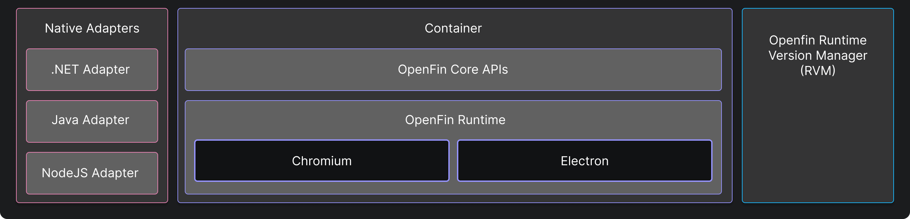

> **_:information_source: OpenFin Workspace:_** [OpenFin Workspace](https://www.openfin.co/workspace/) is a commercial product and this repo is for evaluation purposes (See [LICENSE.MD](../LICENSE.MD)). Use of the OpenFin Container and OpenFin Workspace components is only granted pursuant to a license from OpenFin (see [manifest](../public/manifest.fin.json)). Please [**contact us**](https://www.openfin.co/workspace/poc/) if you would like to request a developer evaluation key or to discuss a production license.
> OpenFin Workspace is currently **only supported on Windows** although you can run the sample on a Mac for development purposes.

[<- Back to Table Of Contents](../README.md)

# What Is Container?

Container is the foundation on which all OpenFin apps are built. Workspace platforms are built on top of a solid foundation. This foundation is made up of the:

- [RVM (Runtime Version Manager)](https://developers.openfin.co/of-docs/docs/rvm) - This application is used in the initial installation and manages the launching and fetching of OpenFin runtimes. If your Workspace Platform manifest is updated and references a version of the OpenFin runtime that isn't available it will fetch it from the OpenFin CDN (unless [Desktop Owner Settings (DOS)](https://developers.openfin.co/of-docs/docs/desktop-owner-settings) are used).
- Container is the OpenFin runtime (which is a combination of Chromium, Electron and our OpenFin APIs which are injected into your HTML document). The container is what gives OpenFin applications the ability to communicate seamlessly with each other as well as native applications. The container also allows you to provide a Native experience to your HTML based applications. A version of Workspace is paired against a runtime. The OpenFin APIs give you access to functionality you wouldn't have in the browser. More information can be found here: [https://developers.openfin.co/of-docs/docs/container-overview](https://developers.openfin.co/of-docs/docs/container-overview)
- [Native Adapters](https://developers.openfin.co/of-docs/docs/overview-of-net-and-java) are optional. They are there if you wish to integrate a native application with your workspace platform or if you want to extend the capability of your workspace platform through native extensions.

[<- Back to Table Of Contents](../README.md)
