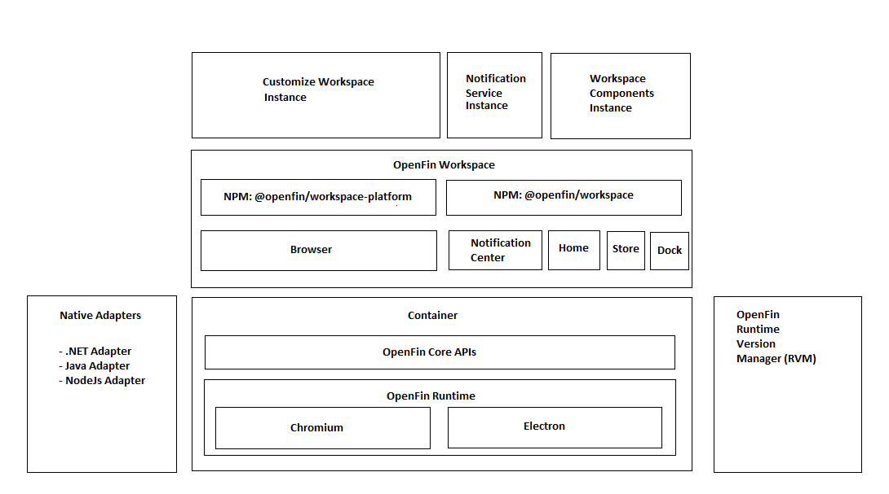

> **_:information_source: OpenFin Workspace:_** [OpenFin Workspace](https://www.openfin.co/workspace/) is a commercial product and this repo is for evaluation purposes (See [LICENSE.MD](../LICENSE.MD)). Use of the OpenFin Container and OpenFin Workspace components is only granted pursuant to a license from OpenFin (see [manifest](../public/manifest.fin.json)). Please [**contact us**](https://www.openfin.co/workspace/poc/) if you would like to request a developer evaluation key or to discuss a production license.
> OpenFin Workspace is currently **only supported on Windows** although you can run the sample on a Mac for development purposes.

[<- Back to Table Of Contents](../README.md)

# What is Customize Workspace?

A Workspace Platform and it's use of the Browser component is it's own OpenFin application running under it's own process, Notification Center is another OpenFin application running under it's own process and Dock, Store and Home UI fall under a Workspace application under it's own process.

By looking at [container](./what-is-container.md) and [workspace](./what-is-workspace.md) you can see that you have the ability to build a rich user experience using OpenFin's offering.

If you have:

- Specific requirements
- Enough dev resources
- Experience of building platforms
- Time

The you could take the starters in this repo and this how-to and use it as guidance for your PoC (Proof of Concept)/PoV (Proof of Value) and start fresh.

If you wish to validate functionality and you want to get up and running quickly then you can use customize-workspace. This is a workspace platform that has been built to let you get setup with a number of defaults while still allowing you a number of extension points that you can define via settings.

The customize-workspace platform allows you to have a platform in a box. It will not give you as much flexibility and power as building a platform yourself using the [workspace](./what-is-workspace.md) npm packages directly but it gives you an opinionated way of running a platform that can be extended by you or other teams within your organization.

The documentation in this folder covers general concepts but the guides are built with customize-workspace in mind.
