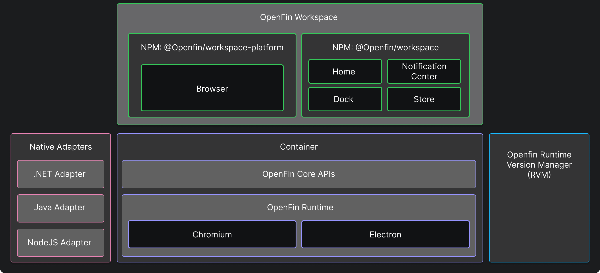

> **_:information_source: OpenFin Workspace:_** [OpenFin Workspace](https://www.openfin.co/workspace/) is a commercial product and this repo is for evaluation purposes (See [LICENSE.MD](../LICENSE.MD)). Use of the OpenFin Container and OpenFin Workspace components is only granted pursuant to a license from OpenFin (see [manifest](../public/manifest.fin.json)). Please [**contact us**](https://www.openfin.co/workspace/poc/) if you would like to request a developer evaluation key or to discuss a production license.
> OpenFin Workspace is currently **only supported on Windows** although you can run the sample on a Mac for development purposes.

[<- Back to Table Of Contents](../README.md)

# What Is Workspace?

Workspace is a set of UI Components that you can reference from your workspace platform. They build on top of [container](./what-is-container.md) and can be used by referencing a set of NPM packages.

Each component serves a purpose and whether or not you decide to utilize all of them in your workspace platform is down to your needs.

## @openfin/workspace

The workspace package allows you to register against and provide functions for:

- Notification Center
- Home
- Store
- Dock

These components do not fall under your application and are singleton instances on the desktop that workspace platforms can register against.

## @openfin/workspace-platform

The workspace platform npm module provides you with the option of initiating a platform (this is a superset of the standard OpenFin platform found in container) and providing overrides for your platform (such as theming options for your platform and workspace components and overrides for the browser component that workspace offers).

The browser component does fall under your workspace platform and is specific to your application.

With these NPM packages and the OpenFin runtime you can build a custom workspace platform specific to your needs.

If you are looking for an example of what a complete workspace platform platform then you have come to the right place. See [What is customize workspace](./what-is-customize-workspace.md)

For more information about OpenFin Workspace please see the [Workspace Overview](https://developers.openfin.co/of-docs/docs/overview-of-workspace)
