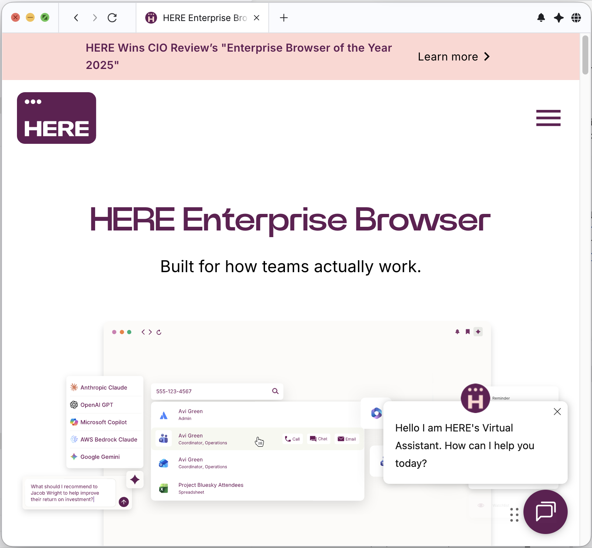

> **_:information_source: HERE Core UI:_** [HERE Core UI](https://resources.here.io/docs/core/hc-ui/) is a commercial product and this repo is for evaluation purposes (See [LICENSE.MD](LICENSE.MD)). Use of the HERE Core Container and HERE Core UI components is only granted pursuant to a license from HERE (see [manifest](public/manifest.fin.json)). Please [**contact us**](https://www.here.io/contact) if you would like to request a developer evaluation key or to discuss a production license.

# HERE Supertabs Starter

## What Is This?

This starter is a preview of using two requested features of **Enterprise Browser** within HERE Core UI applications:

1. **Supertab Windows** — A next-generation tabbed browser experience with navigation controls (back, forward, refresh) and context group assignment via right-click
2. **AI Center** — An integrated AI panel that can capture and understand the context of content running within a Supertab

It builds on the same module-based architecture as [workspace-platform-starter](../workspace-platform-starter/), so configuration of apps, adding search integrations for Home, etc. all behave in the same way.



> **_:warning: Preview:_** This starter is **experimental and subject to change**. APIs, configuration, and behavior may evolve before general availability. For ongoing product guidance, please refer to your HERE engagement and the maintained workspace-starter / Core UI documentation.

## Getting Started

This example assumes you have already [set up your development environment](https://resources.here.io/docs/core/develop/).

### Prerequisites

- Node.js (v18+)
- An HERE Core UI developer evaluation key or production license

### Option 1: Build From The Root (Recommended)

From the root of the workspace-starter repo:

```bash
npm install
npm run build
```

Then navigate to this starter:

```bash
cd how-to/here-supertabs-starter
```

### Option 2: Build This Starter Only

From the `how-to/here-supertabs-starter` folder:

```bash
npm install
npm run build
```

### Running The Example

1. **(Windows only)** Set up a local DOS so that the example uses version 24 of workspace Home, Store, Dock:

```bash
npm run dos
```

2. Start the local web server:

```bash
npm start
```

3. Launch the OpenFin client:

```bash
npm run client
```

## What You Will See

- **Home and Dock** will launch — these are the same components from workspace-platform-starter
- **Launch applications from the Dock** — apps will open in a Supertab window (e.g., the "Manager Portal" dock menu entry)
- **Right-click a Supertab** to see the option to assign it to a colour context group (by default all tabs exist within the same context group)
- **Click the AI icon** (second from the right in the top-right of the browser) to open the AI panel
- **The AI Panel** hosts a HERE Starter example of BYOAI — a simple page that lets you request the context of the Supertab and logs it out

This demonstrates that:

- Content loaded into the AI panel receives the AI Context API and can use it
- Content loaded into a Supertab is made available to the AI Center for querying
- You can also launch applications from Home and Store just like in Workspace Platform Starter

## Key Concepts

### Supertabs vs Standard Browser

| Feature        | Standard Browser    | Supertabs                                      |
| -------------- | ------------------- | ---------------------------------------------- |
| Tab management | Basic tabs          | Enhanced tabbed experience with context groups |
| Navigation     | Needs to be Enabled | Back / Forward / Refresh                       |
| AI assistance  | Not included        | AI Center with view context capture            |
| Browser shell  | Workspace shell     | Enterprise Browser shell                       |

### Enterprise Browser Configuration

The Enterprise Browser UI is configured through:

- **`client/here.config.ts`** — Supertabs-specific configuration
- **`prepare-browser.mjs`** — Copies Enterprise Browser static assets into `public/platform/enterprise` at install time (runs automatically during `npm install`)
- **`public/manifest.fin.json`** — Platform manifest with Enterprise Browser settings

## AI Center

The AI Center provides an integrated panel that can understand what users are looking at across their open Supertab views. It uses a context collection system where opted-in views contribute page signals to the AI, and the AI panel can request and react to that context.

### How It Works

1. **User views** receive a `dom-sender.cjs` preload that collects lightweight page signals (title, URL, DOM content)
2. **The AI panel view** receives an `ai-context.cjs` preload that exposes `window._aiContext`
3. **The platform provider** coordinates context collection via `client/src/framework/ai-context.ts`

### Configuring The AI Center URL

The AI Center view loaded into the panel is sourced from:
[here-starter/use-custom-ai-center](https://github.com/built-on-openfin/here-starter/tree/main/how-to/use-custom-ai-center)

To change the AI Center URL, update two entries in `public/manifest.fin.json` (search for the current URL `https://built-on-openfin.github.io/here-starter/main/use-custom-ai-center/`):

1. **Domain Settings** — The URL to add the AI Center API to. You will also see entries for other content URLs (e.g., contact, manager portal) — these tell the platform to enable those views for AI Center querying. Add additional URLs here to make more content available to the AI Center.
2. **Browser Provider** — Where you specify whether the AI Center is enabled and the URL to load into the AI Center panel.

### Key Files

| File                                      | Purpose                                                |
| ----------------------------------------- | ------------------------------------------------------ |
| `client/src/framework/ai-context.ts`      | Central coordinator for AI context                     |
| `public/common/ai-context/dom-sender.cjs` | Preload for user/content views (collects page signals) |
| `public/common/ai-context/ai-context.cjs` | Preload for the AI panel view (provides context API)   |
| `public/manifest.fin.json`                | Domain rules controlling which views are AI-enabled    |

### Further AI Customization

For detailed information on customizing the AI Center — including how to control which views participate, how context is collected, and the preload architecture — see the [AI Context Guide](./docs/AI-Context-README.md).

## Build Commands

| Command                         | Description                                                      |
| ------------------------------- | ---------------------------------------------------------------- |
| `npm run setup`                 | Install dependencies and build everything                        |
| `npm run build`                 | Build server and client                                          |
| `npm run build-framework`       | Build only the framework                                         |
| `npm run build-client-modules`  | Build only user modules                                          |
| `npm run build-starter-modules` | Build the pre-shipped modules                                    |
| `npm run dos`                   | **(Windows only)** Set up local DOS for workspace v24 components |
| `npm start`                     | Start the dev server                                             |
| `npm run client`                | Launch the OpenFin client                                        |
| `npm run generate-module`       | Scaffold a new module (same as workspace-platform-starter)       |

## Further Reading

- [AI Context Guide](./docs/AI-Context-README.md) — Detailed AI Center architecture and customization
- [AI Center View Source](https://github.com/built-on-openfin/here-starter/tree/main/how-to/use-custom-ai-center) — The BYOAI example loaded into the panel
- [Workspace Platform Starter](../workspace-platform-starter/) — The base platform this starter builds upon
- [HERE Core UI Documentation](https://resources.here.io/docs/core/hc-ui/) — Product documentation
