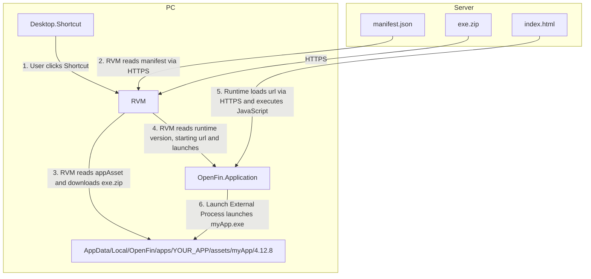
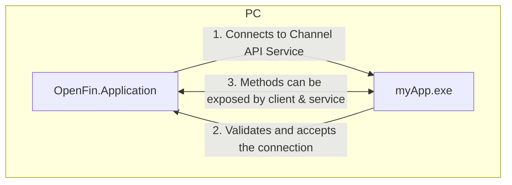

> **_:information_source: OpenFin Workspace:_** [OpenFin Workspace](https://www.openfin.co/workspace/) is a commercial product and this repo is for evaluation purposes (See [LICENSE.MD](../../../LICENSE.MD)). Use of the OpenFin Container and OpenFin Workspace components is only granted pursuant to a license from OpenFin. Please [**contact us**](https://www.openfin.co/workspace/poc/) if you would like to request a developer evaluation key or to discuss a production license.

[<- Back to Table Of Contents](../README.md)

# App Assets and Launch External Process

This hints and tips entry aims to cover these two features and how they can be used together. First we will cover a high level overview, then we will cover some common use cases and finally we take a deeper dive into these features followed by an example you can look at.

## An overview of App Assets and Launch External Process



In the example above we have a developer who has created a simple OpenFin Application. They have a .NET app that they wish to use with the OpenFin application. They have zipped up the app as exe.zip and placed it on their server. They have created a manifest.json file to specify the app asset they need, the version of OpenFin they wish to use, the permissions required and the url to load when launched (which launches the .NET app). The index.html page and manifest are uploaded to the server alongside the exe.zip.

An end user installs the OpenFin Application and clicks on the desktop shortcut. The OpenFin installation has added the OpenFin RVM to the user's machine. The desktop shortcut points to the RVM and passes the url to the manifest hosted on the developer's server. The RVM notes that the manifest lists an app asset and that it doesn't exist on disk. The RVM downloads and extracts the app asset into a versioned folder under the OpenFin Application's directory.

When the index.html page is loaded and requests the launch of the .NET app it already exists on disk and is launched.



Once the .NET app is downloaded as an app asset, launched via launch external process the OpenFin application can connect to a Channel API Service exposed by the .NET application. The .NET application will see the connection request and can validate whether it should accept it. Once connected the OpenFin application can call functions/methods exposed by the .NET app. The .NET app in turn can call functions/methods (if any) exposed by the OpenFin application. The [Channel API](https://developers.openfin.co/of-docs/docs/channels) is a low level API that can be used to build an SDK that exposes a set of functions that can be called by applications.

A basic example of a .NET app exposing a service to a OpenFin application can be seen at the end of this article.

## Common use cases for App Assets and Launch External Process

The general recommendation is to only use app assets and launch external process if you really need to. If you can rely solely on the OpenFin runtime and the fin APIs then you will have the smoothest deployment and upgrade experience. There are some uses cases where this is not possible and here are two of them:

### Native Application Migration

Some companies have native applications that have been used for a number of years. These applications are rich in functionality but the goal is to move to HTML. How do you move to the Web while keeping a native experience in a manageable amount of time?

If your application can be copied to another machine and run without installation then it can be packaged and versioned using app assets. With an app asset you can setup an OpenFin application that gets installed and when launched downloads and launches the native application. You can then migrate content to the web in a phased approach and have it loaded into OpenFin. Existing features are still available through the native app that was launched and any data/services that are required can be exposed to the OpenFin Application from the native app using the [Channel API](https://developers.openfin.co/of-docs/docs/channels) (you might decide to migrate the client side features first and expose your backend through your native application until you are ready to also move the backend). You can then chip away and move more and more of the UI to the web until the native app can become headless and kept around for any remaining services that are required. Eventually you may be able to remove the dependency on the app asset and have a pure OpenFin application.

### SideCar / Helper Application

There are times where your application needs features that are available to languages such as C# (.NET) or Java but not available through the OpenFin Runtime. An app asset can act as a sidecar/helper application that exposes additional capabilities to your OpenFin application. This will require additional permissions and adds additional steps to your deployment (packaging and downloading app assets) but this may be an acceptable trade off to provide the features your application requires. A sidecar/helper application can be very small as it is only exposing the features that your application requires instead of an existing application such as the earlier use case.

## A deeper dive into App Assets and Launch External Process

### App Assets

App Assets is a way of defining something you wish to package and make available through your OpenFin application. Generally these are applications of one kind or another. App Assets can be defined in two ways.

#### App Assets via Manifest

In your manifest file (this is a json file that describes your OpenFin application and is hosted on your server) you can add an appAssets setting which defines one or more App Assets that should be fetched as part of your application.

This snippet is taken from our website: [Launch Assets By Using A Secured API](https://developers.openfin.co/of-docs/docs/launch-assets-by-using-a-secured-api#launch-application-assets)

```json
"appAssets": [
    {
        "src": "http://filesamples.com/exe.zip",
        "alias": "myApp",
        "version": "4.12.8",
        "target": "myApp.exe",
        "args": "a b c d"
    },
    {
        "src": "http://examples.com/exe.zip",
        "alias": "myApp2",
        "version": "5.12.8",
        "target": "myApp2.exe",
        "args": "a b c",
        "mandatory": false
    }
]
```

The definition of an app asset and what each property means can be found here: [OpenFin.AppAssetInfo](https://developer.openfin.co/docs/javascript/stable/interfaces/OpenFin.AppAssetInfo.html).

Both apps provide a source url, a version number for the zipped file, an alias which can be used for launching it, a target to indicate what file should be launched within the zip file once extracted and what command line args should be passed when calling it.

The main difference between the two is that the first entry will cause the OpenFin application to fail if it can't be downloaded whereas the second entry says that the OpenFin app can continue loading if it fails to fetch the asset.

#### App Assets via Code

**One thing to note is that in the manifest approach above the RVM will fetch these assets on first launch of your manifest (or whenever the version of your asset changes)**. This might not be the behavior you want. You might want assets to be fetched after the user logs in or you might want to have dynamic app assets based on the currently logged in user.

To define and fetch an asset via code you would do the following:

```js
try {
    // this is hardcoded here but could have come from a rest api call
  const appAsset: OpenFin.AppAssetInfo = {
   src: "http://filesamples.com/exe.zip",
   alias: "myApp",
   version: "4.12.8",
   target: "myApp.exe",
   args: "a b c d"
  };

  await fin.System.downloadAsset(appAsset, (progress) => {
   const downloadedPercent = Math.floor((progress.downloadedBytes / progress.totalBytes) * 100);
   console.log(`Downloaded ${downloadedPercent}% of app asset.`);
  });
  console.log("App Asset is downloaded.");
 } catch(err) {
  console.error("There has been an error when trying to fetch the app asset.", err);
 }
```

If you already have this version of the app asset then the RVM will not re-fetch it.

#### Where do App Assets go?

App assets are downloaded and extracted within your OpenFin application's folder. Using **myApp** as an example it would end up in the following location:

> `C:\Users\{YOUR_USER_ID}\AppData\Local\OpenFin\apps\{YOUR_APPLICATION}\assets\myApp\4.12.8`

#### Things to consider with App Assets

There are a few things to consider with app assets:

- Does your app need to write any files locally. If it does please note that the RVM will replace the versioned folder with a brand new versioned folder with the extracted zip contents. Locally written files will be removed. If you wish to persist files across installs then consider creating a directory one level above the exe e.g. `C:\Users\{YOUR_USER_ID}\AppData\Local\OpenFin\apps\{YOUR_APPLICATION}\assets\myApp\4.12.8` would store it's data in `C:\Users\{YOUR_USER_ID}\AppData\Local\OpenFin\apps\{YOUR_APPLICATION}\assets\myApp\data`. Multiple versions could then check look for the data directory after an upgrade/install.
- Applications that can be copied to a machine and run without installation work best in this scenario. Applications that do not need Admin rights or installation would mean they run without additional steps.
- You may need to check with your client to see if they block zip files that contain binaries. If they do then you will need to ask to see if your site/domain can be added to an allow list.
- Permissions - to be able to download an app asset you will need to request the downloadAsset permission details below.

### Permissions For App Assets

To download app assets you should request the permission to download app assets. This is defined in your manifest and you can specify this at the platform level, default window options level or the default view options level. It is recommended to only give permissions to the pieces that need it and we recommend starting at the platform level and having your platform provider responsible for fetching assets (if you are not using appAssets in the manifest).

```json
"permissions": {
   "System": {
    "downloadAsset": true
   }
  }
```

If you want to see where these permissions can go in the manifest please see our [protocol support](./protocol-support.md) article as it provides examples of setting permissions at the platform, window and view level.

### Launch External Process

Once you have an app available through an app asset you will be able to launch it through the assigned alias: e.g. "myApp".

#### Launching an App Asset Through Code

```js
const app: OpenFin.ExternalProcessRequestType = {
  alias: "myApp",
  lifetime: "application",
  listener: (result) => {
   console.log("result", result);
   if (result.exitCode === 1) {
    console.log(`Successfully exited myApp`);
   }
  }
 };
 try {
  console.log("Launching App.");
  const data = await fin.System.launchExternalProcess(app);
  console.log("successfully launched App:", data);
 } catch (err) {
  console.error("There was an error launching the app asset app.", err);
 }
```

There are additional settings you can specify when launching an app asset: [OpenFin.ExternalProcessRequestType](https://developer.openfin.co/docs/javascript/stable/interfaces/OpenFin.ExternalProcessRequestType.html).

#### Things to consider with Launch External Process

There are a few things to consider with launch external process and app assets:

- Is the app asset portable (can easily be copied to a machine and run without needing admin rights or requiring an install)?
- What should be the lifetime of the asset you are launching? By specifying a lifetime, an external process can live as long the window/application that launched it or persist after the application exits. The default value is null, which is equivalent to 'persist', meaning the process lives on after the application exits. The alternatives are: 'application', 'window', 'persist'. Note: A process that exits when the window/application exits cannot be released via [fin.System.releaseExternalProcess](https://developer.openfin.co/docs/javascript/stable/classes/OpenFin.System.html#releaseExternalProcess).
- You will need to add the relevant permissions and have those permissions accepted by the client (OpenFin have updated the permission model around launch external process so that you can make it a lot more granular and specific to your app assets).

#### Permissions for Launch External Process

We have an article about the ability to set granular permissions for launching app assets so please refer to this article: [Launch Assets By Using A Secured API](https://developers.openfin.co/of-docs/docs/launch-assets-by-using-a-secured-api#launch-application-assets)

Here is a snippet from that article that shows the permissions needed to be able to launch the app asset used in this example:

```json
"permissions": {
    "System": {
        "launchExternalProcess": {
            "enabled": true,
            "assets": {
                "enabled": true,
                "srcRules": [
                    {
                        "match": [
                            "*://filesamples.com/*"
                        ],
                        "behavior": "allow"
                    },
                    {
                        "match": [
                            "<all_urls>"
                        ],
                        "behavior": "block"
                    }
                ]
            }
        }
    }
}
```

If you want to see where these permissions can go in the manifest please see our [protocol support](./protocol-support.md) article as it provides examples of setting permissions at the platform, window and view level.

### Checking for permissions for App Assets and Launch External Process

There is an api you can use to check to see if your application has been granted permission for a particular API.

```js
/**
 * Do we have the permissions to launch external processes.
 * @returns True if we have permission.
 */
async function getCanLaunchExternalProcess(): Promise<boolean> {
 let canLaunchExternalProcess = false;

 try {
  const canLaunchExternalProcessResponse = await fin.System.queryPermissionForCurrentContext(
   "System.launchExternalProcess"
  );

  canLaunchExternalProcess = canLaunchExternalProcessResponse?.granted;
 } catch (error) {
  console.error("Error while querying for System.launchExternalProcess permission", error);
 }

 return canLaunchExternalProcess;
}

/**
 * Do we have the permissions to download app assets.
 * @returns True if we have permission.
 */
async function getCanDownloadAppAssets(): Promise<boolean> {
 let canDownloadAppAssets = false;

 try {
  const canDownloadAppAssetsResponse =
   await fin.System.queryPermissionForCurrentContext("System.downloadAsset");
  canDownloadAppAssets = canDownloadAppAssetsResponse?.granted;
 } catch (error) {
  console.error("Error while querying for System.downloadAsset permission", error);
 }

 return canDownloadAppAssets;
}
```

## Examples

One example that covers the use case of a C# sidecar/helper app that is required by an OpenFin application can be found on our csharp-starter repo here: [how to use a sidecar application - basic](https://github.com/built-on-openfin/csharp-starter/tree/main/how-to.v2/use-a-sidecar-app-basic).
