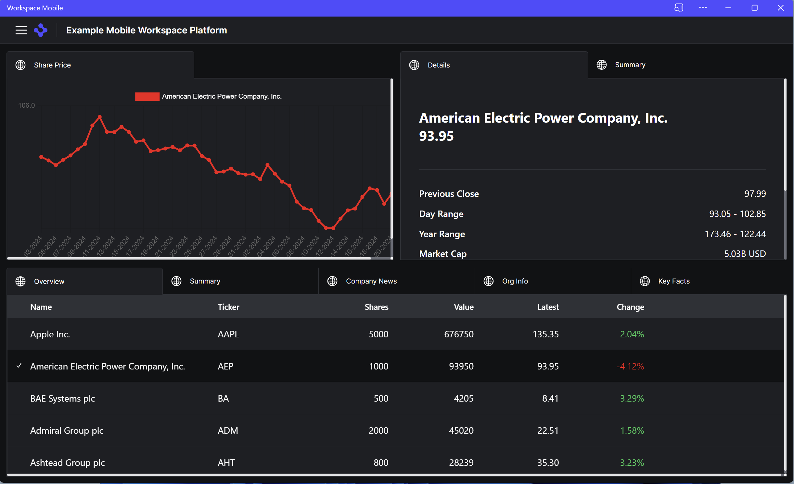
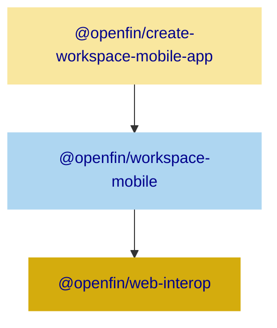
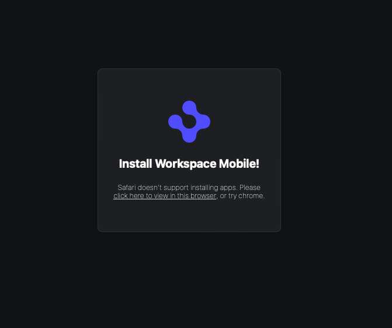
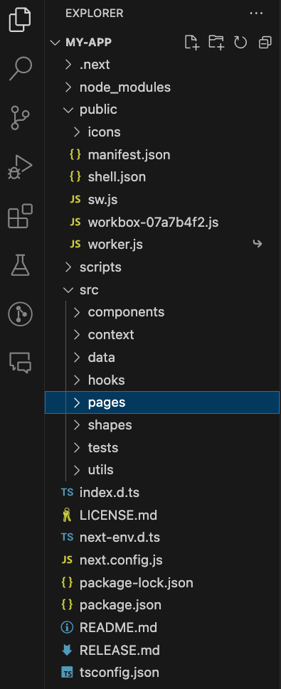
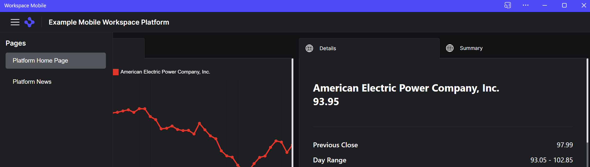

> **_:information_source: OpenFin Workspace:_** [OpenFin Workspace](https://www.openfin.co/workspace/) is a commercial product and this repo is for evaluation purposes (See [LICENSE.MD](../../../LICENSE.MD)). Use of the OpenFin Container and OpenFin Workspace components is only granted pursuant to a license from OpenFin. Please [**contact us**](https://www.openfin.co/workspace/poc/) if you would like to request a developer evaluation key or to discuss a production license.

[<- Back to Table Of Contents](../README.md)

# [Create Workspace Mobile App](https://www.npmjs.com/package/@openfin/create-workspace-mobile-app)

As part of OpenFin's strategy to be available across multiple hosts (Desktop via our container, Desktop Browser and Mobile) we have made a number of npm packages available and this article focuses on getting up and running quickly with our mobile offering.

We are actively working on this initiative so please check to see the latest version available on npm and our [developer documentation](https://developers.openfin.co).

## What do you get with create-workspace-mobile-app?

This is an npm package that generates a PWA shell with some sample content using NextJS. This lets you get up and running quickly with a few quick npm commands.

### What does it look like?



### What does it support?

The generated code supports:

- Tabbed Pages to support different layouts
- Interoperability between the content in the layouts. Each view is automatically included in the mobile channel, and joins the default context group. Not configurable. The default example demonstrates the /chart and /instrument contexts.
- The ability to load content from multiple domains and have them work with interop.

### What is the Architecture?

This solution builds on top of a number of npm packages.



- [@openfin/create-workspace-mobile-app](https://www.npmjs.com/package/@openfin/create-workspace-mobile-app) - This package is the main package you will be using and it generates the initial shell of your PWA. It brings in the layout and interop support and wires up a default interop channel.
- [@openfin/workspace-mobile](https://www.npmjs.com/package/@openfin/workspace-mobile) - This is the package that contains the layout system used by the example and provides the binding of views to the default interop channel.
- [@openfin/web-interop](https://www.npmjs.com/package/@openfin/web-interop) - The base library used to bring interop support to desktop and mobile browsers.

## How do I begin?

You will need to have [NodeJS](https://nodejs.org/) installed.

> :bulb: **We recommend:** you run a version of NodeJS that is still maintained. This will either be the Long Term Support version of NodeJS or the previous Long Term Support version of NodeJS. You can see the supported releases [here](https://nodejs.org/en/about/previous-releases).

Once you have NodeJS and NPM installed you can run the following commands in a terminal:

```bash
npm install -g @openfin/create-workspace-mobile-app
npx @openfin/create-workspace-mobile-app my-app
cd my-app
npm run build
npm run start
```

### After running build and start

This will build and start a web server on port 3000. You should be able to open the following link:

- [https://localhost:3000/](https://localhost:3000/)

This will ask you to install the PWA or if you wish to browse the site in the browser.



When you navigate to the main page you will have the option of selecting a row in the blotter/grid. This will broadcast the selected instrument to the other apps loaded into the layout. You should see the other applications update to reflect the change as you click on different rows.

## What do I do next?

Now that you have run the initial step to create and build the code you will end up with the following directory structure:



### How do I update the title, colors and icons?

The title, icons and colors can be updated in three places.

- public/shell.json - This lets you specify the icons, palette and install text that is shown when the initial screen is shown suggesting the installation.
- public/manifest.json - This is a [standard pwa manifest](https://developer.mozilla.org/en-US/docs/Web/Manifest) where names, colors and icons can be specified.
- src/pages/app/index.tsx - This is where the @openfin/workspace-mobile package is initialized through the init function and the MobilePlatformOptions are specified. This configuration will let you specify the primary icon, title, the html element to bind to (containerId i.e. the div that should contain the header, menu and layout system) and the palette. An example of what is generated and can be changed is shown below.

```javascript
    const platformConfig: MobilePlatformOptions = {
        primaryIcon: '/icons/icon-96x96.png',
        title: 'Example Mobile Workspace Platform',
        containerId: 'workspace-root',
        palette: {
            brandPrimary: '#504CFF',
            brandSecondary: '#383A40',
            backgroundPrimary: '#000',
            background1: '#111214',
            background2: '#1E1F23',
            background3: '#24262B',
            background4: '#2F3136',
            background5: '#383A40',
            background6: '#53565F',
            statusSuccess: '#35C759',
            statusWarning: '#C93400',
            statusCritical: '#000',
            statusActive: '#0879C4',
            inputBackground: '#53565F',
            inputColor: '#FFFFFF',
            inputPlaceholder: '#C9CBD2',
            inputDisabled: '#7D808A',
            inputFocused: '#C9CBD2',
            textDefault: '#FFFFFF',
            textHelp: '#C9CBD2',
            textInactive: '#7D808A'
        }
    };
```

### How do I update the layout to add my own content?

The generated example includes content (apps such as a ChartView) along with the host (the platform that loads the content/apps into it).

You may wish to keep the two things distinct.

- One codebase that represents the host (e.g. I am a desktop browser or mobile browser platform).
- And a different codebase representing the content (I am the ChartView app that isn't tied to a particular host and can be loaded into a OpenFin mobile/desktop browser Workspace Platform or an OpenFin Container based Workspace Platform).

If you want to add additional components to the generated example then you can add them to the src/components directory (e.g. see **src/components/PortfolioView** for an example of a component that sets contextual data using fin.me.interop.setContext).

If you want to load that component into a layout then you can create a page for it and reference it. See **src/pages/instrument**.

Once you have added your content you can rebuild the code using:

```bash
npm run build
```

You can add your pages or external content to the platform by updating **content** in src/pages/app/index.tsx. The following shows an example of what might have been generated for you (the generated code may have changed when you read this article).

```js
    const content: Content = [
        {
            id: 'home',
            title: 'Platform Home Page',
            icon: '/icons/icon-96x96.png',
            layout: {
                type: 'column',
                children: [
                    {
                        type: 'row',
                        sizeProportion: 1,
                        children: [
                            {
                                views: [
                                    {
                                        id: 'Chart',
                                        title: 'Share Price',
                                        url: '/chart'
                                    }
                                ]
                            },
                            {
                                views: [
                                    {
                                        id: 'Instrument',
                                        title: 'Details',
                                        url: '/instrument'
                                    },
                                    {
                                        id: 'Summary',
                                        title: 'Summary',
                                        url: '/summary'
                                    }
                                ]
                            }
                        ]
                    },
                    {
                        views: [
                            {
                                id: 'Portfolio',
                                title: 'Overview',
                                url: '/portfolio'
                            },
                            {
                                id: 'Summary1',
                                title: 'Summary',
                                url: '/summary'
                            },
                            {
                                id: 'Summary2',
                                title: 'Company News',
                                url: '/summary'
                            },
                            {
                                id: 'Summary3',
                                title: 'Org Info',
                                url: '/summary'
                            },
                            {
                                id: 'Summary4',
                                title: 'Key Facts',
                                url: '/summary'
                            }
                        ]
                    }
                ]
            }
        },
        {
            id: 'other',
            title: 'Platform News',
            icon: '/icons/icon-96x96.png',
            layout: {
                type: 'column',
                children: [
                    {
                        views: [
                            {
                                id: 'News',
                                title: 'Platform News',
                                url: '/news'
                            }
                        ]
                    }
                ]
            }
        }
    ];
```

Each entry in the content array gets represented as a page in the menu.



Each entry in the content array can contain a layout that supports a column or a row with one or more sections. Each section can have a list of views (a view can be thought of an iframe that points to the url you wish to be loaded).

You could add a view that points to a component/page that you have added to the example or an external url e.g.:

```javascript
     {
            id: 'other',
            title: 'Platform News',
            icon: '/icons/icon-96x96.png',
            layout: {
                type: 'column',
                children: [
                    {
                        views: [
                            {
                                id: 'News',
                                title: 'Platform News',
                                url: '/news'
                            },
                            {
                                id: 'MyCustomComponent',
                                title: 'Custom Component',
                                url: '/custom'
                            },
                            {
                                id: 'MyAngularApp',
                                title: 'MyAngularApp',
                                url: 'http://localhost:port/angular'
                            }
                        ]
                    }
                ]
            }
        }
```

The example above would expect there to be a page called **custom** in src/pages/custom and an application to be hosted on <http://localhost:port/angular> where port might be 8080, 8000 etc. This would show up when you select the page called Platform News.

Experiment with the configuration to try different combinations and load different urls.

> :warning: **Warning:** Websites can prevent their content from being displayed within an iframe on another site for security and privacy reasons. This is controlled by the `X-Frame-Options` HTTP response header.
>
> The `X-Frame-Options` header can have three values:
>
> 1. `DENY`: The page cannot be displayed in a frame, regardless of the site attempting to do so.
> 2. `SAMEORIGIN`: The page can only be displayed in a frame on the same origin as the page itself.
> 3. `ALLOW-FROM uri`: The page can only be displayed in a frame on the specified origin.
>
> If a website has set `X-Frame-Options` to `DENY` or `SAMEORIGIN`, you won't be able to display its content in an iframe unless you control the website and can change this setting.
>
> In addition to `X-Frame-Options`, the newer `Content-Security-Policy` header with the `frame-ancestors` directive provides more granular control over which sites can embed a page in an iframe.
>
> To resolve this issue, you would need to control the server that serves the page and configure it to send the appropriate `X-Frame-Options` or `Content-Security-Policy` header. If you don't control the server, you'll need to contact the server's administrator or the website's owner to request a change.

### How are platform settings and content wired together?

With the platform settings defined and the content defined the example platform calls the init function from @openfin/workspace-mobile to initialize and bind the layout against the specified html element.

```javascript
 init(platformConfig, content, interopOptions);
```

The interopOptions specify the web-broker url that should be loaded (this page is hosted on the same domain as the host platform and is the enabler for context sharing).

## What can I change?

At the time of writing you can change the following:

- The PWA shell (we have provided the initial shell as a starting point and you could modify what is generated).
- Icons, Titles and Palette.
- The list of pages and the content within those pages.

We have tried to show where those things can be changed within this article.

We are interested in your use cases so please reach out to OpenFin to cover your needs if you are looking to take the mobile support further.

## If I am loading external content how can the external content share contextual data or listen to contextual data?

The goal for content providers should be:

- Create a [Micro Frontend](https://martinfowler.com/articles/micro-frontends.html) (if you know you are being loaded into multiple hosts then there may be things that can be hidden/omitted e.g. headers, footers, large menus).
- Make your content responsive so it can react to different layouts.
- Use progressive enhancement to detect whether or not you are capable of contextual data sharing or using the OpenFin API and react accordingly.

For the final point we will show how you could update your external content so that it could share context from within a Workspace Platform inside of an OpenFin container or a Workspace Platform within the desktop browser (e.g. Edge).

### Adding the Fin API to content loaded in a Desktop/Mobile Browser Dynamically

When your content is loaded into an OpenFin Container (our desktop application) we automatically inject the **fin** API and it is always available. A desktop browser like Edge does not allow the injection of APIs from an iframe so your webpage will need to use our npm package to request the fin API.

Rather than bundle our mobile/desktop browser code into your webpage you may prefer to have some initialization logic that checks for the existence of the fin API. If the API doesn't exist then you dynamically import and initialize the OpenFin code (reducing what is included in your bundle to just the key pieces that are required dependant on the host).

Below we have an example webpage that you can create and drop in the public folder of the sample app or host on a different web server.

```html
<html>
 <head>
  <title>Test Context Aware Page</title>
  <style>
   body {
    font-family: -apple-system, BlinkMacSystemFont, 'Segoe UI', Roboto, Oxygen, Ubuntu, Cantarell,
     'Fira Sans', 'Droid Sans', 'Helvetica Neue', sans-serif;
    color: white;
    background-color: rgb(30, 31, 35);
   }
  </style>
 </head>
 <body>
  <h1>Test Context Aware Page</h1>
  <p>
   Name of the context received using Interop:
   <span id="interop-context-name">Not Set</span>
  </p>
  <p>
   Name of the context received using FDC3:
   <span id="fdc3-context-name">Not Set</span>
  </p>
  <p><button id="setContext">SetContext of Tesla Instrument using Interop</button></p>
  <p><button id="broadcast">Broadcast Apple Instrument using FDC3 2.0</button></p>
  <script type="module">
   async function initApi(connectionOptions, target) {
    try {
     // We are using jsdelivr as an example.
     // You can create your own esmodule that packages the web-interop library and it's dependencies.
     const moduleUrl = 'https://cdn.jsdelivr.net/npm/@openfin/web-interop@0.37.17/+esm';
     const workspaceMobile = await import(moduleUrl);
     const connectedFin = await workspaceMobile.connect(connectionOptions);
     if (connectedFin !== undefined) {
      console.log('The fin api has been fetched and will be returned.');
      if (target !== undefined) {
       target.fin = connectedFin;
       console.log('The fin api has been applied to the passed target');
      }
     }

     return connectedFin;
    } catch (error) {
     console.error('An error occurred while trying to fetch the fin API', error);
    }
   }

   async function checkAndAssignFin() {
    if (window.fin === undefined) {
     // we are not loaded into a host that dynamically provides the OpenFin API. Fetch and initialize the OpenFin API
     try {
      const connectionOptions = {
       connectionInheritance: 'enabled'
      };
      const connectedFin = await initApi(connectionOptions, window);
      if (connectedFin !== undefined) {
       console.log(
        'The fin api has been fetched. We could assign it here but window was passed as a target so this is just a confirmation that the API was fetched. Fin exists on the window: ' +
         window.fin !==
         undefined
       );
      } else {
       console.error('The fin api was not returned.');
      }
     } catch (error) {
      console.error('An error occurred while trying to fetch the fin API', error);
     }
    }
   }

   async function init() {
    await checkAndAssignFin();
    if (window.fin !== undefined) {
     // start of example of how to use the interop API and FDC3 API
     const fdc3 = await fin.me.interop.getFDC3('2.0');
     const interopContextName = document.getElementById('interop-context-name');
     const fdc3ContextName = document.getElementById('fdc3-context-name');
     const broadcast = document.getElementById('broadcast');
     const setContext = document.getElementById('setContext');
     fin.me.interop.addContextHandler((ctx) => {
      console.log('Interop Context received: ', ctx);
      if (interopContextName !== null) {
       interopContextName.innerText = ctx.name;
      }
     });
     fdc3.addContextListener('fdc3.instrument', (ctx) => {
      console.log('User Context Received', ctx);
      if (fdc3ContextName !== null) {
       fdc3ContextName.innerText = ctx.name;
      }
     });

     console.log('Listening for context changes');
     setContext.addEventListener('click', () => {
      const context = {
       type: 'fdc3.instrument',
       name: 'Tesla Inc',
       id: {
        ticker: 'TSLA',
        BBG: 'TSLA US Equity',
        ISIN: 'US88160R1014'
       }
      };

      try {
       console.log('setting context on system contextual group through interop', context);
       fin.me.interop.setContext(context);
      } catch (error) {
       console.warn(
        'You are not bound to a system context group and are unable to set context',
        error
       );
      }
     });

     broadcast.addEventListener('click', () => {
      const context = {
       type: 'fdc3.instrument',
       name: 'Apple Inc.',
       id: {
        ticker: 'AAPL',
        BBG: 'AAPL US Equity',
        ISIN: 'US0378331005'
       }
      };

      try {
       console.log('setting context on system contextual group through fdc3', context);
       fdc3.broadcast(context);
      } catch (error) {
       console.warn(
        'You are not bound to a system context group and are unable to set context',
        error
       );
      }
     });
     // end of example of how to use the interop API
    } else {
     console.log(
      'The fin api is still not available even after the check and assignment have been performed.'
     );
    }
   }

   await init();
  </script>
 </body>
</html>
```

This example is a complete webpage and it is using vanilla JavaScript. You might have a npm module that you give your content providers. This package would include @openfin/web-interop and it's dependencies and your content developers would only import this module if needed. We recommend you come up with your own module to import rather than the approach used above (which is just for demonstration purposes).

The flow could be:

- Page Load - check to see if the fin API exists.
- If yes then continue with common functionality.
- If no then dynamically import an additional package that you control. It could export an initApi/getFinAPI function. The package would use the @openfin/web-interop package as a dependency.
- Once the fin api is available continue with common functionality.

### Adding the Fin API to content loaded in a Desktop/Mobile Browser statically

You may decide that you just want to import the @openfin/web-interop and initializes the connection to get the fin API.

You would npm install the package e.g:

```bash
npm install @openfin/web-interop@0.37.17 --save
```

You would then import the connect function at the top of your TypeScript file.

```javascript
import { connect } from "@openfin/web-interop";
```

You could use this connect function in a initApi function similar to the one you saw above.

```javascript
async function initApi(connectionOptions, target) {
    try {
     const connectedFin = await connect(connectionOptions);
     if (connectedFin !== undefined) {
      console.log('The fin api has been fetched and will be returned.');
      if (target !== undefined) {
        target.fin = connectedFin;
        console.log('The fin api has been applied to the passed target');
      }
     }

     return connectedFin;
    } catch (error) {
     console.error('An error occurred while trying to fetch the fin API', error);
    }
   }
```

Everything would then be packaged inside of your bundle and would work in the Desktop Container Workspace or Desktop Browser Workspace without any dynamic loading.

### Interop API

If you add the logic shown above then your content will be able to share contextual data or listen for contextual data regardless of the host. We include interop API usage in the example above but here is an additional example for clarity.

```javascript
// --------------------------------
// SetContext code
// --------------------------------  
if (fin !== undefined) {
   const context = {
      "type": "fdc3.instrument",
      "name": "Tesla Inc",
      "id": {
         "ticker": "TSLA",
         "BBG": "TSLA US Equity",
         "ISIN": "US88160R1014"
      }
   };

   try {
       console.log("setting context on system contextual group", context);

       fin.me.interop.setContext(context);
     } catch(error) {
      console.warn(
         "You are not bound to a system context group and are unable to set context",
         error
      );
   }

}

// --------------------------------
// Listening code
// --------------------------------
if (fin !== undefined) {

   const systemHandler = (ctx) => {
       console.log("System Context Received: ", ctx);
   };

   const systemListener = fin.me.interop.addContextHandler(systemHandler);

}
```

### FDC3 API

Once you have the fin api available (using our web-interop package) you can request the fdc3 API. If you are running inside of the container then the need for fdc3 and the version would have been specified in your view/window options and you would already have the fdc3 api on the window object i.e. window.fdc3.

If it doesn't exist then you can request it:

```javascript
// request an fdc3 2.0 api. Alternatively specify 1.2
const fdc3 = await fin.me.interop.getFDC3("2.0");
```

Once you have the fdc3 api then you can use it as follows:

```javascript
// --------------------------------
// Broadcast code
// --------------------------------  
if (fdc3 !== undefined) {
   const context = {
        type: "fdc3.instrument",
        name: "Apple Inc.",
        id: { 
            ticker: "AAPL", 
            BBG: "AAPL US Equity", 
            ISIN: "US0378331005" 
            }
        };

   try {
       console.log("setting context on system contextual group", context);

       fdc3.broadcast(context);
     } catch(error) {
      console.warn(
         "You are not bound to a system context group and are unable to set context using broadcast",
         error
      );
   }

}

// --------------------------------
// Listening code
// --------------------------------
if (fdc3 !== undefined) {

   const contextHandler = (ctx) => {
       console.log("FDC3 Context Received: ", ctx);
   };

   const contextListener = fdc3.addContextListener("fdc3.instrument", contextHandler);
}
```

Please let us know if you have found this hints and tips article useful.

## What about upgrades?

The create-workspace-mobile-app generates a starting point. It includes examples and is not meant to be used as a means of upgrading previous versions.

If you are interested in what has changed between releases you can compare the generated output from current and prior releases and use a comparison tool like the one included in Visual Studio Code. ALternatively if you had one clean output from version x checked in and then replaced it with the output of version y then you would see the differences.

The examples use the main package @openfin/workspace-mobile and this package contains the layout system and wires up the web interop. This package exports a set of functions that you can import into your application as shown in the example. Any changes to the functions will show up in Visual Studio and when you tried to do a build.

To keep things clearer we recommend you have one codebase that represents the host/platform (This is where the entrypoint starts, authentication takes place and the applications/content a user can access is determined). Then build content as a separate application (this will make the separation of concerns clear and if more teams wish to be loaded into your platform then you already know how to treat them because you have been doing the same for your own applications/content).
