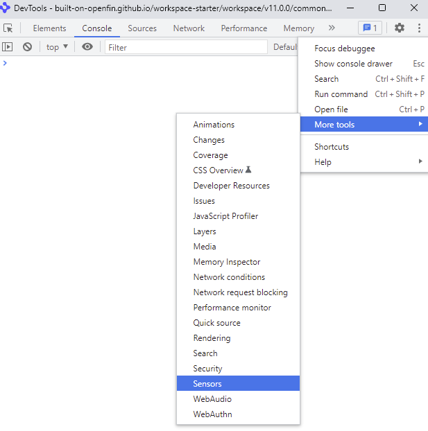
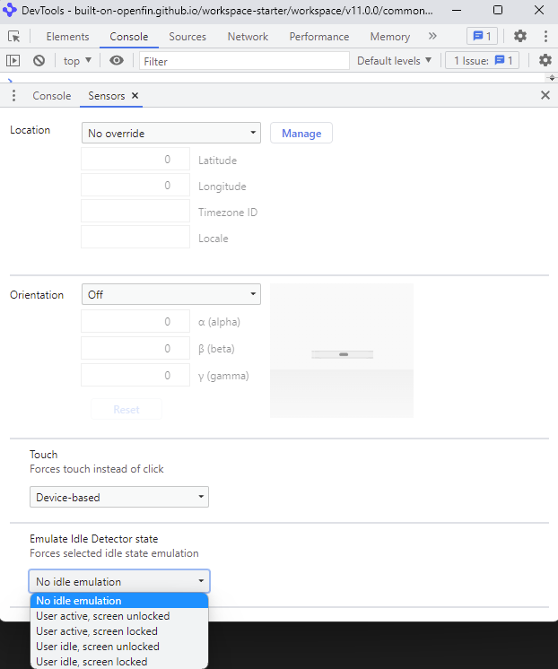

> **_:information_source: OpenFin Workspace:_** [OpenFin Workspace](https://www.openfin.co/workspace/) is a commercial product and this repo is for evaluation purposes (See [LICENSE.MD](../LICENSE.MD)). Use of the OpenFin Container and OpenFin Workspace components is only granted pursuant to a license from OpenFin (see [manifest](../public/manifest.fin.json)). Please [**contact us**](https://www.openfin.co/workspace/poc/) if you would like to request a developer evaluation key or to discuss a production license.
> OpenFin Workspace is currently **only supported on Windows** although you can run the sample on a Mac for development purposes.

[<- Back to Table Of Contents](../README.md)

# User Engagement - Idleness and Visibility

If you are streaming data or are running an expensive web view then it can be beneficial to know:

- Is my content currently visible or has the user switched tabs or minimized the window?
- If my content is visible is the user currently idle or is the screen locked?

## Checking to see if the user is idle or the screen is locked

To enable this functionality you need the following permission: **idle-detection**

You can add this to the permissions section of your manifest (either at the platform, window or view level):

```js
"permissions": {
   "webAPIs": [
    "idle-detection"
    ]
}
```

You should check to see if the permission is enabled in your code:

```js
const state = await IdleDetector.requestPermission();
if (state !== 'granted') {
  console.log('Idle detection permission not granted.');
}
```

With the permission granted you can then add logic to be notified when the idle state changes:

```js
try {
  const controller = new AbortController();
  const signal = controller.signal;

  const idleDetector = new IdleDetector();
  idleDetector.addEventListener('change', () => {
    const userState = idleDetector.userState;
    const screenState = idleDetector.screenState;
    console.log(`Idle change: ${userState}, ${screenState}.`);
  });

  await idleDetector.start({
    threshold: 60000,
    signal,
  });
  console.log('IdleDetector is active.');
} catch (err) {
  // Deal with initialization errors like permission denied,
  // running outside of top-level frame, etc.
  console.error(err.name, err.message);
}
```

To simulate this behavior you can open up the dev tools for the window/view you are working against and do the following:

- Go to the more options menu option in dev tools
- Select More tools
- Select Sensors



In the sensors tab you can scroll down to the idle emulation option and trigger different states:



You can now build your own logic to power down when the user is not interacting with your application.

### Is your content visible?

If you have a view it might be covered for the following reasons:

- There is more than one view in a section of the layout and the user has selected another view and your view is now hidden
- There is more than one page in the window and the user has selected another page and your view is now hidden
- They have minimized the window that contains your view
- They have focused on another window and that window is now covering the window that contains your view

### How can you detect when your view is hidden and made visible again?

```js
document.addEventListener("visibilitychange", () => {
  if (document.hidden) {
   console.log("hidden")
  } else {
    console.log("shown")
  }
});
```

Now you might not want to power down your view as soon as it is hidden. You may wish to have a configured interval before you power down a view. The reason for doing this is because the user may be quickly switching between views or pages or quickly bringing up an additional window but they haven't settled (they are quickly checking something). An interval will let you have an idea that they are now engaged with another piece of content and it may be a while before they go back to your view.
