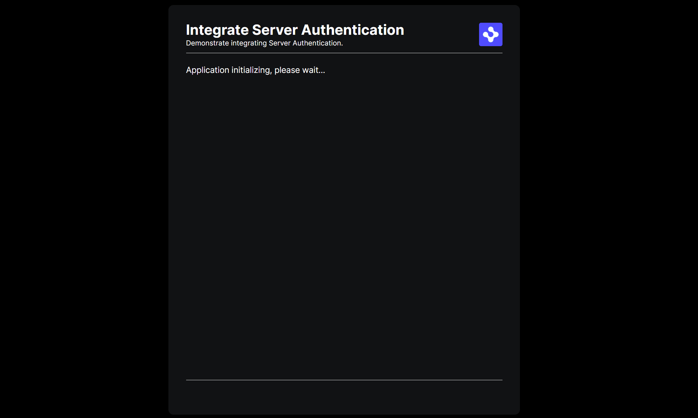

> **_:information_source: OpenFin Workspace:_** [OpenFin Workspace](https://www.openfin.co/workspace/) is a commercial product and this repo is for evaluation purposes (See [LICENSE.MD](LICENSE.MD)). Use of the OpenFin Container and OpenFin Workspace components is only granted pursuant to a license from OpenFin (see [manifest](public/manifest.fin.json)). Please [**contact us**](https://www.openfin.co/workspace/poc/) if you would like to request a developer evaluation key or to discuss a production license.
> OpenFin Workspace is currently **only supported on Windows** although you can run the sample on a Mac for development purposes.

# Integrate Server Authentication

Your OpenFin application will often need to authenticate using a server login page before use, this examples demonstrates such an integration.

This application you are about to install is a simple example of plugging in your own content or app. The basic server intercepts a request to the provider window and checks to see if you are authenticated. If you are not it redirects to a login screen. If you are then it will load the provider window. The settings in the manifest make the provider window visible (so it acts as a splash screen or the location where the login form will be displayed). When you have an authenticated session and the splash screen is visible then the provider will hide itself after a period of time and launch the main application window. This example assumes you have already [set up your development environment](https://developers.openfin.co/of-docs/docs/set-up-your-dev-environment)

## Running the Sample

To run this sample you can:

- Clone this repo and follow the instructions below. This will let you customize the sample to learn more about our APIs.

## Getting Started

1. Install dependencies and build the code. Note that these examples assume you are in the sub-directory for the example.

```shell
npm run setup
```

2. Optional (if you wish to pin the version of OpenFin Workspace to version next and you are on Windows) - Set Windows registry key for [Desktop Owner Settings](https://developers.openfin.co/docs/desktop-owner-settings).
   This example runs a utility [desktop-owner-settings.bat](../common/desktop-owner-settings.bat) that adds the Windows registry key for you, pointing to a local desktop owner
   settings file so you can test these settings. If you already have a desktop owner settings file, this script prompts to overwrite the location. Be sure to capture the existing location so you can update the key when you are done using this example.

   (**WARNING**: This script kills all open OpenFin processes. **This is not something you should do in production to close apps as force killing processes could kill an application while it's trying to save state/perform an action**).

```shell
npm run dos
```

3. Start the test server in a new window.

```shell
npm run start
```

4. Start the demonstration application.

```shell
npm run client
```

5. If you modify and want to build the code you can run the build command.

```shell
npm run build
```



---

### Read more about [working with Workspace](https://developers.openfin.co/of-docs/docs/overview-of-workspace)
