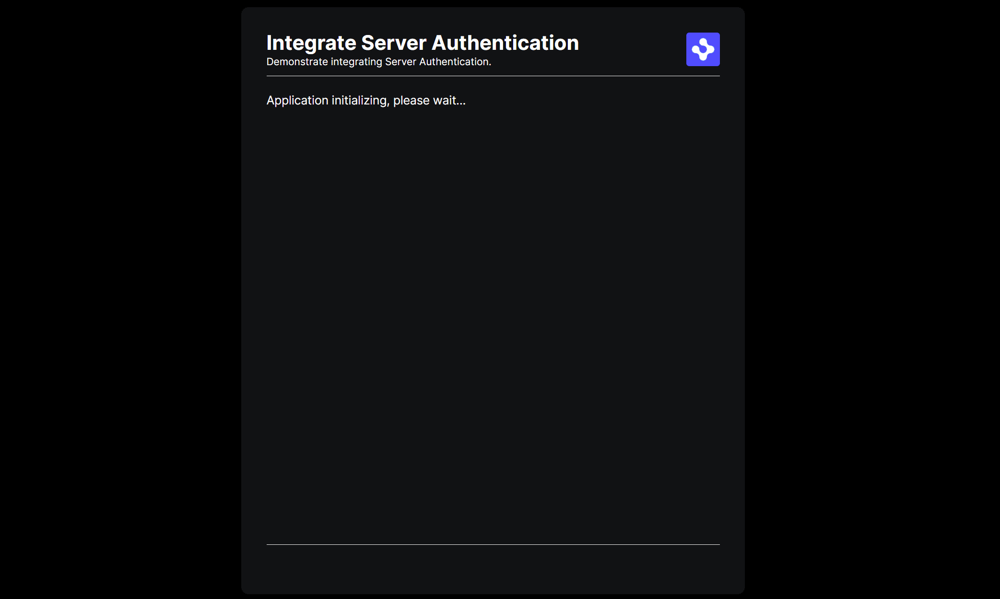

> **_:information_source: OpenFin Workspace:_** [OpenFin Workspace](https://www.openfin.co/workspace/) is a commercial product and this repo is for evaluation purposes (See [LICENSE.MD](LICENSE.MD)). Use of the OpenFin Container and OpenFin Workspace components is only granted pursuant to a license from OpenFin (see [manifest](public/manifest.fin.json)). Please [**contact us**](https://www.openfin.co/workspace/poc/) if you would like to request a developer evaluation key or to discuss a production license.

# Integrate Server Authentication

Your OpenFin application will often need to authenticate using a server login page before use, this examples demonstrates such an integration.

This application you are about to install is a simple example of plugging in your own content or app. The basic server intercepts a request to the provider window and checks to see if you are authenticated. If you are not it redirects to a login screen. If you are then it will load the provider window.

This example assumes you have already [set up your development environment](https://developers.openfin.co/of-docs/docs/set-up-your-dev-environment)

There are two use cases covered:

## Server side authentication with the platform provider window visible

The settings in the [manifest.fin.json](./public/manifest.fin.json) make the provider window visible (so it acts as a splash screen or the location where the login form will be displayed). When you have an authenticated session and the splash screen is visible then the provider will hide itself after a period of time and launch the main application window.

```json
"platform": {
   ...
  "autoShow": true,
  "providerUrl": "http://localhost:8080/platform/provider.html",
 },
```

## Server side authentication with the platform provider window invisible

The settings in the [second.manifest.fin.json](./public/second.manifest.fin.json) make the provider window invisible. When the server redirects to a login screen then a preload script which is loaded into the provider window checks to see if the window should be visible (if it is the login screen) or if an error window should be shown (if it isn't the login screen and it isn't the provider window....i.e. it has become stuck as part of a redirect).

```json
"platform": {
   ...
  "autoShow": false,
  "providerUrl": "http://localhost:8080/platform/provider.html",
   "preloadScripts": [
   {
    "url": "http://localhost:8080/preload/auth-preload-check.js"
   }
  ]
 },
```

The preload script needs to be in an area that does not require authentication (as you haven't been authenticated yet if you are on the login screen).

The [preload script](./public/preload/auth-preload-check.js) is an example and should not be treated as production code:

```javascript
document.addEventListener('DOMContentLoaded', async () => {
  console.log('auth-preload-check.js loaded. Performing logic checks.');
  // preload scripts can be loaded into an iframe so only check the top level window
  if (window === window.top && window.fin !== undefined) {
    // TODO: ADD YOUR OWN LOGIC HERE
    console.log('auth-preload-check.js logic starting.');
    // Create a new URL object from the current window location
    const url = new URL(window.location.href);

    // TODO: ADD YOUR OWN PATH LOGIC HERE
    // determine behavior based on the current URL (we have example paths)
    if (url.pathname === '/app/login') {
      console.log('Detected we are on the login page.');
      // If we are on the login page ensure the page is visible
      await fin.me.show();
    } else {
      // ensure the page is hidden as we may have shown it if it was the login page and we are now on a redirect page or the provider.
      console.log('We are on a page that should not be visible. Ensuring the window is hidden.');
      await fin.me.hide();
    }

    // TODO: WHEN STUCK OR UNHAPPY PATH DETERMINE WHAT TO DO NEXT
    // We provide an example of launching a new window to show a friendly error message
    if (url.pathname === '/app/stuck') {
      console.log(
        'Detected we are authenticated but a redirect has encountered an error and is stuck so the main provider.html page will not be loaded. Showing a friendly error message.'
      );
      window.open('/app/friendly-error', '_blank');
    }
  }
});
```

## Login Accounts

There are two login accounts that simulate a successful scenario and a stuck scenario. The stuck scenario is a redirect page the platform doesn't control so when it happens the manifest.fin.json file will be stuck on that page. The second.manifest.fin.json file uses a preload script that detects it is on a stuck page and launches a user error page.

- Success account: `test@example.com / pass1234`
- Stuck account: `stuck@example.com / pass1234`

## Things to note

You may have different paths depending on environment. You might decide to have environment based preload scripts that are assigned to the environment specific manifest file.

Consider the unhappy path. What would be helpful to your users and your support team if a user could not login to your platform. In our example we show a pop up window but your business/product owner should be involved in the conversation.

## Running the Sample

To run this sample you can:

- Clone this repo and follow the instructions below. This will let you customize the sample to learn more about our APIs.

## Getting Started

1. Install dependencies and build the code. Note that these examples assume you are in the sub-directory for the example.

```shell
npm run setup
```

2. Optional (if you wish to pin the version of OpenFin Workspace to version 19.2.0 and you are on Windows) - Set Windows registry key for [Desktop Owner Settings](https://developers.openfin.co/docs/desktop-owner-settings).
   This example runs a utility [dos.mjs](./scripts/dos.mjs) that adds the Windows registry key for you, pointing to a local desktop owner
   settings file so you can test these settings. If you already have a desktop owner settings file, this script prompts to overwrite the location. Be sure to capture the existing location so you can update the key when you are done using this example.

   (**WARNING**: This script kills all open OpenFin processes. **This is not something you should do in production to close apps as force killing processes could kill an application while it's trying to save state/perform an action**).

```shell
npm run dos
```

3. Start the test server in a new window.

```shell
npm run start
```

4. Start the demonstration application.

```shell
npm run client
```

or to run the hidden provider window using a preload script:

```shell
npm run secondclient
```

5. If you modify and want to build the code you can run the build command.

```shell
npm run build
```

## Scenario 1 - manifest.fin.json - Visible Provider Window


## Scenario 2 - second.manifest.fin.json - Invisible Provider Window



---

### Read more about [working with Workspace](https://developers.openfin.co/of-docs/docs/overview-of-workspace)
