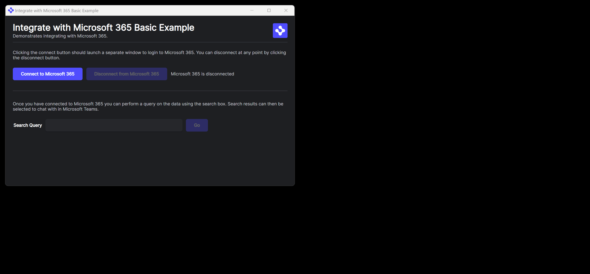

> **_:information_source: HERE Core UI:_** [HERE Core UI](https://resources.here.io/docs/core/hc-ui/) is a commercial product and this repo is for evaluation purposes (See [LICENSE.MD](LICENSE.MD)). Use of the HERE Core Container and HERE Core UI components is only granted pursuant to a license from HERE (see [manifest](public/manifest.fin.json)). Please [**contact us**](https://www.here.io/contact) if you would like to request a developer evaluation key or to discuss a production license.

# Integrate with Microsoft 365 - Basic

HERE Core UI empowers you to use our integration packages to connect to 3rd party data sources, such as Microsoft 365.

This example demonstrates connecting to Microsoft 365 and retrieving data.

The integration package utilized by this example is [@openfin/microsoft365](https://www.npmjs.com/package/@openfin/microsoft365).

For more information on the Microsoft 365 integration package and how you should configure your Microsoft 365 platform to be accessible from the HERE integration package see [Microsoft 365 Integration](https://resources.here.io/docs/core/integrations/microsoft-365/).

When you have finished configuring your Microsoft 365 platform for access by the integration you should modify `provider.ts` to include your `CLIENT_ID` and `TENANT_ID`

## Getting Started

1. Install dependencies and do the initial build. Note that these examples assume you are in the sub-directory for the example.

```shell
npm run setup
```

2. Optional (if you wish to pin the version of HERE Core UI to version 23.2.0 and you are on Windows) - Set Windows registry key for [Desktop Owner Settings](https://resources.here.io/docs/core/manage/desktops/dos/).
   This example runs a utility [dos.mjs](./scripts/dos.mjs) that adds the Windows registry key for you, pointing to a local desktop owner
   settings file so you can test these settings. If you already have a desktop owner settings file, this script prompts to overwrite the location. Be sure to capture the existing location so you can update the key when you are done using this example.

   (**WARNING**: This script kills all open HERE processes. **This is not something you should do in production to close apps as force killing processes could kill an application while it's trying to save state/perform an action**).

```shell
npm run dos
```

3. Start the test server in a new window.

```shell
npm run start
```

4. Start Your HERE Core UI Platform (this starts Workspace if it isn't already running).

```shell
npm run client
```

5. If you modify the project and wish to rebuild you can run setup again or the build command below:

```shell
npm run build
```



---
