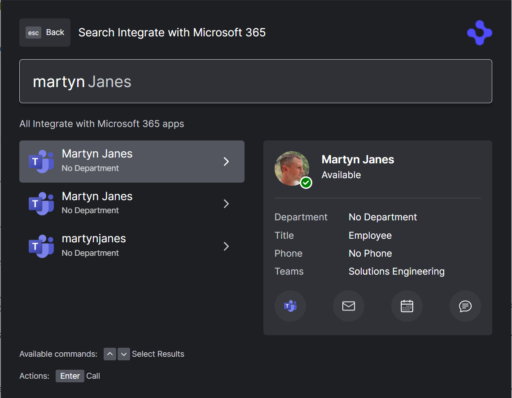
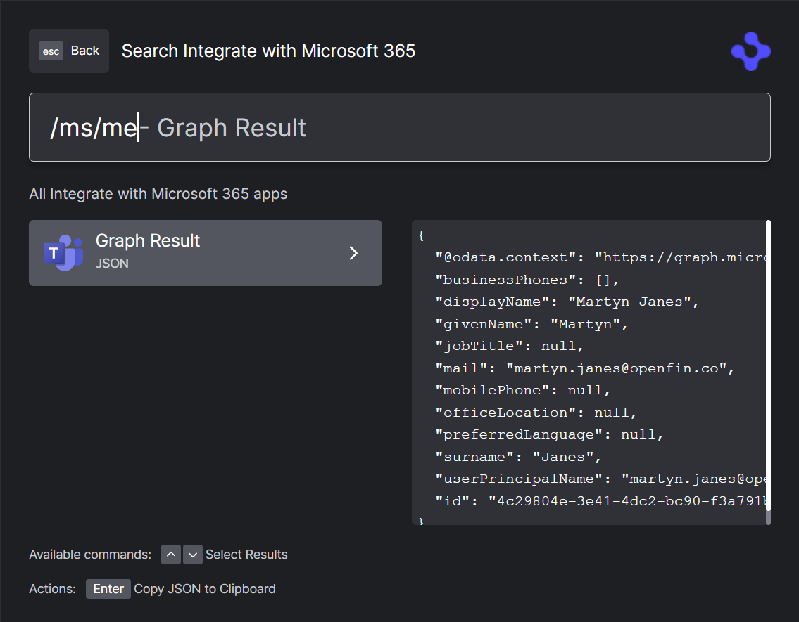

> **_:information_source: OpenFin Workspace:_** [OpenFin Workspace](https://www.openfin.co/workspace/) is a commercial product and this repo is for evaluation purposes (See [LICENSE.MD](LICENSE.MD)). Use of the OpenFin Container and OpenFin Workspace components is only granted pursuant to a license from OpenFin (see [manifest](public/manifest.fin.json)). Please [**contact us**](https://www.openfin.co/workspace/poc/) if you would like to request a developer evaluation key or to discuss a production license.
> OpenFin Workspace is currently **only supported on Windows** although you can run the sample on a Mac for development purposes.

# Integrate With Microsoft 365

OpenFin Workspace empowers you to browse and search your Microsoft 365 org data using OpenFin Home, via our Microsoft 365 integration API. OpenFin Home provides you with a fast and intuitive interface for discovering your Microsoft data.

## Running the Sample

To run this sample you can:

- Clone this repo and follow the instructions below. This will let you customize the sample to learn more about our APIs.

## Getting Started

### Configure Microsoft 365

Before you can integrate your Microsoft 365 with OpenFin Home, you must following the required [configuration steps](https://developers.openfin.co/of-docs/docs/ms365-integration) for our Microsoft integration.

When configuring CORS, the URL that you need to add is: `http://localhost:8080`, corresponding to the hostname and port number that this sample uses.

Once you have completed the configuration steps, update the `customSettings` section in the sample app's [manifest file](./public/manifest.fin.json) as follows:

- **`tenantId`**: the tenant id of your Microsoft 365 org
- **`clientId`**: the client id of your application

With Microsoft 365 is configured and the sample custom settings updated, you can continue to run the sample.

### Run The Sample

1. Install dependencies. Note that these samples assume you are in the sub-directory for the sample.

```shell
npm install
```

2. Optional (if you wish to pin the version of OpenFin Workspace to version 14.0.18 and you are on Windows) - Set Windows registry key for [Desktop Owner Settings](https://developers.openfin.co/docs/desktop-owner-settings).
   This example runs a utility [dos.mjs](./scripts/dos.mjs) that adds the Windows registry key for you, pointing to a local desktop owner
   settings file so you can test these settings. If you already have a desktop owner settings file, this script prompts to overwrite the location. Be sure to capture the existing location so you can update the key when you are done using this example.

   (**WARNING**: This script kills all open OpenFin processes. **This is not something you should do in production to close apps as force killing processes could kill an application while it's trying to save state/perform an action**).

```shell
npm run dos
```

3. Start the test server in a new window.

```shell
npm run start
```

4. Start Your Workspace Platform (this starts Workspace if it isn't already running).

```shell
npm run client
```

5. At this point you will be prompted to log in to your Microsoft 365 org), and to authorize your App's request for permissions.

6. Assuming login and authorization was successful, OpenFin Home will appear. Start typing a users name from your organization and the Microsoft 365 directory will be searched.

7. Build the project if you have modified the code.

```shell
npm run build
```

## What does it look like?

When searching and finding contacts you will be able to initiate, teams call, email, calender invite and chat.



Microsoft Graph API:

You can use the integration to explore the [Microsoft 365 Graph API](https://developer.microsoft.com/en-us/graph/graph-explorer)

By starting the query with `/ms/` you can explore the APIs, the resulting JSON can be copied to the clipboard.

e.g. `/ms/me`



## Admin Permissions

To access some of data in the graph API you might need specific permissions that needs to be granted by an administrator. You can either request them from your Active Directory administrator or remove the specific permission from the config `permissions` entry.

### Note About This Example

This is an example of how to use our APIs to configure OpenFin Workspace. It's purpose is to provide an example and provide suggestions. This is not a production application and shouldn't be treated as such. Please use this as a guide and provide feedback. Thanks!

---

### Read more about [working with Workspace](https://developers.openfin.co/of-docs/docs/overview-of-workspace)
