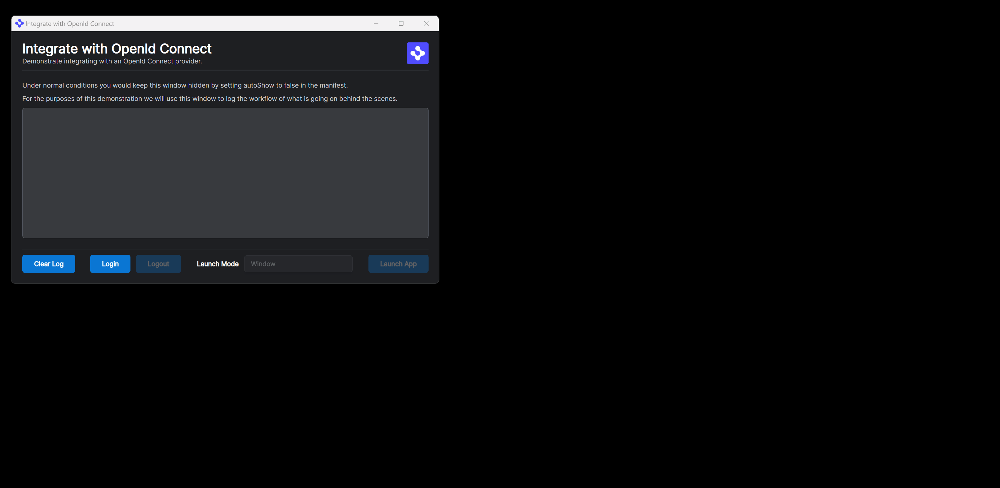

> **_:information_source: OpenFin Workspace:_** [OpenFin Workspace](https://www.openfin.co/workspace/) is a commercial product and this repo is for evaluation purposes (See [LICENSE.MD](LICENSE.MD)). Use of the OpenFin Container and OpenFin Workspace components is only granted pursuant to a license from OpenFin (see [manifest](public/manifest.fin.json)). Please [**contact us**](https://www.openfin.co/workspace/poc/) if you would like to request a developer evaluation key or to discuss a production license.
> OpenFin Workspace is currently **only supported on Windows** although you can run the sample on a Mac for development purposes.

# Integrate with Okta

Your OpenFin application will often need to authenticate with the and SSO provider before use, this examples demonstrates using the OpenId Connect protocol for such an integration.

This application you are about to install is a simple example of plugging in your own content or app. This example assumes you have already [set up your development environment](https://developers.openfin.co/of-docs/docs/set-up-your-dev-environment)

## Running the Sample

To run this sample you can:

- Clone this repo and follow the instructions below. This will let you customize the sample to learn more about our APIs.

## Getting Started

1. Install dependencies and build the sample. Note that these examples assume you are in the sub-directory for the example.

```shell
npm run setup
```

2. Configure the OpenId Connect provider

   The OpenId Connect provider can connect to any provider that supports the standard, such as [Okta](#okta), Auth0, Azure AD, Google etc

3. Optional (if you wish to pin the version of OpenFin Workspace to version 13.1.5 and you are on Windows) - Set Windows registry key for [Desktop Owner Settings](https://developers.openfin.co/docs/desktop-owner-settings).
   This example runs a utility [dos.mjs](./scripts/dos.mjs) that adds the Windows registry key for you, pointing to a local desktop owner
   settings file so you can test these settings. If you already have a desktop owner settings file, this script prompts to overwrite the location. Be sure to capture the existing location so you can update the key when you are done using this example.

   (**WARNING**: This script kills all open OpenFin processes. **This is not something you should do in production to close apps as force killing processes could kill an application while it's trying to save state/perform an action**).

```shell
npm run dos
```

4. Start the test server in a new window.

```shell
npm run start
```

5. Start the demonstration application.

```shell
npm run client
```

6. Build the project if you have modified the code.

```shell
npm run build
```



### Okta

[Okta](https://developer.okta.com/) can be used as a SSO provider using OpenId Connect.

In order to integrate an SPA with Okta please refer to this link: [SPA Redirect](https://developer.okta.com/docs/guides/sign-into-spa-redirect/react/main/)

After creating the Okta integration using the example above, populate the `customSettings` in the `public/manifest.fin.json` and `public/second.manifest.fin.json` files in the repo. The `providerUrl` and `clientId` values can be viewed in the settings for the application on the Okta Admin management console.

The `loginRedirectUrl` and `logoutRedirectUrl` need to be configured in the Okta dashboard settings as valid urls for authentication.

```json
"customSettings": {
  "auth": {
   "providerUrl": "<PROVIDERURL>",
   "clientId": "<CLIENTID>",
   "loginRedirectUrl": "http://localhost:8080/oidc_login.html",
   "logoutRedirectUrl": "http://localhost:8080/oidc_logout.html"
  }
 }
```

### Auth0

[Auth0](https://auth0.com/docs/authenticate/protocols/openid-connect-protocol) can be used as a SSO provider using OpenId Connect.

After creating the Auth0 integration, populate the `customSettings` in the `public/manifest.fin.json` and `public/second.manifest.fin.json` files in the repo. The `providerUrl` and `clientId` values can be viewed in the settings for the application on the Auth0 Admin management console.

The `loginRedirectUrl` and `logoutRedirectUrl` need to be configured in the Auth0 dashboard settings as valid urls for authentication.

```json
"customSettings": {
  "auth": {
   "providerUrl": "<PROVIDERURL>",
   "clientId": "<CLIENTID>",
   "loginRedirectUrl": "http://localhost:8080/oidc_login.html",
   "logoutRedirectUrl": "http://localhost:8080/oidc_logout.html"
  }
 }
```

---

### Read more about [working with Workspace](https://developers.openfin.co/of-docs/docs/overview-of-workspace)
