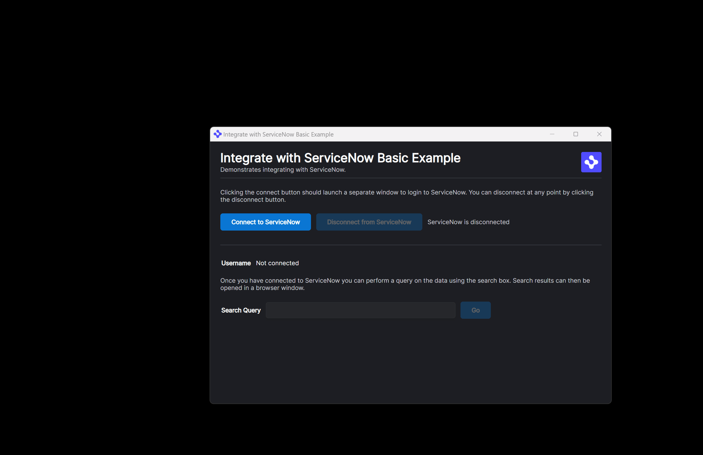

> **_:information_source: OpenFin Workspace:_** [OpenFin Workspace](https://www.openfin.co/workspace/) is a commercial product and this repo is for evaluation purposes (See [LICENSE.MD](LICENSE.MD)). Use of the OpenFin Container and OpenFin Workspace components is only granted pursuant to a license from OpenFin (see [manifest](public/manifest.fin.json)). Please [**contact us**](https://www.openfin.co/workspace/poc/) if you would like to request a developer evaluation key or to discuss a production license.
> OpenFin Workspace is currently **only supported on Windows** although you can run the sample on a Mac for development purposes.

# Integrate with ServiceNow - Basic

OpenFin Workspace empowers you to use our integration packages to connect to 3rd party data sources, such as ServiceNow.

This example demonstrates connecting to ServiceNow, retrieving data and opening a window.

The integration package utilized by this example is [@openfin/servicenow](https://www.npmjs.com/package/@openfin/servicenow).

For more information on the ServiceNow integration package and how you should configure your ServiceNow platform to be accessible from the OpenFin integration package see [ServiceNow Integration](https://developers.openfin.co/of-docs/docs/servicenow-integration).

When you have finished configuring your ServiceNow platform for access by the integration you should modify `provider.ts` to include your `INSTANCE_URL` and `CLIENT_ID`

## Getting Started

1. Install dependencies and do the initial build. Note that these examples assume you are in the sub-directory for the example.

```shell
npm run setup
```

2. Optional (if you wish to pin the version of OpenFin Workspace to version 13.1.5 and you are on Windows) - Set Windows registry key for [Desktop Owner Settings](https://developers.openfin.co/docs/desktop-owner-settings).
   This example runs a utility [desktop-owner-settings.bat](../common/desktop-owner-settings.bat) that adds the Windows registry key for you, pointing to a local desktop owner
   settings file so you can test these settings. If you already have a desktop owner settings file, this script prompts to overwrite the location. Be sure to capture the existing location so you can update the key when you are done using this example.

   (**WARNING**: This script kills all open OpenFin processes. **This is not something you should do in production to close apps as force killing processes could kill an application while it's trying to save state/perform an action**).

```shell
npm run dos
```

3. Start the test server in a new window.

```shell
npm run start
```

4. Start Your Workspace Platform (this starts Workspace if it isn't already running).

```shell
npm run client
```

5. If you modify the project and wish to rebuild you can run setup again or the build command below:

```shell
npm run build
```



---

### Read more about [working with Workspace](https://developers.openfin.co/of-docs/docs/overview-of-workspace)
