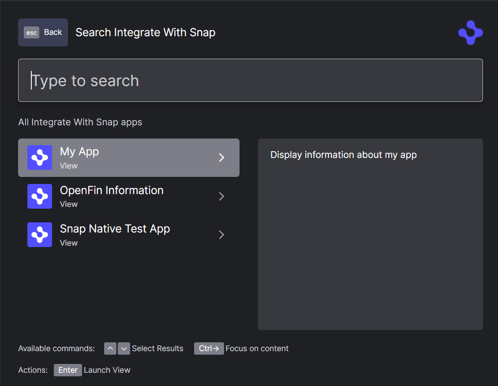

> **_:information_source: OpenFin Workspace:_** [OpenFin Workspace](https://www.openfin.co/workspace/) is a commercial product and this repo is for evaluation purposes (See [LICENSE.MD](LICENSE.MD)). Use of the OpenFin Container and OpenFin Workspace components is only granted pursuant to a license from OpenFin (see [manifest](public/manifest.fin.json)). Please [**contact us**](https://www.openfin.co/workspace/poc/) if you would like to request a developer evaluation key or to discuss a production license.

# Integrate with Snap

> This example is **Windows** only, it will not run on a **Mac**.

OpenFin Workspace empowers you to use our Snap tools, to enable layouts which include native applications.

This example demonstrates saving and restoring native applications as part of a workspace.

The package utilized by this example is [@openfin/snap-sdk](https://www.npmjs.com/package/@openfin/snap-sdk).

> The **@openfin/snap-sdk** is currently in beta, this sample requires the Snap Asset Url for the Snap Server. Please ask OpenFin for the url and then replace the `SNAP_ASSET_URL` in `manifest.fin.json` with it.

## Getting Started

1. Install dependencies and do the initial build. Note that these examples assume you are in the sub-directory for the example.

```shell
npm run setup
```

2. Optional (if you wish to pin the version of OpenFin Workspace to version 116.0.0 and you are on Windows) - Set Windows registry key for [Desktop Owner Settings](https://developers.openfin.co/docs/desktop-owner-settings).
   This example runs a utility [dos.mjs](./scripts/dos.mjs) that adds the Windows registry key for you, pointing to a local desktop owner
   settings file so you can test these settings. If you already have a desktop owner settings file, this script prompts to overwrite the location. Be sure to capture the existing location so you can update the key when you are done using this example.

   (**WARNING**: This script kills all open OpenFin processes. **This is not something you should do in production to close apps as force killing processes could kill an application while it's trying to save state/perform an action**).

```shell
npm run dos
```

3. Start the test server in a new window.

```shell
npm run start
```

4. Start Your Workspace Platform (this starts Workspace if it isn't already running).

```shell
npm run client
```

5. If you modify the project and wish to rebuild you can run setup again or the build command below:

```shell
npm run build
```

## Adding your own url/app to this example

This is how you can add your own urls to this example:

### Create a view manifest in the public directory

Create a json file called **my.view.fin.json** and place it in the [public](./public/) directory.

```json
{
  "url": "https://your-url"
}
```

### Add an app entry to the codebase

Open [apps.ts](./client/src/apps.ts) and add an app entry (e.g. around line 24):

```javascript
/**
 * App definition to use for demonstration which shows your content.
 */
const MY_APP: PlatformApp = {
 appId: "my-app",
 title: "My App",
 description: "Display information about my app",
 manifest: "http://localhost:8080/my.view.fin.json",
 manifestType: "view",
 icons: [
  {
   src: "http://localhost:8080/common/images/icon-blue.png"
  }
 ],
 contactEmail: "contact@example.com",
 supportEmail: "support@example.com",
 publisher: "you",
 intents: [],
 images: [
 ],
 tags: ["view", "you"]
};
```

### Add your app definition to the apps array

In [apps.ts](./client/src/apps.ts) update the apps array and add your app.

From:

```javascript
/**
 * Get the list of apps to display.
 * @returns List of app definitions.
 */
export async function getApps(): Promise<PlatformApp[]> {
 return [OPENFIN_INFORMATION_APP, SNAP_NATIVE_TEST_APP];
}
```

To:

```javascript
/**
 * Get the list of apps to display.
 * @returns List of app definitions.
 */
export async function getApps(): Promise<PlatformApp[]> {
 return [MY_APP, OPENFIN_INFORMATION_APP, SNAP_NATIVE_TEST_APP];
}
```

### Rebuild and start the sample

Run step 5 mentioned above to build the sample. Start the sample using step 4 mentioned above.

### Launch your application through Home

You app should now be listed and you should be able to launch it and snap it with the sample content.



---

### Read more about [working with Workspace](https://developers.openfin.co/of-docs/docs/overview-of-workspace)
