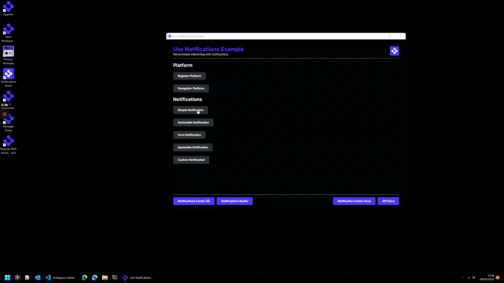

> **_:information_source: OpenFin Workspace:_** [OpenFin Workspace](https://www.openfin.co/workspace/) is a commercial product and this repo is for evaluation purposes (See [LICENSE.MD](LICENSE.MD)). Use of the OpenFin Container and OpenFin Workspace components is only granted pursuant to a license from OpenFin (see [manifest](public/manifest.fin.json)). Please [**contact us**](https://www.openfin.co/workspace/poc/) if you would like to request a developer evaluation key or to discuss a production license.
> OpenFin Workspace is currently **only supported on Windows** although you can run the sample on a Mac for development purposes.

# Integrate with SSO

Your OpenFin application will often need to authenticate with a SSO provider before use, this examples demonstrates such an integration.

This application you are about to install is a simple example of plugging in your own content or app. This example assumes you have already [set up your development environment](https://developers.openfin.co/of-docs/docs/set-up-your-dev-environment)

---

**Running the Sample**

To run this sample you can:

- Clone this repo and follow the instructions below. This will let you customize the sample to learn more about our APIs.

---

## Getting Started

1. Install dependencies. Note that these examples assume you are in the sub-directory for the example.

```bash
$ npm install
```

2. Build the project.

```bash
$ npm run build
```

3. Configure the SSO provider

This example uses [Auth0](https://auth0.com/developers/hub) as a provider for the SSO features, you can signup for a free account to test this demonstration.

You need to create a `tenant` with an `application` and then populate the `customSettings` in the `public/manifest.fin.json` file in the repo. The `domain` and `clientId` values can be viewed in the settings for the application on the Auth0 management console.

```json
"customSettings": {
   "auth": {
      "domain": "<DOMAIN>",
      "clientId": "<CLIENTID>",
      "loginUrl": "http://localhost:8080/platform/login-complete.html",
      "logoutUrls": [
        "http://localhost:8080/platform/logout-complete.html",
        "https://accounts.google.com"
      ],
      "appUrl": "http://localhost:8080/platform/app.html",
      "verifyPollMs": 10000
   }
}
```

The login url `http://localhost:8080/platform/login-complete.html` needs to be added in Auth0 app config as an **Allowed Callback Url**.

The logout urls contain `http://localhost:8080/platform/logout-complete.html` which needs to be added in auth0 app config as a **Allowed Logout Url**, this is the default completion url for the logout flow.

There is also a second entry for `https://accounts.google.com` in the `logoutUrls`, as the default for Auth0 is to include Google as a federated provider. This means that the logout flow can also complete at that secondary url.

If you enable additional federated providers in Auth0 you might need additional logout urls.

4. Optional (if you wish to pin the version of OpenFin Workspace to version 7.0.0) - Set Windows registry key for [Desktop Owner Settings](https://developers.openfin.co/docs/desktop-owner-settings).
   This example includes a utility (`desktop-owner-settings.bat`) that adds the Windows registry key for you, pointing to a local desktop owner
   settings file so you can test these settings. If you already have a desktop owner settings file, this script prompts to overwrite the location. Be sure to capture the existing location so you can update the key when you are done using this example.

   (**WARNING**: This script kills all open OpenFin processes. **Do not use this in production to close apps as force killing processes could kill an application while it's trying to save state/perform an action**).

```bash
$ npm run dos
```

4. Start the test server in a new window.

```bash
$ start npm run start
```

5. Start the demonstration application.

```bash
$ npm run client
```



### Read more about [working with Workspace](https://developers.openfin.co/of-docs/docs/overview-of-workspace).
