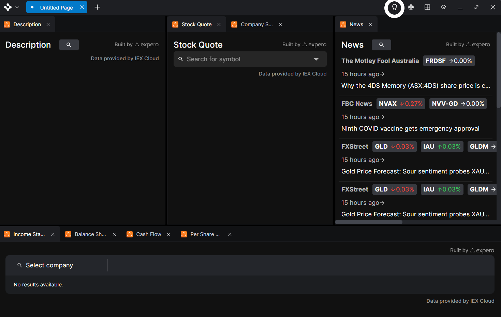
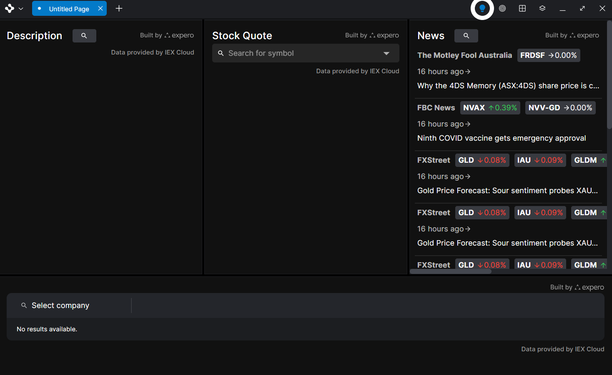
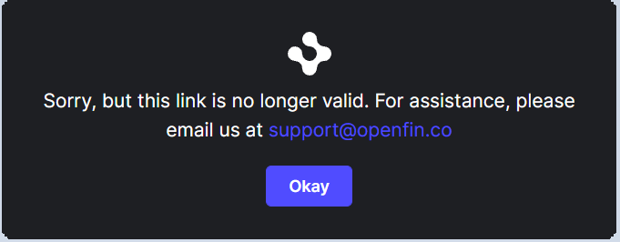
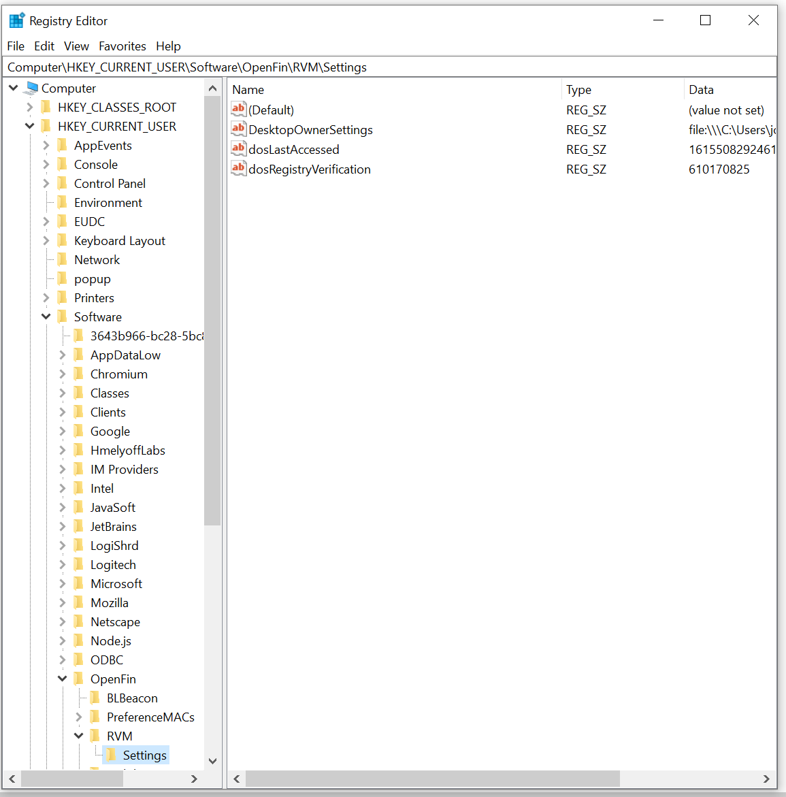
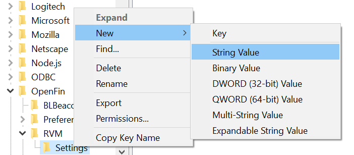

> **_:information_source: OpenFin Workspace:_** [OpenFin Workspace](https://www.openfin.co/workspace/) is a commercial product and this repo is for evaluation purposes. Use of the OpenFin Container and OpenFin Workspace components is only granted pursuant to a license from OpenFin. Please [**contact us**](https://www.openfin.co/workspace/poc/) if you would like to request a developer evaluation key or to discuss a production license.
> OpenFin Workspace is currently **only supported on Windows**.

## Migrate from a previous version - From v9.1 to v10

- Coming once v10 enters beta.

## Migrate from a previous version - From v9.0 to v9.1

The main focus of this release is:

### Browser Enhancements

You have the ability to hide favicons from the view tabs if you don't wish them to show.

### Notification Enhancements

#### Improved formatting of timestamps in Notifications

The format of timestamps on notifications has improved. A notification that is at least 1 hour old will now display the absolute timestamp (e.g., “Jun 3, 11:59 PM”) of creation to users. A notification that is less than 1 hour old will continue showing the relative timestamp of creation (e.g., “36 min ago”) to users.

#### Monitor Selection

End-users can now select a specific monitor for Notification Toasts and the Notification Center to appear on.

#### Default dismiss behavior for notifications changed

We are changing the default behavior of notifications so that clicking on the body of a notification does nothing, rather than dismissing it; the user must click on the icon in the top right corner of a notification to dismiss or clear it. Notification providers can override this behavior so that clicking does dismiss (the previous behavior).

## Migrate from a previous version - From v8.0 to v9.0

The main focus of this release is:

### New and improved Dock

OpenFin has introduced the ability for developers to register a Workspace Platform with the Dock component. This enables end-users to access multiple Workspace Platforms in a single, unified Dock component.

In addition, Dock is fully themable by Workspace Platforms, to deliver a branded experience whilst being part of a shared experience.

Developers of Workspace Platform can also fully customize the buttons in Dock. For example, they can add, remove and reorder buttons in Dock.

### Change of Behavior - Home doesn't automatically appear on registration

Home no longer appears when a Workspace Platform first registers the Home component. For Home to show automatically, developers of Workspace Platforms must add `Home.show()` right after registering the Home component. This is the pattern followed in the starters so if you have been following the starters you have already been doing this.

### Version Information upon registration

When you register a component you will be returned information that will tell you the version of Workspace you have registered against as well as the version of the npm module that was used for the registration.

```javascript
{
  clientAPIVersion: string;
  workspaceVersion: string;
}
```

## What dependencies will I need for v9

You will need the following dependencies

```javascript
"dependencies": {
                    "@openfin/workspace": "^9.2.0",
                    "@openfin/workspace-platform": "^9.2.0"
                }
```

## Other Changes?

We have introduced new starters:

- use-theming - this starter is focused on giving you an easy way of trying out different theme palettes. You can change and apply them to the workspace to find the right combination of colors for your platform.
- register-with-dock-basic - a starter that gives you an easy introduction to Dock and how you can customize it.
- integrate-with-rss - a few people have asked us about providing a feed for notifications and opening the result in a window. We've used rss as an example and created a starter you can experiment with.
- common - we have an updated Winform app that demonstrates context sharing and we now point to our brand new Process Manager to help you in debugging your application.
- customize-workspace - customize workspace continues to be the main example that shows a way of combining all the workspace components and some patterns as suggestions. The following changes have been applied:

  - DockProvider - Dock support has been added and is configurable through the manifest file
  - An additional example endpoint has been added. This one lets you expose an endpoint that wraps a channel api.
  - InitOptionsProvider - More module types supported. You can now create a module for handling init option params and we include an example that allows external apps to raise an intent or pass context via querystring parameters that target a platform.
  - ConnectionProvider - The concept of connections has been added to customize-workspace. How do you support other applications e.g. Native C# apps to provide listing for their child views? How do they get launched when selected and how can the child views be captured in a snapshot (by becoming a snapshot source).

## Migrate from a previous version - From v7.0 to v8.0

The main focus of this release is:

### Support Platform Windows

For developers of existing applications that use the Platform API, you now have the option to use OpenFin Workspace components while continuing to use your existing custom platform windows. This provides additional flexibility on deciding when to adopt our out-of-the box Browser component, easing your transition to Workspace.

- We have a sample [how-to/register-with-platform-windows](../register-with-platform-windows)
- [https://developers.openfin.co/of-docs/docs/integrate-platform-apps-with-workspace](https://developers.openfin.co/of-docs/docs/integrate-platform-apps-with-workspace)

### Asynchronous Search Results in Home

Platform Providers can now configure search results to display only on-demand, after the end-user selects a result. This can significantly improve performance for queries that can have numerous results. For example, your Home Provider can fetch only the top-level search results in the initial query and then display the details of a particular result only after a user clicks on it, deferring the lookup of additional rich information to your backend services only when that information is required. Templates to indicate result loading or failure to the user are included.

- The [how-to/customize-home-templates](../customize-home-templates) sample has been updated with examples.
- [https://developers.openfin.co/of-docs/docs/provide-search-results-async](https://developers.openfin.co/of-docs/docs/provide-search-results-async)

### Content Locking

Platform Providers can now lock Browser Windows and/or Pages to offer fixed, repeatable experiences for end-users. End-users can also manually lock and unlock Pages themselves in Workspace Browser, if that feature is enabled through a Platform Provider’s configuration.

- The [how-to/register-with-browser](../register-with-browser) samples shows a page with browser lock/unlock enabled.
- [https://developers.openfin.co/of-docs/docs/lock-content-in-browser](https://developers.openfin.co/of-docs/docs/lock-content-in-browser)

### Improved Designs of Home Filters

The visual designs of filters in Workspace Home have been improved, so end-users can quickly and easily zero in on the content that they are searching for and quickly clear out selected filters

## What dependencies will I need for v8

You will need the following dependencies

```javascript
"dependencies": {
                    "@openfin/workspace": "^8.0.0",
                    "@openfin/workspace-platform": "^8.0.0"
                }
```

## Other Changes

The structure of the how-to samples has been updated. The views (content) and some of the common scripts to setup dos, start and kill the project and the apps.json file have been moved to a [how-to/common](../common) folder. The express.js code has been simplified so it most cases you just have an index.ts file. And the server now maps the sample folder and /common to the common how-to.

A new npm command **"npm run setup"** has also been introduced that takes advantage of our npm workspaces support and installs from the root directory and then builds the sample you are currently in and the common directory.

Samples that used the apps.json file can still do so but most will be updated to point to the apps.json file in common (so there is consistency across samples). The manifest for samples that point to the common/apps.json have a new setting in the manifest appProvider section. This tells the sample which manifestTypes from within the apps.json file you wish to support (e.g. only customize-workspace supports inline-view as a manifestType as it is supported by the sample and will not be recognized by the workspace api).

# Migrate from a previous version - From v6.0 to v7.0

The main focus of this release is on introducing support for Workspace Management APIs and adding a UI for Workspace Management to the Browser.

If you have customized the main browser menu you may want to change the way the menu is constructed so that it inherits the default menu options instead of being a list of specific menu options (the customize-workspace example shows this change between the move from v6 to v7) or you can extend that custom menu to include the new options that are available as seen in the following documentation:

- [https://developers.openfin.co/of-docs/docs/workspace-management](https://developers.openfin.co/of-docs/docs/workspace-management)

## What dependencies will I need for v7?

You will need the following dependencies

```javascript
"dependencies": {
                    "@openfin/workspace": "^7.0.0",
                    "@openfin/workspace-platform": "^7.0.0"
                }
```

# Migrate from a previous version - From v5.5 to v6.0

With Workspace 6.0, OpenFin has added additional options when it comes to customization. You can now customize:

- The browser controls and menu [(https://developers.openfin.co/of-docs/docs/customize-browser-features)](https://developers.openfin.co/of-docs/docs/customize-browser-features)
- Customize the template displayed as part of a search result entry in home [(https://developers.openfin.co/of-docs/docs/customize-search-results-in-home)](https://developers.openfin.co/of-docs/docs/customize-search-results-in-home)
- Register your workspace platform with Notification Center so that your theming is taken into account.[(https://developers.openfin.co/of-docs/docs/connect-a-workspace-platform-to-notification-center)](https://developers.openfin.co/of-docs/docs/connect-a-workspace-platform-to-notification-center)

## What dependencies will I need v5?

You will need the following dependencies

```javascript
"dependencies": {
                    "@openfin/workspace": "^6.0.0",
                    "@openfin/workspace-platform": "^6.0.0"
                }
```

## What changes will I need to do if I want the simplest move from v5.5 to v6?

There are no breaking changes in this release (just fixes and the new features mentioned above). If you have pinned your workspace version you will need to update your desktop owner setting to point to version 6.3.6 (if you have not pinned it then you will get the latest version of workspace on your next launch). If you are running a sample from this branch then running the npm command "npm run dos" update your desktop owner settings to point to the local dos file that specifies version 6.3.6.

# Migrate from a previous version - From v5 to v5.5

With Workspace 5.5, OpenFin has continued extended theme support so that the provided palette now applies to the OpenFin Home and Store Components.

## What dependencies will I need for v6?

You will need the following dependencies

```javascript
"dependencies": {
                    "@openfin/workspace": "^5.5.0",
                    "@openfin/workspace-platform": "^5.5.0"
                }
```

## What changes will I need to do if I want the simplest move from v5 to v5.5?

There are no breaking changes and this release just includes fixes and extends theming support to OpenFin Home and Store (no api changes are required). If you have pinned your workspace version you will need to update your desktop owner setting to point to version 5.5.0 (if you have not pinned it then you will get the latest version of workspace on your next launch). If you are running a sample from this branch then running the npm command "npm run dos" update your desktop owner settings to point to the local dos file that specifies version 5.5.0.

# Migrate from a previous version - From v4 to v5

With Workspace 5.0, OpenFin has extended the ability for Workspace customers to have more granular control of their Workspace implementation. The **@openfin/workspace** module adds additional capabilities such as an improved ability to theme components. We have also introduced a new npm module **@openfin/workspace-platform** which lets you instantiate a workspace platform instead of the existing platform api. This lets you application launch OpenFin Browser Windows (with pages) under your own application instead of under Workspace giving you greater control and flexibility.

## What dependencies will I need for v5?

You will need the following dependencies

```javascript
"dependencies": {
                    "@openfin/workspace": "^5.0.0",
                    "@openfin/workspace-platform": "^5.0.0"
                }
```

## What changes will I need to do if I want the simplest move from v4 to v5?

Using the register-with-store example as a guide:

- Update your npm dependencies as shown above
- Update your manifest
- Do a few api updates (show below)

### Manifest updates

You will need to do a few manifest updates as you are now responsible for launching views, snapshots and native apps (if you decide to support that).

- Update the runtime version in your manifest to at least: **23.96.67.7**
- Add the following setting to your platform configuration in your manifest: **"preventQuitOnLastWindowClosed":true**
- Permissions: You need to add a **openUrlWithBrowser** permission (OpenFin Browser gives the option of opening a view using the system browser via right click). Optional: permissions for launching external processes (**launchExternalProcess**) if you wish to enable the launching of native apps and **downloadAsset** (if you want to version and deploy your native app through OpenFin). An example of the platform section of the register-with-store manifest is shown below:

```javascript
 "platform": {
    "uuid": "register-with-store",
    "icon": "http://localhost:8080/favicon.ico",
    "autoShow": false,
    "providerUrl": "http://localhost:8080/platform/provider.html",
    "preventQuitOnLastWindowClosed":true,
    "permissions": {
      "System": {
        "launchExternalProcess": true,
        "downloadAsset": true,
        "openUrlWithBrowser": {
            "enabled": true,
            "protocols": ["mailto"]
        }
      }
    },
    "defaultWindowOptions": {
      "permissions": {
        "System": {
            "openUrlWithBrowser": {
                "enabled": true,
                "protocols": ["mailto"]
            }
        }
      }
    }
  }
```

### Search related filters now need an id

File: [home.ts](../register-with-store/client/src/home.ts)

To make it easier to determine which filter was selected we have added an id so you don't have to rely on 'title' when determining what logic to apply.

So this:

```javascript
let tagFilter: CLIFilter = {
  title: 'Tags',
  type: CLIFilterOptionType.MultiSelect,
  options: []
};
```

becomes:

```javascript
let tagFilter: CLIFilter = {
  id: 'tags',
  title: 'Tags',
  type: CLIFilterOptionType.MultiSelect,
  options: []
};
```

### Store registration now requires an icon (similar to Home registration)

File: [store.ts](../register-with-store/client/src/store.ts)

You now need to specify an icon with your registration. This icon will show in the store dropdown alongside your store name.

So this:

```javascript
return {
  id: settings.storefrontProvider.id,
  title: settings.storefrontProvider.title,
  getNavigation: getNavigation.bind(this),
  getLandingPage: getLandingPage.bind(this),
  getFooter: getFooter.bind(this),
  getApps,
  launchApp: launch
};
```

becomes:

```javascript
return {
  id: settings.storefrontProvider.id,
  title: settings.storefrontProvider.title,
  icon: settings.storefrontProvider.icon,
  getNavigation: getNavigation.bind(this),
  getLandingPage: getLandingPage.bind(this),
  getFooter: getFooter.bind(this),
  getApps,
  launchApp: launch
};
```

settings.storefrontProvider.icon is just a setting in the manifest.fin.json file of the sample that provides a string to an icon url.

### TS2305: Module '"@openfin/workspace"' has no exported member 'launchApp'

Launching an app is now a platform responsibility and has moved from @openfin/workspace to @openfin/workspace-platform.

This requires two changes:

File: [platform.ts](../register-with-store/client/src/platform.ts)

Instead of initializing an OpenFin Platform you will be initializing an OpenFin Workspace Platform.

So this:

```javascript
import { fin } from 'openfin-adapter/src/mock';

export async function init() {
  console.log('Initialising platform');
  await fin.Platform.init({});
}
```

becomes:

```javascript
import { init as workspacePlatformInit, BrowserInitConfig } from '@openfin/workspace-platform';

export async function init() {
  console.log('Initialising platform');
  let browser: BrowserInitConfig = {};
  await workspacePlatformInit({
    browser
  });
}
```

Once you know your app has initialized a workspace platform you can now safely reference it and use the launchApp function it provides. The platform.ts file in the sample shows an example of configuring the icons and window title but it was excluded from the snippet above to keep things simple.

File: [launch.ts](../register-with-store/client/src/launch.ts)

The following snippet replaces common code with **...** to highlight the changes.

So this:

```javascript
import { launchApp } from "@openfin/workspace";
...

export async function launch(appEntry: App) {
    console.log("Application launch requested: ", appEntry);
    if(appEntry.manifestType === "external") {
        ...
    } else {
        await launchApp(appEntry);
    }
    console.log("Finished application launch request");
}
```

becomes:

```javascript
import { getCurrentSync } from '@openfin/workspace-platform';
...

export async function launch(appEntry: App) {
    console.log("Application launch requested: ", appEntry);
    if(appEntry.manifestType === "external") {
        ...
    } else {
        let platform = getCurrentSync();
        await platform.launchApp({app: appEntry});
    }
    console.log("Finished application launch request");
}
```

### Hand Crafted Snapshots might fail to load correctly

In the store sample there is a [snapshot.json](../register-with-store/public/snapshot.json) file that includes two views showing OpenFin related documentation. The snapshot had the following:

```javascript
...

"workstacks": [
                {
                    "name": "Developer Docs"
                }
            ],
```

It shouldn't have that. It is an incomplete workstacks definition and this has now been renamed to pages. If you have this, remove it from your snapshot and it will load correctly.

## Do I still need Desktop Owner Settings (DOS)?

Desktop Owner Settings are still needed for two things:

- Pinning the version of workspace (we still provide the dos command so you can pin your workspace to version 5.0.0 to run the 5.0.0 sample). Without this the latest version of Workspace will be used.
- Specifying an icon - this is only used by the dock now as everything else is configured using APIs.

## How do I configure the logo and title for the browser?

This is now done when you initialize your workspace platform. You can specify Default Window Options for your Browser Windows. Example taken from the store example: [platform.ts](../register-with-store/client/src/platform.ts)

```javascript
import { init as workspacePlatformInit, BrowserInitConfig } from '@openfin/workspace-platform';
import { getSettings } from './settings';

export async function init() {
  console.log('Initialising platform');
  let settings = await getSettings();
  let browser: BrowserInitConfig = {};

  if (settings.browserProvider !== undefined) {
    browser.defaultWindowOptions = {
      icon: settings.browserProvider.windowOptions?.icon,
      workspacePlatform: {
        pages: null,
        title: settings.browserProvider.windowOptions?.title,
        favicon: settings.browserProvider.windowOptions?.icon
      }
    };
  }
  await workspacePlatformInit({
    browser
  });
}
```

## Behavior Changes

So now that your code is working what else has changed from a user perspective?

### Workspaces & Pages

Workspaces & Pages are no longer shown by default in the Home UI - We now provide APIs to be able to fetch saved pages and return them in the search results yourself. If you want to implement workspaces then you will need to do that through your workspace platform.

The save icon is present on your browser's window and by default it will save your page to indexedDB. Version 5 provides APIs to get these pages. You can also specify a different storage location (e.g. you may decide you want to save them to a rest endpoint).

If you have existing pages from version 1-4 that you need to migrate please contact support@openfin.co who can either help or put you in touch with a solution engineer. Documentation on migration approaches will also be available on the OpenFin site.

### The share capability is gone

The ability to share content will come back but has been removed in order to plan an approach that suits the SDK first approach that we have in place.

Please contact support@openfin.co who can put you in contact with one of our Solution Engineers if you currently use this feature and want to talk about options.

### The Add New Page/View button (and right click context menu option) is hidden by default and needs to be configured

In versions 1-4 you would see a + button next to the page tab (the visibility of this button could be configured through DOS).

This button is now missing by default and needs to be configured. Configuring this option lets you specify the page that should be loaded into the Add New View view.

## New Features

The new features for this release will be covered is covered in our release notes but this section will give a brief overview.

### @openfin/workspace-platform

There is a new npm module available that continues to empower you as the workspace platform developer.

This module lets you initialize a workspace platform instead of a standard OpenFin platform and in doing so gives you the following:

- An API to launch OpenFin Browser windows and Pages (that fall under your platform and not OpenFin Workspace).
- The ability to specify custom urls for the "Add Page" and "Add View" views.
- The ability to specify default window options so that you can customize the logo shown in the menu and taskbar as well as the Window Title without needing Desktop Owner Settings.
- An API for the retrieval and saving of Pages with a local store as default but with the option of overriding and providing your own logic for where pages should be saved and retrieved.
- The initial introduction of theming support.

### Specifying custom add (view/page) urls and custom title/icon

This is best done through default window options.

```javascript
import { init as workspacePlatformInit, BrowserInitConfig } from '@openfin/workspace-platform';

export async function init() {
  console.log('Initialising platform');
  let browser: BrowserInitConfig = {};

  browser.defaultWindowOptions = {
    icon: 'http path to icon',
    workspacePlatform: {
      pages: null,
      title: 'Title for windows',
      favicon: 'http path to favicon',
      newTabUrl: 'http url of page to load when someone selects adds a new view',
      newPageUrl: 'http url of page to load when someone selects add a page'
    }
  };

  await workspacePlatformInit({
    browser
  });
}
```

### Initial theme support

This is done when you initialize your platform:

```javascript
import { init as workspacePlatformInit, CustomThemes } from '@openfin/workspace-platform';

export async function init() {
  console.log('Initialising platform');
  const theme: CustomThemes = [
    {
      label: 'Starter Theme',
      logoUrl: 'http://localhost:8080/favicon.ico',
      palette: {
        brandPrimary: '#504CFF',
        brandSecondary: '#383A40',
        backgroundPrimary: '#111214'
      }
    }
  ];
  await workspacePlatformInit({
    theme
  });
}
```

### The api to get, delete and save pages as well as launching a page or a view under your own platform

This is taken from the **browser.ts** file (assuming the platform has been initialized) in the how-to register-store as (well as home) examples.

File: [browser.ts](../register-with-store/client/src/browser.ts)

```javascript
import { getCurrentSync, Page } from '@openfin/workspace-platform';

export async function getPage(pageId: string) {
  let platform = getCurrentSync();
  return platform.Storage.getPage(pageId);
}

export async function getPages() {
  let platform = getCurrentSync();
  return platform.Storage.getPages();
}

export async function deletePage(pageId: string) {
  let platform = getCurrentSync();
  return platform.Storage.deletePage(pageId);
}

export async function launchPage(page: Page) {
  let platform = getCurrentSync();
  return platform.Browser.createWindow({
    workspacePlatform: {
      pages: [page]
    }
  });
}

export async function launchView(
  view: OpenFin.PlatformViewCreationOptions | string,
  targetIdentity?: OpenFin.Identity
) {
  let platform = getCurrentSync();
  let viewOptions;
  if (typeof view === 'string') {
    viewOptions = { url: view };
  } else {
    viewOptions = view;
  }
  return platform.createView(viewOptions, targetIdentity);
}
```

### Focus - the ability to show/hide tabs to make it easier to focus on the content within a browser window

The following new feature has been added for your end users:

#### Tabs Showing - Click on the focus icon



#### Tabs Hidden - Click on the focus icon again



# Migrate from a previous version - From v1-v3 to v4

With Workspace 4.0, OpenFin has introduced the ability for Workspace customers to have more granular control of their Workspace implementation. This control is enabled through Workspace by exposing an API that allows for Provider Apps to perform the function of a CLI Provider. This approach allows Provider Apps to register with the Home API and then perform such actions as:

Manage the application, view and workspaces content available in Workspace
Provide an async (aka “lazy”) Search
Provide in-memory auto-complete Search
Display icons for all registered Providers in the Home/Search UI
Selecting a given CLI provider icon to show the results from that provider
Apply icons/ logos

With the addition of the CLI Provider concept, OpenFin has deprecated Workspace Desktop Owner Setting overrides (customConfig options ) that pertain to apps and workspaces REST URLs in favor of this programmatic API approach.

## Behavior Changes v4

- The fins link or desktop icon to start workspace components is no longer supported. These must be started by a workspace platform or CLI provider. The system will now return an error if the fins link is used to start a workspace component.
- The “/W” entry point into the Workspaces directory has been removed.
- The command buttons (Storefront, Notifications etc) no longer show on the Home UI. They are available as root commands by typing /.
- You can no longer specify a Content Discovery Service (CDS). An example is available for how to mimic this functionality using the new APIs available in the howto.
- Home and Store are now enabled by default. However, they will not show unless a platform has registered with them.
- Workspace service is no longer supported. Any saved workspaces are only saved locally. Additional workspace related APIs will be released in upcoming releases.
- Unlike the v1 search API, you must select a CLI provider to see the results from that provider. However, if only one provider is registered then it is automatically selected.

## I used DesktopOwnerSettings to configure the logo. How do I do that now?

The logo setting is still supported for Desktop Owners and is used to specify the default logo for Home, Browser, the Dock and TaskBar Icons:

```javascript
"style": {
            "iconUrl": "https://yourserver/favicon-16x16.png"
         }
```

The new API approach will let you register your logo for Home without the need for DesktopOwnerSettings (configuring the logo for Browser etc will be available in a future release).

You can import Home from @openfin/workspace to register your application against Home. The icon setting lets you specify your logo.

```javascript
const cliProvider: CLIProvider = {
  title: 'title',
  id: 'id',
  icon: 'http://pathto/icon',
  onUserInput: onUserInput,
  onResultDispatch: onResultDispatch
};

await Home.register(cliProvider);
```

The how to samples provide a basic how to example ([how-to/register-with-home-basic](../register-with-home-basic/)) as well as a more complex example ([how-to/register-with-home](../register-with-home/)).

## I used DesktopOwnerSettings to configure the apps. How do I do that now?

Instead of configuring the apps endpoint through DesktopOwnerSettings:

```javascript
 "appDirectoryUrl": "https://yourserver/api/apps"
```

You can now import Home from @openfin/workspace to register your application against Home. The onUserInput and onResultDispatch setting lets you specify functions to determine what results to return based on user queries and the ability to respond to a user selection.

```javascript
const cliProvider: CLIProvider = {
  title: 'title',
  id: 'id',
  icon: 'http://pathto/icon',
  onUserInput: onUserInput,
  onResultDispatch: onResultDispatch
};

await Home.register(cliProvider);
```

We have an example ([how-to/register-with-home](../register-with-home/)) that shows how to register against Home, query a rest endpoint that matches the appDirectoryUrl format and map that to a collection of search results to display in Home.

## I used DesktopOwnerSettings to configure a share url. How do I do that now?

If you have never configured a share url in DesktopOwnerSettings then we recommend not starting that now as we are looking at having an API driven approach. If you already have this configured then it will continue to work in version 4 of OpenFin Workspace.

```javascript
 "shareUrl": "https://yourserver/api/share"
```

## I used DesktopOwnerSettings to configure a workspace url. How do I do that now?

This DesktopOwnerSetting is no longer supported in version 4. Please reach out to support or a Solutions Engineer to go over alternate approaches.

```javascript
 "workspacesUrl": "https://yourserver/api/workspaces"
```

## I used the @openfin/search-api npm module to populate Home with my apps. How do I do that now?

We have examples of using the search api to populate a list of applications in our version 3 branch. The example: [how-to/register-with-home](../register-with-home/) is an updated version of the version 3 [how-to/add-an-application-to-workspace-via-api](https://github.com/built-on-openfin/workspace-starter/tree/workspace/v3.0.0/how-to/add-an-application-to-workspace-via-api) example. You will notice that both examples still follow the same approach. The main difference can be found by comparing search.ts against home.ts. You will see that @openfin/workspace is used instead of @openfin/search-api and that workspace.ts is also no longer needed.

## Will the views that I developed need changing with version 4?

No. Views will continue to behave in the same way.

## Will I lose my saved pages/workspaces?

No. Your pages and workspaces will still be listed in Home.

## I am still on version 3, have the examples gone?

No. There is a version 3 branch configured to help teams who are still on version 3: [https://github.com/built-on-openfin/workspace-starter/tree/workspace/v3.0.0/](https://github.com/built-on-openfin/workspace-starter/tree/workspace/v3.0.0/)

## I am seeing a message when I try to launch OpenFin Workspace. How do I get Workspace running?



Seeing this messages means you are running version 4+ of OpenFin Workspace. From version 4 OpenFin Workspace is an API driven experience and is launched from an application instead of directly. The how-to samples in this repo show you how to build an application that uses our openfin/workspace APIs.

It may be that your existing shortcuts point to the **latest** version of OpenFin Workspace instead of a specific version. To pin to an earlier version of OpenFin Workspace please look at the question below.

## I am not ready to move to OpenFin Workspace v4, how do I stick with version 3?

To stay on version v3 you can do the following:

### Use Version 3 Examples

Clone the [version 3 branch](https://github.com/built-on-openfin/workspace-starter/tree/workspace/v3.0.0/)> and run the npm run dos command on any of the how-to samples. You will need to have the local server running to serve the dos.json file.

#### Create your own dos file and point to it

Create your own dos file:

```javascript
 {
  "desktopSettings": {
    "systemApps": {
      "workspace": {
        "version": "3.0.0"
      }
    }
  }
}
```

To configure Desktop Owner Settings you will need to be able to modify your registry settings. This can be done by scripts, applications or by hand.

You need to add a registry key:

```javascript
Key   :     HKEY_CURRENT_USER\Software\OpenFin\RVM\Settings\DesktopOwnerSettings
Type  :     String
Value :     file:\\\C:\PATH\TO\YOUR\FOLDER\registry_dos_local.json
```

##### Adding/Updating the DesktopOwnerSetting by hand using RegEdit

To add/update this setting we are going to launch RegEdit from the command line (or you can launch it from the Windows Start Bar) by typing regedit and hitting enter.

You will be presented with RegEdit where you can expand the folders until you get to OpenFin\RVM\Settings.
If you see "DesktopOwnerSettings" it means that this has already been set by your organization. Please check with your organization's desktop owner so that configuration can take place with their awareness.



If no DesktopOwnerSettings value exists then please add it by right clicking on OpenFin/RVM/Settings and adding a new string value:



You will provided an entry in the Settings Folder that you can rename to **DesktopOwnerSettings**. Double click on the new entry to set the value to a file path e.g.:

`file:\\\C:\PATH\TO\YOUR\FOLDER\registry_dos_local.json`

or a url (if you have a webserver):

`http://localhost:8080/registry_dos_local.json`

##### Once you have configured DesktopOwnerSettings

Once you have done either of the approaches above you need to:

- Use TaskManager, ProcessExplorer or the command line to close all OpenFin applications (so that the new DesktopOwnerSettings will get picked up).

- Launch OpenFin Workspace using the system apps fins link (this will pick up your version setting and update any desktop shortcuts): [fins://system-apps/workspace](fins://system-apps/workspace)

You should now see version 3 of OpenFin Workspace.

---

### Read more about [working with Workspace](https://developers.openfin.co/of-docs/docs/overview-of-workspace)
