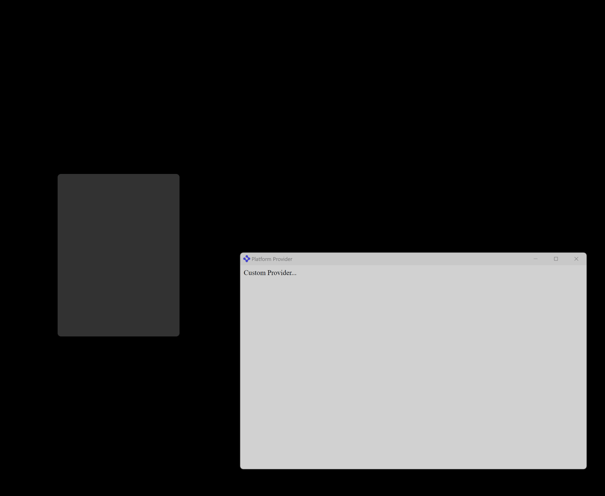
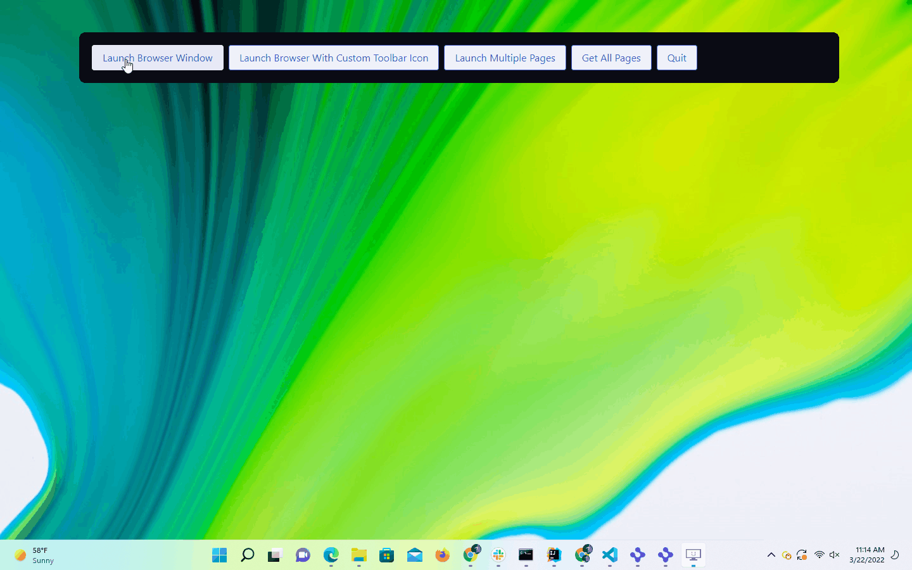
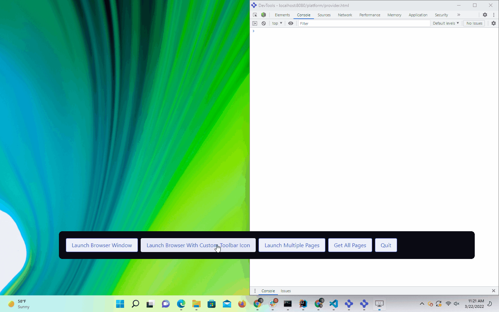
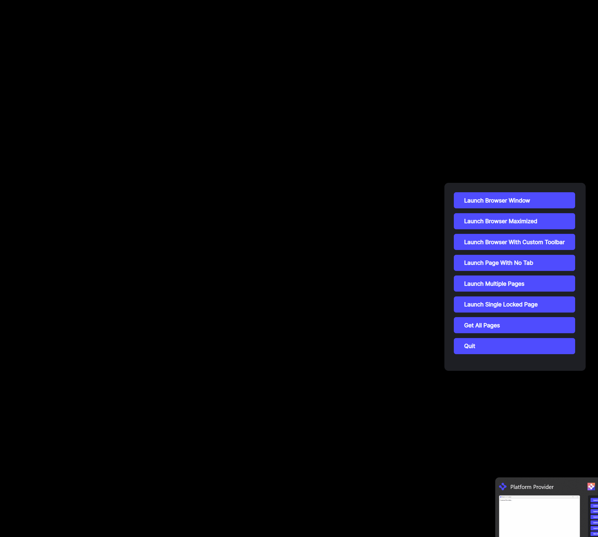
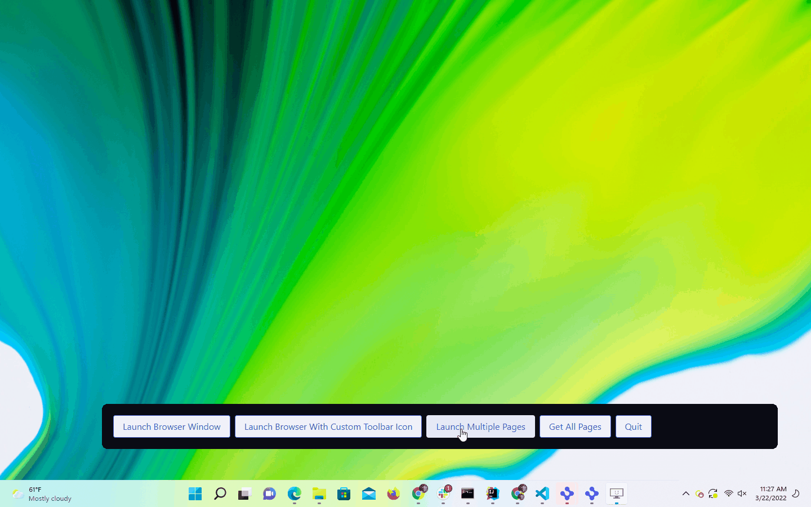
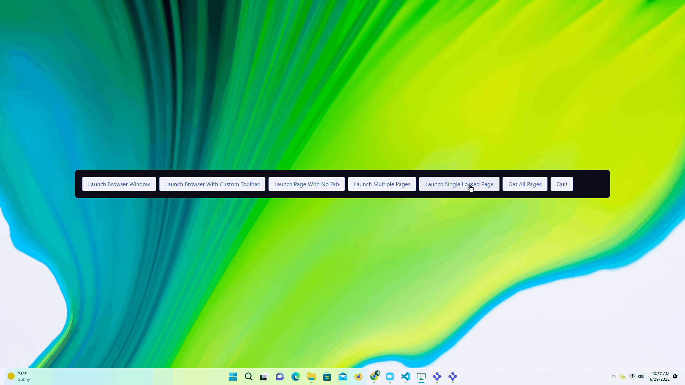
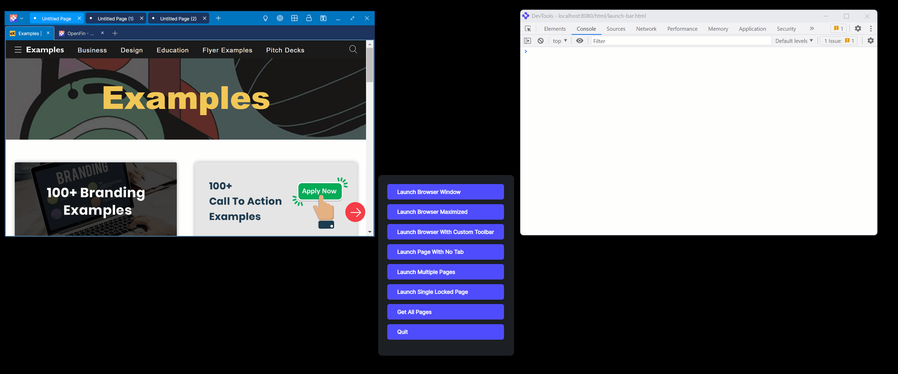

> **_:information_source: OpenFin Workspace:_** [OpenFin Workspace](https://www.openfin.co/workspace/) is a commercial product and this repo is for evaluation purposes (See [LICENSE.MD](LICENSE.MD)). Use of the OpenFin Container and OpenFin Workspace components is only granted pursuant to a license from OpenFin (see [manifest](public/manifest.fin.json)). Please [**contact us**](https://www.openfin.co/workspace/poc/) if you would like to request a developer evaluation key or to discuss a production license.
> OpenFin Workspace is currently **only supported on Windows** although you can run the sample on a Mac for development purposes.

# Register With Browser

OpenFin Workspace empowers you to take advantage of our browser component by using our Workspace Platform SDK to control the behavior of the OpenFin Browser independent of the Home and Storefront components. This example shows how to do a few basic things such as:

1. Launch a browser window.
2. Launch a browser window with a custom toolbar.
3. Launch a browser window with multiple pages.
4. Get all the pages for all open browser windows.
5. Quit the running platform.

This example assumes you have already [set up your development environment](https://developers.openfin.co/of-docs/docs/set-up-your-dev-environment)

## Running the Sample

To run this sample you can:

- Clone this repo and follow the instructions below. This will let you customize the sample to learn more about our APIs.
- Launch the Github hosted version of this sample to interact with it by going to the following link: [Github Workspace Starter Register With Browser](https://start.openfin.co/?manifest=https%3A%2F%2Fbuilt-on-openfin.github.io%2Fworkspace-starter%2Fworkspace%2Fv11.0.0%2Fregister-with-browser%2Fmanifest.fin.json)

## Getting Started

1. Install dependencies and do the initial build. Note that these examples assume you are in the sub-directory for the example.

```shell
npm run setup
```

2. Optional (if you wish to pin the version of OpenFin Workspace to version 11.0.0 and you are on Windows) - Set Windows registry key for [Desktop Owner Settings](https://developers.openfin.co/docs/desktop-owner-settings).
   This example runs a utility [desktop-owner-settings.bat](../common/desktop-owner-settings.bat) that adds the Windows registry key for you, pointing to a local desktop owner
   settings file so you can test these settings. If you already have a desktop owner settings file, this script prompts to overwrite the location. Be sure to capture the existing location so you can update the key when you are done using this example.

   (**WARNING**: This script kills all open OpenFin processes. **This is not something you should do in production to close apps as force killing processes could kill an application while it's trying to save state/perform an action**).

```shell
npm run dos
```

3. Start the test server in a new window.

```shell
npm run start
```

4. Start Your Workspace Platform (this starts Workspace if it isn't already running).

```shell
npm run client
```

5. Build the project if you modify the code.

```shell
npm run build
```

### Note About The App

This is a headless application. If you wish to debug it then you can update the [manifest file](public/manifest.fin.json) and set platform.autoShow to **true**. Otherwise you can use Process Manager (which is included in your list of apps).

### How this example works

```shell
npm run client
```

1. The client command will launch a window with the options object `customSettings.bootstrap.launchBarWindowSettings` set in the `public/manifest.fin.json` file. The window creation for the launch bar containing the buttons is invoked in `client/src/bootstrapper.ts`.



2. In `client/src/launchbar.ts` the `createBrowserWindow` function is invoked on click of the "Launch Browser Window" button.



3. In `client/src/launchbar.ts` the `createBrowserWindowMaximized` function is invoked on click of the "Launch Browser Window Maximized" button.


4. In `client/src/launchbar.ts` the `createCustomToolbarWindow` function is invoked on click of the "Launch Browser With Custom Toolbar" button. The open developer tools reflect the payload defined on the custom button action option in the `createCustomToolbarWindow`, and logged in the registered by the custom action id: `'custom-save-page-clicked` in `WorkspaceInitPlatformConfig` options of `client/src/platform.ts`.



5. In `client/src/launchbar.ts` the `createSinglePageNoTabWindow` function is invoked on click of the "Launch Browser With No Tab" button.



6. In `client/src/launchbar.ts` the `createMultiPageWindow` function is invoked on click of the "Launch Multiple Pages" button.



7. In `client/src/launchbar.ts` the `createWindowWithLockedPage` click listener function is invoked on click of the "Launch Single Locked Page" button. The function uses the `isLocked` page property to programmatically lock a single page.



8. In `client/src/launchbar.ts` the `createWindowWithFixedViews` click listener function is invoked on click of the "Launch Browser With Fixed Views" button. The function uses fixed panels, the first page has panels top, left, right and bottom, the second page has only the top panel which it shares with the first page by re-using the `viewOptions.name`.


9. In `client/src/launchbar.ts` the `getBrowserPagesBtn` click listener function is invoked on click of the "Get All Pages" button. The listener logs: all pages, all unsaved pages, and the last focused page in the context of the launchbar window.



10. The quit button simply quits the workspace platform with will quit both the app and all browser windows.

### Note About This Example

This is an example of how to use our APIs to configure OpenFin Workspace. It's purpose is to provide an example and provide suggestions. This is not a production application and shouldn't be treated as such. Please use this as a guide and provide feedback. Thanks!

---

### Read more about [working with Workspace](https://developers.openfin.co/of-docs/docs/overview-of-workspace)
