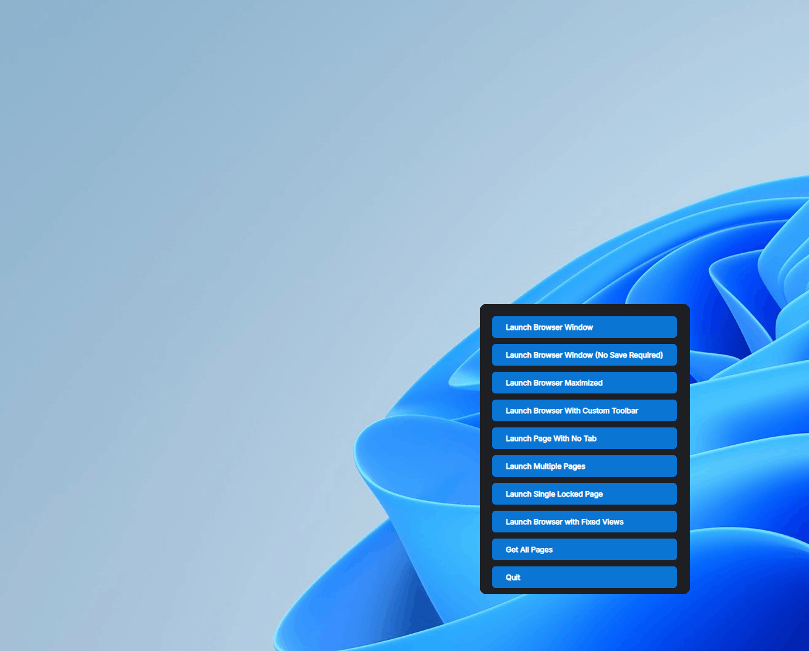

> **_:information_source: HERE Core UI:_** [HERE Core UI](https://resources.here.io/docs/core/hc-ui/) is a commercial product and this repo is for evaluation purposes (See [LICENSE.MD](LICENSE.MD)). Use of the HERE Core Container and HERE Core UI components is only granted pursuant to a license from HERE (see [manifest](public/manifest.fin.json)). Please [**contact us**](https://www.here.io/contact) if you would like to request a developer evaluation key or to discuss a production license.

# Register With Browser

HERE Core UI empowers you to take advantage of our browser component by using our HERE Core UI Platform SDK to control the behavior of the HERE Browser independent of the Home and Storefront components. The control window (`public/platform/provider.html`) loads **without** calling `WorkspacePlatform.init()`. Configure a scenario and settings, then use the lifecycle buttons:

1. **Initialize Platform** — calls `init({ allowDuplicatePageTitles, ... })` using the current checkbox value.
2. **Launch Browser** — runs the selected scenario from `client/src/browser-scenarios.ts` (enabled after initialize).
3. **Restart Demo** — restarts the application without initializing the platform so you can change settings (including Allow Duplicate Page Titles) and click **Initialize Platform** again.
4. **Quit** — exits the application (works before or after initialize).

Scenarios you can try:

1. Launch a browser window.
2. Launch a browser window that doesn't require saving unless changes have been applied.
3. Launch a browser in a maximized state.
4. Launch a browser window with a custom toolbar.
5. Launch a page with no page tab.
6. Launch a browser window with multiple pages.
7. Launch a single locked page.
8. Launch a browser window with fixed views.
9. Launch a browser window to explore duplicate page titles (two pages start with the same intended title).
10. Launch a browser window with pinned pages (three platform pins, three user pins, and one regular tab). Requires HERE Core UI workspace **24.0.19+** (see [dos.json](public/common/dos.json) or run `npm run dos` to pin locally).

Set **Allow Duplicate Page Titles** before **Initialize Platform** (the checkbox is disabled while the platform is initialized). On create, the second tab may still receive a suffix such as `(1)` even when the option is enabled — that is expected. To observe duplicate titles: enable the checkbox, initialize, launch the duplicate page titles scenario, then **rename one page tab** so it matches the other (for example, both `Shared Page Title`). To try a different setting, click **Restart Demo**, change the checkbox, and **Initialize Platform** again.

To try pinned tabs: initialize the platform, select **Launch Browser With Pinned Pages**, and click **Launch Browser**. The window opens with three developer-locked platform pins (`pinned: "platform"`), three user pins (`pinned: "user"`) that can be unpinned from the tab context menu, and one regular unpinned tab for comparison.

This example assumes you have already [set up your development environment](https://resources.here.io/docs/core/develop/)

## Running the Sample

To run this sample you can:

- Clone this repo and follow the instructions below. This will let you customize the sample to learn more about our APIs.
- Launch the Github hosted version of this sample to interact with it by going to the following link: [Github Workspace Starter Register With Browser](https://start.openfin.co/?manifest=https%3A%2F%2Fbuilt-on-openfin.github.io%2Fworkspace-starter%2Fworkspace%2Fv45.0.0%2Fregister-with-browser%2Fmanifest.fin.json)

## Getting Started

1. Install dependencies and do the initial build. Note that these examples assume you are in the sub-directory for the example.

```shell
npm run setup
```

2. Optional (if you wish to pin the version of HERE Core UI to version 24.0.19 and you are on Windows) - Set Windows registry key for [Desktop Owner Settings](https://resources.here.io/docs/core/manage/desktops/dos/).
   This example runs a utility [dos.mjs](./scripts/dos.mjs) that adds the Windows registry key for you, pointing to a local desktop owner
   settings file so you can test these settings. If you already have a desktop owner settings file, this script prompts to overwrite the location. Be sure to capture the existing location so you can update the key when you are done using this example.

   (**WARNING**: This script kills all open HERE processes. **This is not something you should do in production to close apps as force killing processes could kill an application while it's trying to save state/perform an action**).

```shell
npm run dos
```

3. Start the test server in a new window.

```shell
npm run start
```

4. Start Your HERE Core UI Platform (this starts Workspace if it isn't already running).

```shell
npm run client
```

5. Build the project if you modify the code.

```shell
npm run build
```

### How this example works

```shell
npm run client
```

1. The client command opens the provider window (`public/platform/provider.html`, `client/src/provider.ts`) with scenario and settings only.
2. **Initialize Platform** bootstraps the HERE Core UI Platform SDK with `allowDuplicatePageTitles` from the checkbox.
3. **Launch Browser** creates the selected browser window; scenario can be changed between launches without restarting.
4. **Restart Demo** closes browser windows, calls `Application.restart()`, and on load restores the control panel in an uninitialized state (checkbox value is restored from **`localStorage`** so you can adjust it before initializing again).



The main menu in the browser and the custom buttons window shows some of the custom behaviors you can add to your browser through the use of our SDK.

### Note About This Example

This is an example of how to use our APIs to configure HERE Core UI. It's purpose is to provide an example and provide suggestions. This is not a production application and shouldn't be treated as such. Please use this as a guide and provide feedback. Thanks!

---
