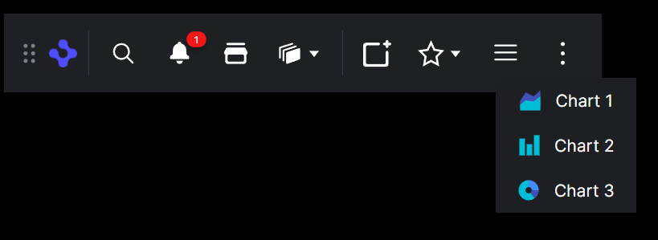

> **_:information_source: OpenFin Workspace:_** [OpenFin Workspace](https://www.openfin.co/workspace/) is a commercial product and this repo is for evaluation purposes (See [LICENSE.MD](LICENSE.MD)). Use of the OpenFin Container and OpenFin Workspace components is only granted pursuant to a license from OpenFin (see [manifest](public/manifest.fin.json)). Please [**contact us**](https://www.openfin.co/workspace/poc/) if you would like to request a developer evaluation key or to discuss a production license.
> OpenFin Workspace is currently **only supported on Windows** although you can run the sample on a Mac for development purposes.

# Register With Dock

OpenFin Workspace empowers you to take advantage of our dock component by using our Workspace Platform SDK.

1. Create a dock.
2. Dynamically add and remove entries from the dock.
3. Override the persistance mechanism.

This example assumes you have already [set up your development environment](https://developers.openfin.co/of-docs/docs/set-up-your-dev-environment)

## Running the Sample

To run this sample you can:

- Clone this repo and follow the instructions below. This will let you customize the sample to learn more about our APIs.
- Launch the Github hosted version of this sample to interact with it by going to the following link: [Github Workspace Starter Register With Dock](https://start.openfin.co/?manifest=https%3A%2F%2Fbuilt-on-openfin.github.io%2Fworkspace-starter%2Fworkspace%2Fv14.0.0%2Fregister-with-dock%2Fmanifest.fin.json)

## Getting Started

1. Install dependencies and do the initial build. Note that these examples assume you are in the sub-directory for the example.

```shell
npm run setup
```

2. Optional (if you wish to pin the version of OpenFin Workspace to version 14.0.19 and you are on Windows) - Set Windows registry key for [Desktop Owner Settings](https://developers.openfin.co/docs/desktop-owner-settings).
   This example runs a utility [dos.mjs](./scripts/dos.mjs) that adds the Windows registry key for you, pointing to a local desktop owner
   settings file so you can test these settings. If you already have a desktop owner settings file, this script prompts to overwrite the location. Be sure to capture the existing location so you can update the key when you are done using this example.

   (**WARNING**: This script kills all open OpenFin processes. **This is not something you should do in production to close apps as force killing processes could kill an application while it's trying to save state/perform an action**).

```shell
npm run dos
```

3. Start the test server in a new window.

```shell
npm run start
```

4. Start Your Workspace Platform (this starts Workspace if it isn't already running).

```shell
npm run client
```

5. Build the project if you modify the code.

```shell
npm run build
```

### Note About The App

This is a headless application. If you wish to debug it then you can update the [manifest file](public/manifest.fin.json) and set platform.autoShow to **true**. Otherwise you can use Process Manager (which is included in your list of apps).

### How this example works

```shell
npm run client
```

1. When the app first launches you should see the dock appear:

2. Click the new tab button to open a window with a new tab.

3. Search in the new tab for web content

4. Click the favorites add button on the browser window to bookmark a page, this will now appear in the favorites menu in the dock.

5. Clicking the favorite in the dock will launch the page.

6. Clicking the favorites remove button on the browser window will remove the url from the dock favorites.

7. The dock positioning and entries will be retained between sessions.


## Custom Menu

This example also demonstrates how to add a custom menu entry to the dock.



### Note About This Example

This is an example of how to use our APIs to configure OpenFin Workspace. It's purpose is to provide an example and provide suggestions. This is not a production application and shouldn't be treated as such. Please use this as a guide and provide feedback. Thanks!

---

### Read more about [working with Workspace](https://developers.openfin.co/of-docs/docs/overview-of-workspace)
