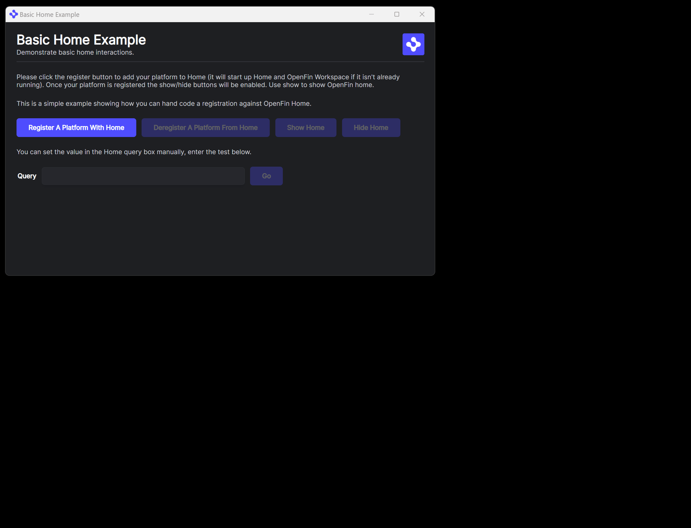

OpenFin Workspace is currently **only supported on Windows**.

# Register With Home - Basic

OpenFin Workspace empowers you to feed content & apps to OpenFin Home via our API. This gives you the choice of fetching your list of applications from a *Content Discovery Service* or somewhere else. 

This application you are about to install is a simple example of plugging in your own content or app. This example assumes you have already [set up your development environment](https://developers.openfin.co/of-docs/docs/set-up-your-dev-environment)

This example has a hard-coded list of apps that is returned from [apps.ts](client/src/apps.ts) and it configures home through [home.ts](client/src/home.ts). The entry point is [provider.ts](client/src/provider.ts). 

The registration of a provider against home will look like the following:

```javascript
 const cliProvider: CLIProvider = {
    title: "title",
    id: "id",
    icon: "http://pathto/icon",
    onUserInput: onUserInput,
    onResultDispatch: onSelection,
  };

  await Home.register(cliProvider);
```

The example is a basic workspace platform that shows a UI allowing you to register against the Home, show/hide Home and unregister the your provider. Store will not be registered against or launched in this example (unless it is already running and has been registered against by another application).

## Getting Started

1. Install dependencies. Note that these examples assume you are in the sub-directory for the example.

```bash
$ npm install
```

2. Build the project.

```bash
$ npm run build
```

3. Optional (if you wish to pin the version of OpenFin Workspace to version 4.0.0) - Set Windows registry key for [Desktop Owner Settings](https://developers.openfin.co/docs/desktop-owner-settings).
   This example includes a utility (`desktop-owner-settings.bat`) that adds the Windows registry key for you, pointing to a local desktop owner 
   settings file so you can test these settings. If you already have a desktop owner settings file, this script prompts to overwrite the location. Be sure to capture the existing location so you can update the key when you are done using this example.

  
   (**WARNING**: This script kills all open OpenFin processes. **This is not something you should do in production to close apps as force killing processes could kill an application while it's trying to save state/perform an action**).


```bash
$ npm run dos
```

4. Start the test server in a new window.

```bash
$ start npm run start
```

5. Start Your Workspace Platform (a basic app in this instance).

```bash
$ npm run client
```

6. Click the register button to register against Home and use the show/hide buttons to control it's visibility.




### Read more about [working with Workspace](https://developers.openfin.co/of-docs/docs/workspace-overview). 
