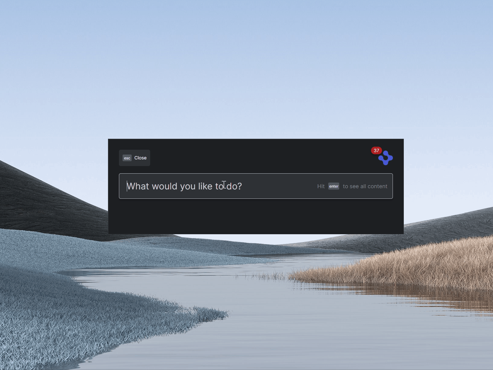

>**_:information_source: OpenFin Workspace:_** [OpenFin Workspace](https://www.openfin.co/workspace/) is a commercial product and this repo is for evaluation purposes (See [LICENSE.MD](LICENSE.MD)). Use of the OpenFin Container and OpenFin Workspace components is only granted pursuant to a  license from OpenFin (see [manifest](public/manifest.fin.json)). Please [**contact us**](https://www.openfin.co/workspace/poc/) if you would like to request a developer evaluation key or to discuss a production license.
OpenFin Workspace is currently **only supported on Windows** although you can run the sample on a Mac for development purposes.

# Register With OpenFin Home

OpenFin Workspace empowers you to feed content & apps to OpenFin Home via our API. This gives you the choice of fetching your list of applications from a *Content Discovery Service* or somewhere else.

This application you are about to install is a simple example of plugging in your own content or app. This example assumes you have already [set up your development environment](https://developers.openfin.co/of-docs/docs/set-up-your-dev-environment)

---
**Running the Sample**

To run this sample you can:

* Clone this repo and follow the instructions below. This will let you customize the sample to learn more about our APIs.
* Launch the Github hosted version of this sample to interact with it by going to the following link: <a href="https://start.openfin.co/?manifest=https%3A%2F%2Fbuilt-on-openfin.github.io%2Fworkspace-starter%2Fworkspace%2Fv7.0.0%2Fregister-with-home%2Fmanifest.fin.json" target="_blank">Github Workspace Starter Register With Home</a>

---

## Getting Started

1. Install dependencies. Note that these examples assume you are in the sub-directory for the example.

```bash
$ npm install
```

2. Build the project.

```bash
$ npm run build
```

3. Optional (if you wish to pin the version of OpenFin Workspace to version 7.0.0) - Set Windows registry key for [Desktop Owner Settings](https://developers.openfin.co/docs/desktop-owner-settings).
   This example includes a utility (`desktop-owner-settings.bat`) that adds the Windows registry key for you, pointing to a local desktop owner 
   settings file so you can test these settings. If you already have a desktop owner settings file, this script prompts to overwrite the location. Be sure to capture the existing location so you can update the key when you are done using this example.

  
   (**WARNING**: This script kills all open OpenFin processes. **This is not something you should do in production to close apps as force killing processes could kill an application while it's trying to save state/perform an action**).

```bash
$ npm run dos
```

4. Start the test server in a new window.

```bash
$ start npm run start
```

5. Start Your Workspace Platform (this starts Workspace if it isn't already running).

```bash
$ npm run client
```

6. Type any character into the search box to show the default list of Applications.
   The [apps](public/apps.json) are displayed as described in their respective files (OpenFin Home is not reading this rest point directly it is being read by the Workspace Platform app and passed to Home via our API).



---
**NOTE ABOUT THE APP**

This is a headless application. If you wish to debug it then you can update the [manifest file](public/manifest.fin.json) and set platform.autoShow to **true**. Otherwise you can use Process Manager (which is included in your list of apps).

---
## How it works

The Server in this example provides two sets of content over HTTP GET.

- [A Desktop Owner Settings file to pin the version of OpenFin Workspace (Optional)](public/dos.json)
- [A list of applications](public/apps.json)
- Examples of View and Snapshot Manifest Types

### List of Applications

The [list of applications](public/apps.json) contains a number of examples:

* Load views into OpenFin Browser
* Launch an OpenFin Application using it's manifest file
* Launch a native application
* Launch a page using the snapshot manifest type

These applications are read and transformed in order to be sent to our API.

### How this example works

You have your own [Workspace Platform](public/manifest.fin.json) that is defined through a manifest. It is headless and it starts up a [custom platform provider](public/platform/provider.html). It is launched by the following command (step 5 above):

```bash
$ npm run client
```

The custom platform provider [provider.ts](client/src/provider.ts) imports the [platform.ts](client/src/platform.ts) and initializes the platform (using the [@openfin/workspace-platform](https://www.npmjs.com/package/@openfin/workspace-platform) module). Once initialized the bootstrapper (that was also imported) is called [bootstrapper](client/src/bootstrapper.ts). 

The bootstrapper has two main responsibilities:

1. Import [home.ts](client/src/home.ts) to register this workspace platform against Home.
2. Listen for when the workspace platform is closing so that it can deregister from Home.

The **home provider**([home.ts](client/src/home.ts)) imports the following:

-  [OpenFin's Workspace NPM Module](https://www.npmjs.com/package/@openfin/workspace) to have access to the relevant functions
-  [OpenFin's Workspace Platform NPM Module](https://www.npmjs.com/package/@openfin/workspace-platform) to have access to the right types
- [settings.ts](client/src/settings.ts) to read settings (such as the id, title of the provider and where it should get the list of apps from)
- [apps.ts](client/src/apps.ts) to fetch a list of applications (the home provider maps these into CLI Search Results)
- [browser.ts](client/src/browser.ts) to fetch saved pages and display them in the Home UI and launch/delete them when the action is executed.
- [launch.ts](client/src/launch.ts) to launch the entry the user selects from OpenFin Home

The registration of a provider against home will look like the following:

```javascript
 const cliProvider: CLIProvider = {
    title: settings.homeProvider.title,
    id: settings.homeProvider.id,
    icon: settings.homeProvider.icon,
    onUserInput: onUserInput,
    onResultDispatch: onSelection,
  };

  await Home.register(cliProvider);
```

The [settings.ts](client/src/settings.ts) file reads the customSettings section of your [manifest file](public/manifest.fin.json):

```javascript
 "customSettings": {
        "appProvider": {
            "appsSourceUrl": "http://localhost:8080/apps.json",
            "includeCredentialOnSourceRequest": "include"
        },
        "homeProvider": {
            "id":"register-with-home",
            "title":"Home Starter",
            "icon":"http://localhost:8080/favicon.ico",
            "queryMinLength": 3,
            "queryAgainst": ["title"]
        }
    }
```

| Property | Description |
| --- | --- |
| **appProvider** | Config related to where the apps should be fetched from |
| appsSourceUrl | Where should we fetch the apps from |
| includeCredentialOnSourceRequest | Should we include credentials when doing the search request. Options:  "omit", "same-origin", "include"|
| **homeProvider** | Config related to the home provider setup to list things in Home and the Browser Add New View |
| id | What your provider should be called |
| title | The title that should be shown in the Home UI to represent your provider |
| icon | The icon to show in the Home UI (top right section as well as an icon to switch between providers when there is more than one registered)  |
| queryMinLength | How many characters should be typed before filtering the list? |
| queryAgainst | What do you wish to run the query against when inspecting your search results. An array of entries. If not specified it will default to ["title"]. Since this example stores the app definition inside of a cli search result's data field you can add data.tags to the array so that it will see if the query matches the start of a tag e.g. ["title","data.tags"] |

---
**NOTE ABOUT THE CONFIG**

This is a demo application for learning and is not meant for production use. Please use this as a way of seeing how you might approach configuring your app.

---
These are settings you can experiment with (e.g. if you already have your own CDS for apps from a previous OpenFin Workspace release you can update the url and restart the Workspace Platform to see it used. CORs needs to be enabled on your server).

The home provider will ask the [apps.ts](client/src/apps.ts) file for a list of applications and it will read the apps directory rest endpoint and return it. The home provider then maps the apps to an array of CLISearchResult objects. The home provider also demonstrates how you can provide filters so that a big result set can be easily filtered.

When a user selects a result in OpenFin Home, it is returned to the Home Provider and we use [launch.ts](client/src/launch.ts) to launch the result.

The [launch.ts](client/src/launch.ts) file imports [OpenFin's Workspace NPM Module](https://www.npmjs.com/package/@openfin/workspace) and [OpenFin's Workspace Platform NPM Module](https://www.npmjs.com/package/@openfin/workspace-platform). It checks the passed app. If the passed app is a Native Application (manifestType: "external") that requires launch external process permissions then it is up to the **Platform Workspace** to support the permission. You can then pass the app to the launchApp function (which will execute under the context of the workspace platform) or call fin.System.launchExternalProcess yourself (if you need custom logic).

The registration of a provider against home will look like the following:

```javascript
 const cliProvider: CLIProvider = {
    title: settings.homeProvider.title,
    id: settings.homeProvider.id,
    icon: settings.homeProvider.icon,
    onUserInput: onUserInput,
    onResultDispatch: onSelection,
  };

  await Home.register(cliProvider);
```

### A note about this example

This is an example of how to use our APIs to configure OpenFin Workspace. It's purpose is to provide an example and provide suggestions. This is not a production application and shouldn't be treated as such. Please use this as a guide and provide feedback. Thanks!

### Read more about [working with Workspace](https://developers.openfin.co/of-docs/docs/overview-of-workspace).
