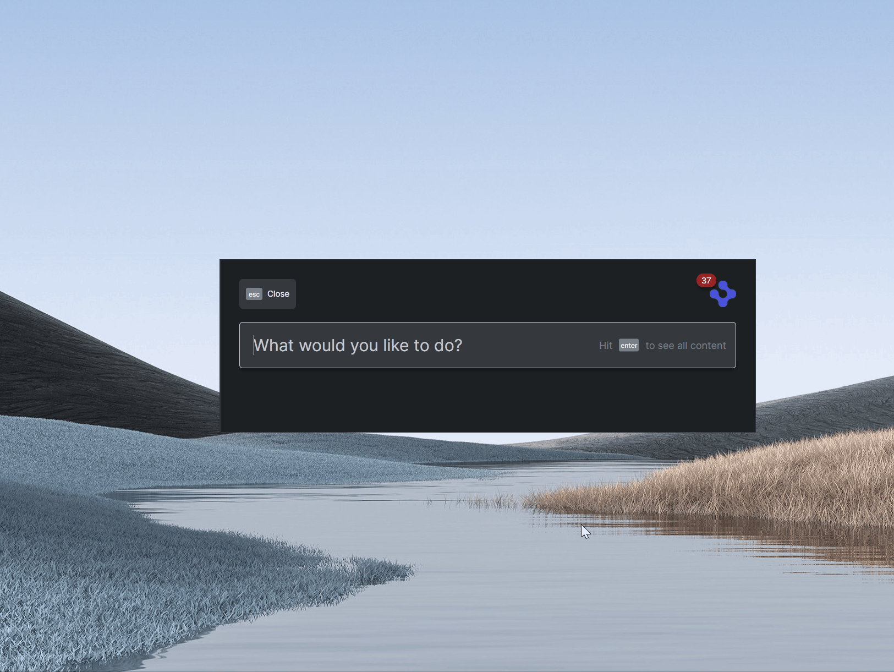
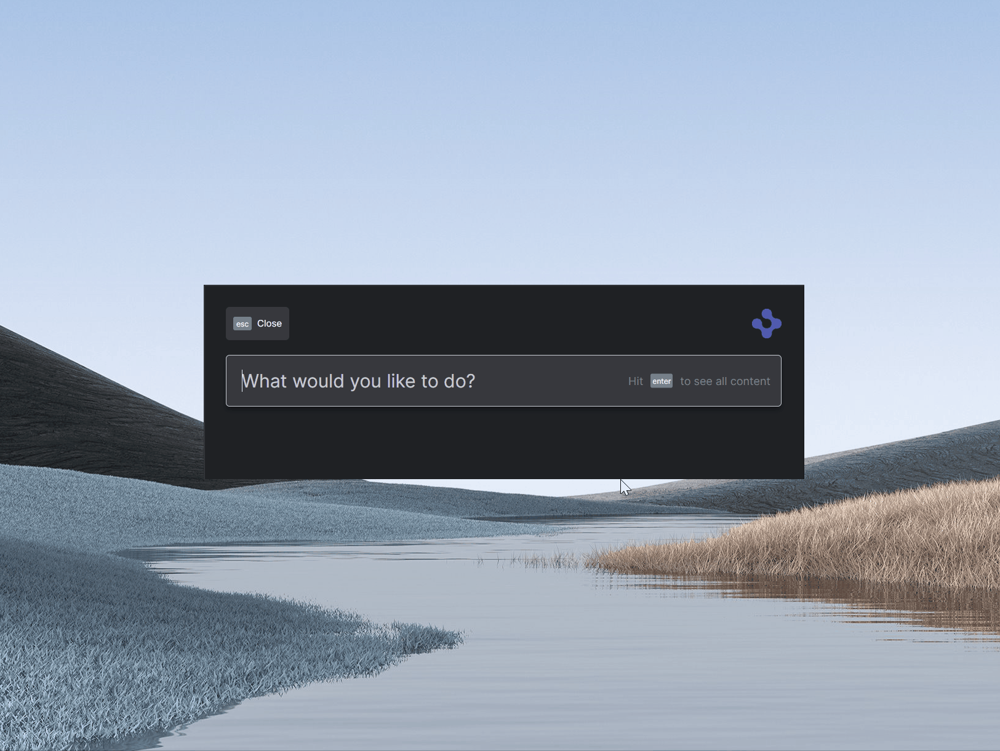

> **_:information_source: OpenFin Workspace:_** [OpenFin Workspace](https://www.openfin.co/workspace/) is a commercial product and this repo is for evaluation purposes (See [LICENSE.MD](LICENSE.MD)). Use of the OpenFin Container and OpenFin Workspace components is only granted pursuant to a license from OpenFin (see [manifest](public/manifest.fin.json)). Please [**contact us**](https://www.openfin.co/workspace/poc/) if you would like to request a developer evaluation key or to discuss a production license.
> OpenFin Workspace is currently **only supported on Windows** although you can run the sample on a Mac for development purposes.

# Register With Platform Windows

OpenFin Workspace empowers you to take advantage of our store component by using our Storefront API to register your own store and populate it with your custom content. This example additionally lets you populate the Home UI using the same data source. This gives you the choice of fetching your list of applications from a _Content Discovery Service_ or somewhere else. This example also shows you that you can use an existing Platform API application and register with these components without using the Browser component (if you have an existing app and don't want to migrate just yet). This example is based off the **Register with Store** starter.

This application you are about to install is an example of plugging in your own content or app via code and using configuration and rest services to determine the data to show and how it should be structured. This example assumes you have already [set up your development environment](https://developers.openfin.co/of-docs/docs/set-up-your-dev-environment)

## Running the Sample

To run this sample you can:

- Clone this repo and follow the instructions below. This will let you customize the sample to learn more about our APIs.
- Launch the Github hosted version of this sample to interact with it by going to the following link: [Github Workspace Starter Register With Platform Windows](https://start.openfin.co/?manifest=https%3A%2F%2Fbuilt-on-openfin.github.io%2Fworkspace-starter%2Fworkspace%2Fvnext%2Fregister-with-platform-windows%2Fmanifest.fin.json)

## Getting Started

1. Install dependencies and do the initial build. Note that these examples assume you are in the sub-directory for the example.

```shell
npm run setup
```

2. Optional (if you wish to pin the version of OpenFin Workspace to version 12.6.0 and you are on Windows) - Set Windows registry key for [Desktop Owner Settings](https://developers.openfin.co/docs/desktop-owner-settings).
   This example runs a utility [desktop-owner-settings.bat](../common/desktop-owner-settings.bat) that adds the Windows registry key for you, pointing to a local desktop owner
   settings file so you can test these settings. If you already have a desktop owner settings file, this script prompts to overwrite the location. Be sure to capture the existing location so you can update the key when you are done using this example.

   (**WARNING**: This script kills all open OpenFin processes. **This is not something you should do in production to close apps as force killing processes could kill an application while it's trying to save state/perform an action**).

```shell
npm run dos
```

3. Start the test server in a new window.

```shell
npm run start
```

4. Start Your Workspace Platform (this starts Workspace if it isn't already running).

```shell
npm run client
```

5. Type any character into the search box to show the default list of Applications.
   You can now use the custom commands e.g. `/price MSFT.

6. If you modify the project and wish to rebuild you can run setup again or the build command below:

```shell
npm run build
```

7. Type any character into the search box to show the default list of applications.
   The [apps](../common/public/apps.json) are displayed as described in their respective files. (OpenFin Home does not read this REST endpoint directly. It is read by the Workspace Platform app and passed to Home via our API).



8. To launch your store launch the Home UI and use / to show a list of the available commands and select Store. Storefront will be shown and your store will be listed.
   The [apps](../common/public/apps.json) are displayed as described in their respective files alongside a Storefront configuration setting defined in your [manifest](public/manifest.fin.json).



## How it works

The behavior is the same as the [Register With Store Sample](../register-with-store/). Please look at that README for information about the settings and the code. The main difference is the platform windows specific part which is described below.

## Custom Platform Windows

The platform api specific code:

- [platform.ts](client/src/platform.ts) - specifying null for browser when initialing your platform against workspace so that the default workspace browser component is not used.
- [manifest.fin.json](public/manifest.fin.json) - if you look at the **defaultWindowOptions** within the platform configuration you will see that the url is specified as: "url": "http://localhost:8080/windows/platform-window.html". This is how an existing platform app would define a custom template to use to host the layout system. This page is used every time you launch a view from home or the store component. **This is optional. If you do not want a custom template then you can remove this url setting from the defaultWindowOptions setting**.
- [platform-window.html](public/windows/platform-window.html) - this is the html template where you specify your custom html. It is important to include a hook for our layout system (see layout-container within the html). You can see that it brings in two scripts.
  - [platform-window.ts](client/src/platform-window.ts) - this file binds to the buttons for closing, minimizing and maximizing your custom window
  - [public/lib/wc-fin/wc-fin.esm.js](public/lib/wc-fin/wc-fin.esm.js) - this is a script that registers a web component that is used in the html template: `<fin-context-group-picker show-list-on-click="false" ></fin-context-group-picker>`. The web component is an example of a context group picker that will assign a context group to every view in the window. The picker is an example which can be found here: [https://github.com/built-on-openfin/interop-api/tree/main/js/components/wc-fin](https://github.com/built-on-openfin/interop-api/tree/main/js/components/wc-fin) and the settings for this particular component can be found here: [https://github.com/built-on-openfin/interop-api/tree/main/js/components/wc-fin/src/components/context-group-picker](https://github.com/built-on-openfin/interop-api/tree/main/js/components/wc-fin/src/components/context-group-picker)

### Note About This Example

This is an example of how to use our APIs to configure OpenFin Workspace. It's purpose is to provide an example and provide suggestions. This is not a production application and shouldn't be treated as such. Please use this as a guide and provide feedback. Thanks!

## FAQ

- The store isn't launching or the store command isn't showing on the home ui?

  - It might be that the config defining the store is invalid. Open up the dev tools for the headless app and check the console log messages.
  - Ensure that the bootstrap section in the customSettings of the manifest has store set to true.

- I am not seeing what I expected?

  - To ensure you are running the right version of this example run the npm run dos command and npm run kill command before running the workspace platform using npm run client (you only need to run the dos command once and it will lock the workspace version for this sample)

- Things have moved/gone?

  - Please check the upgrade guide which covers what has changed between releases: [Migrate from a previous version guide](../migrate-from-a-previous-version)

---

### Read more about [working with Workspace](https://developers.openfin.co/of-docs/docs/overview-of-workspace)
