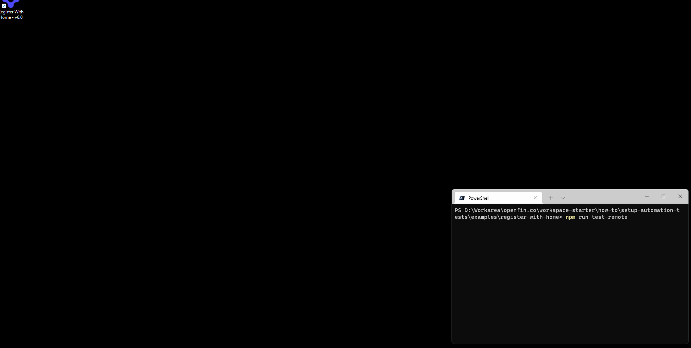

>**_:information_source: OpenFin Workspace:_** [OpenFin Workspace](https://www.openfin.co/workspace/) is a commercial product and this repo is for evaluation purposes. Use of the OpenFin Container and OpenFin Workspace components is only granted pursuant to a  license from OpenFin (see [manifest](public/manifest.fin.json)). Please [**contact us**](https://www.openfin.co/workspace/poc/) if you would like to request a developer evaluation key or to discuss a production license.
OpenFin Workspace is currently **only supported on Windows**.

# OpenFin Setup Test Automation

Any application that requires front end test automation can be complicated to setup. The tests can also be convoluted using the out of the box automation APIs.

This example contains two packages which aim to simplify this process:

* @openfin/automation-helpers - A set of helper methods that can be used in tests to automate access to the OpenFin objects and UI.

* @openfin/automation-cli - A CLI which when passed a manifest and set of tests will launch the necessary processes to run the tests. The correct chromedriver version for the runtime from the manifest will be downloaded if required.

## To build

To build the packages.

```shell
npm install
npm run dist --workspaces
```

## To execute the example tests

There are some example tests written which use the `@openfin/automation-cli` and `@openfin/automation-helpers`, they are written to execute against the `how-to/register-with-home` e.g.

To run the tests against the hosted version of the `register-with-home` app you can run.

```shell
cd examples/register-with-home
npm install
npm run test-remote
```

Or if you already have a local version of the example running serving its manifest on `http://localhost:8080` then you can run.

```shell
cd examples
npm install
npm run test-local
```

## Running using CI

The examples can be run on CI, to use GitHub actions to run the tests there is an example workflow in [automation-tests.yaml](../../.github/workflows/automation-tests.yaml)

This workflow demonstrates Building the packages, then serving the manifest, finally using the automation cli to run the tests against the served manifest.

## Example running locally



## Example running GitHub action

<details>
  <summary>Log of GitHub Action run</summary>
  
  ```shell
start server "npm run server --prefix how-to/register-with-home" command "npm run server --prefix how-to/register-with-home"
waiting on "http://localhost:8080/manifest.fin.json" with timeout of 60 seconds
[command]C:\Windows\system32\cmd.exe /D /S /C "C:\hostedtoolcache\windows\node\16.14.2\x64\npm.cmd run server --prefix how-to/register-with-home"

> openfin-workspace--register-with-home@6.0.0 server
> node ./server/build/index.js

server is listening on port 8080
run command "npm run test-local --prefix how-to/setup-automation-tests/examples/register-with-home" command "npm run test-local --prefix how-to/setup-automation-tests/examples/register-with-home"
[command]C:\Windows\system32\cmd.exe /D /S /C "C:\hostedtoolcache\windows\node\16.14.2\x64\npm.cmd run test-local --prefix how-to/setup-automation-tests/examples/register-with-home"

> setup-automation-tests-register-with-home@1.0.0 test-local
> of-automation http://localhost:8080/manifest.fin.json ./tests/**/*.spec.js

OpenFin Automation

Manifest Url http://localhost:8080/manifest.fin.json
Test Glob Path ./tests/**/*.spec.js
Log Level silent
Dev Tools Port 9090
Chrome Driver Port 4444
Chrome Driver Store ./chromedriver/
Test Timeout 120
Default Runtime Version 23.96.68.3
----------------------------------------------------------
Loading manifest http://localhost:8080/manifest.fin.json
Manifest loaded
Manifest Runtime Version 23.96.68.3
----------------------------------------------------------
Chromium runtime version 96
Fetching Chrome Driver Version manifest https://chromedriver.storage.googleapis.com/
Fetching Chrome Driver https://chromedriver.storage.googleapis.com/96.0.4664.18/chromedriver_win32.zip
Unzipping Chrome Driver to D:\a\workspace-starter\workspace-starter\how-to\setup-automation-tests\examples\register-with-home\chromedriver\96\chromedriver.exe
----------------------------------------------------------
Creating temp profile dir C:\Users\RUNNER~1\AppData\Local\Temp\openfin-test-1649419137419
----------------------------------------------------------
Cleaning up existing OpenFin instances
Cleanup complete
----------------------------------------------------------
Downloading the OpenFinRVM
Creating temp installer dir C:\Users\RUNNER~1\AppData\Local\Temp\openfin-installer-1649419137595
Unzipping OpenFinRVM C:\Users\RUNNER~1\AppData\Local\Temp\openfin-installer-1649419137595\openfin-installer.exe
Installing OpenFinRVM C:\Users\RUNNER~1\AppData\Local\Temp\openfin-installer-1649419137595\openfin-installer.exe
Querying Desktop Owner Settings


Writing Temporary Desktop Owner Settings C:\Users\RUNNER~1\AppData\Local\Temp\openfin-dos-1649419158322.json
Setting Desktop Owner Setting file:\\\C:\Users\RUNNER~1\AppData\Local\Temp\openfin-dos-1649419158322.json
The operation completed successfully.

----------------------------------------------------------
Running OpenFin C:\Users\runneradmin\AppData\Local\OpenFin\OpenFinRVM.exe
Args --config=http://localhost:8080/manifest.fin.json,--working-dir="C:\Users\runneradmin\AppData\Local\OpenFin",--runtime-arguments="--remote-debugging-port=9090"
OpenFinRVM Process 1712
----------------------------------------------------------
Starting Chrome Driver D:\a\workspace-starter\workspace-starter\how-to\setup-automation-tests\examples\register-with-home\chromedriver\96\chromedriver.exe port 4444
Chrome Driver Process 5668
Waiting for Chrome Driver to be ready
Starting ChromeDriver 96.0.4664.18 (b8887b3d1742adb0873f871edc1d8d8c1d46bb96-refs/branch-heads/4664@{#236}) on port 4444
Only local connections are allowed.
Please see https://chromedriver.chromium.org/security-considerations for suggestions on keeping ChromeDriver safe.
ChromeDriver was started successfully.
Waiting for Chrome Driver to connect to OpenFin platform...
----------------------------------------------------------
Running Tests using Mocha


  Register With Home
    ✔ The title should be set (1336ms)
    ✔ The runtime version should be set
    ✔ Can open the home window (7600ms)
    ✔ Can search in the home window (1542ms)
    ✔ Can select entries in the home window by index (2184ms)
    ✔ Can select entries in the home window by id (2094ms)
    ✔ Can open the home window filters (195ms)
    ✔ Can get the filter ids (54ms)
    ✔ Set a filter by index
    ✔ Set a filter by id
    ✔ Can close the home window filters (3779ms)
    ✔ Can check selected entry content
    ✔ Can open an entry in the home window (1053ms)
    ✔ Can clear entries in the home window (1838ms)
    ✔ Can close the home window (610ms)
    ✔ Can perform operation in the interop window (2079ms)


  16 passing (24s)

----------------------------------------------------------
Closing Chrome Driver
SUCCESS: The process with PID 5668 (child process of PID 1828) has been terminated.
Restoring DOS
Deleting Desktop Owner Setting 
Delete the registry value DesktopOwnerSettings (Yes/No)? The operation completed successfully.

Removing temporary DOS Settings
Cleaning up existing OpenFin instances
SUCCESS: The process with PID 1556 (child process of PID 1956) has been terminated.
SUCCESS: The process with PID 6608 (child process of PID 1956) has been terminated.
SUCCESS: The process with PID 5964 (child process of PID 1956) has been terminated.
Cleanup complete
----------------------------------------------------------
Removing temp data dir C:\Users\RUNNER~1\AppData\Local\Temp\openfin-test-1649419137419
```
</details>