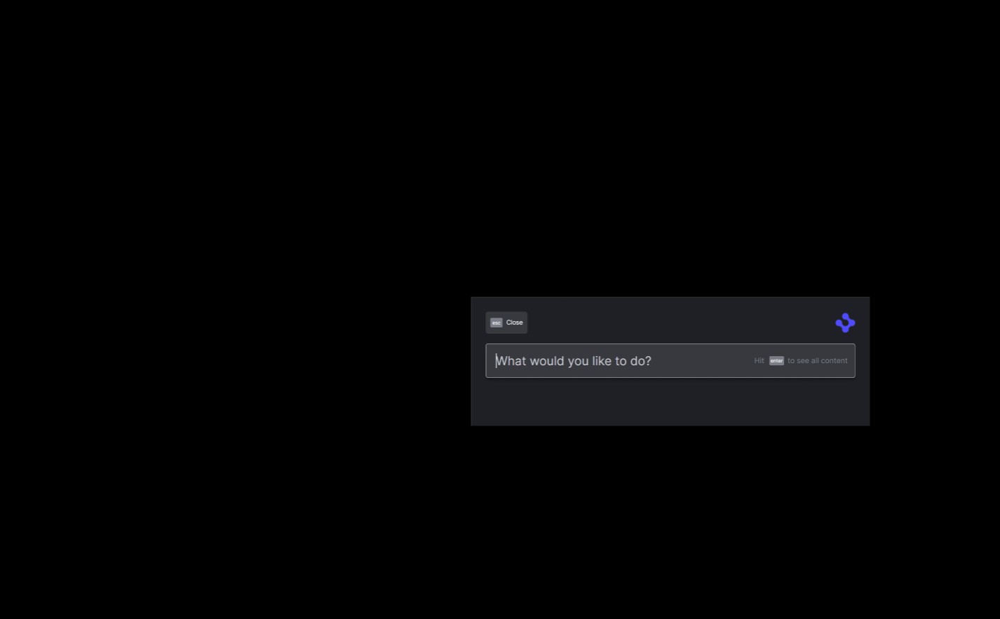

>**_:information_source: OpenFin Workspace:_** [OpenFin Workspace](https://www.openfin.co/workspace/) is a commercial product and this repo is for evaluation purposes. Use of the OpenFin Container and OpenFin Workspace components is only granted pursuant to a  license from OpenFin (see [manifest](public/manifest.fin.json)). Please [**contact us**](https://www.openfin.co/workspace/poc/) if you would like to request a developer evaluation key or to discuss a production license.
OpenFin Workspace is currently **only supported on Windows**.

# Support Context and Intents - How is Intent Support implemented?

[Back to main README.md](README.md)

Intent support is added to the sample in the following ways:

* An implementation of InteropBroker is provided in [interopbroker.ts](client/src/interopbroker.ts) and it overrides handleInfoForIntentsByContext, handleInfoForIntent, handleFiredIntentForContext and handleFiredIntent
* [platform.ts](client/src/platform.ts) uses this implementation when calling the init function from the @openfin/workspace-platform npm module.
* We have provided a view that demonstrates raising and listening to an intent [fdc3-intent-view.json](../common/public/views/fdc3/intent/fdc3-intent-view.json) and [interop-intent-view.json](../common/public/views/interop/intent/interop-intent-view.json). The intent views have been setup so you can see ones that support a single instance and a version that can be launched multiple times.
* We have provided a view that demonstrates broadcasting/setting context and listening for context [fdc3-broadcast-view.json](../common/public/views/fdc3/context/fdc3-broadcast-view.json) and [interop-broadcast-view.json](../common/public/views/interop/context/interop-broadcast-view.json). 
* We have added pages that contain the interop and fdc3 views to show launching a page where multiple views receive the intent. This contains two types of page:
  * singe instance - we only want one instance of this page to be launched and the views within it to be passed the intent context each time. This page is represented as a snapshot: [snapshot-intent-single-instance.json](../common/public/snapshots/snapshot-intent-single-instance.json). To support this approach the example disables the option of closing the views or moving the views outside of the page.
  * multi instance - each time an intent is raised a new copy of this page is launched and the intent is passed to the views within it:  [snapshot-intent-multi-instance.json](../common/public/snapshots/snapshot-intent-multi-instance.json). This page doesn't impose any restrictions so you can close or pull out views.
* Provide an example intent/app picker if a context supports more than one intent or an intent supports more than one application: [picker.html](../common/public/windows/intents/picker.html)
* Update [apps.json](../common/public/apps.json) to add the new views/pages and specify that they support intents in their metadata.
* Update [apps.ts](client/src/apps.ts) to support getting apps that support intents or context types.
* Update [launch.ts](client/src/launch.ts) so that it can launch views and pages directly (it needs to do this as the interopbroker needs to know the ids of the views created in order to pass the intent to them). 

---
**Running the Sample**

To run this sample:

* Run the sample using the instructions provided in the main [README.md](README.md).
* Bring up the Home UI and search for 'Intent' and you will see the intent raising view.
* You have the choice of picking the FDC3 or Interop Intent View.
* You can now pick from a number of options:
  * Do you want to raise an intent by name or by context object
  * What intent do you want to raise
  * What context type do you want to publish
  * What sample data (or custom data) do you want to send
  * App Preference: No preference will result in a list of applications being shown in the app picker if more than one app supports an intent, Non Existent App (to demonstrate what would happen if an incorrect app id was passed when raising an intent), A specific app (this list is built dynamically using the interop or fdc3 apis to query the interop broker)
* Once you are happy with your selections can click the button to raise the intent or context.
---

## Example of raising intents

## Example of Sharing context with Third Party Websites using preload scripts and fdc3 broadcasting.

