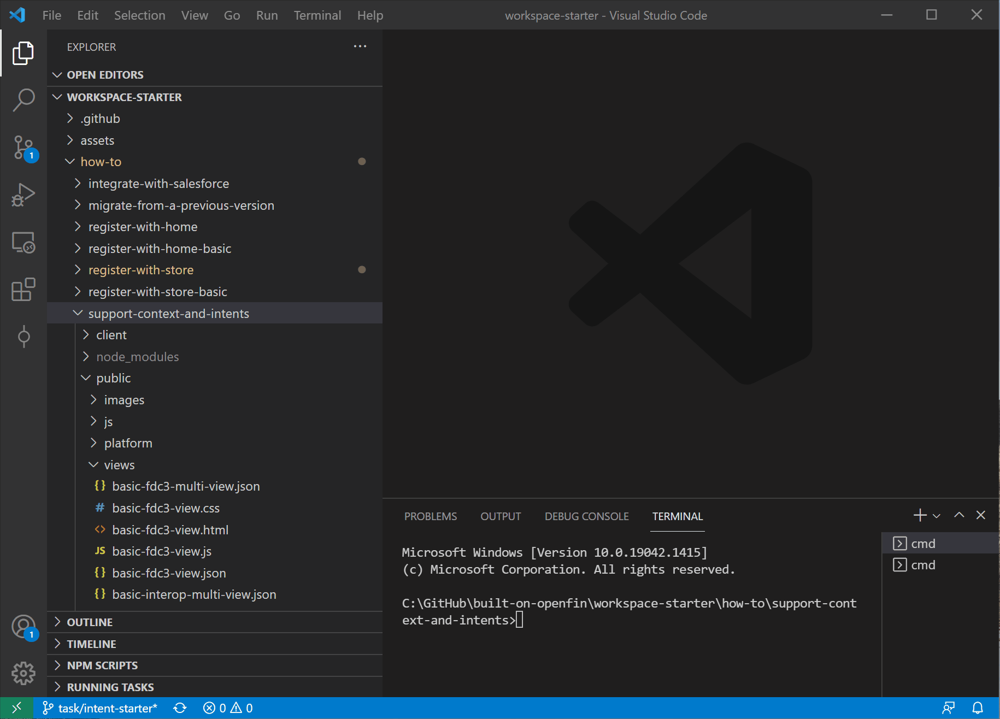

>**_:information_source: OpenFin Workspace:_** [OpenFin Workspace](https://www.openfin.co/workspace/) is a commercial product and this repo is for evaluation purposes. Use of the OpenFin Container and OpenFin Workspace components is only granted pursuant to a  license from OpenFin (see [manifest](public/manifest.fin.json)). Please [**contact us**](https://www.openfin.co/workspace/poc/) if you would like to request a developer evaluation key or to discuss a production license.
OpenFin Workspace is currently **only supported on Windows** although you can run the sample on a Mac for development purposes.

# Support Context and Intents

This sample is an extension of the register with store example. The sample covers:

* Registering with Home
* Registering a Store
* Customizing OpenFin Browser
* Supporting Interop/FDC3 Context messages
* Supporting Interop/FDC3 Intents
* Using a golden data source (in [apps.json](public/apps.json)) to drive the apps that show up in Home, Store and in intent resolution
* Customization through config (in the [manifest.fin.json](public/manifest.fin.json) file) 

This example assumes you have already [set up your development environment](https://developers.openfin.co/of-docs/docs/set-up-your-dev-environment)

---
**Running the Sample**

To run this sample you can:

* Clone this repo and follow the instructions below. This will let you customize the sample to learn more about our APIs.
* Launch the Github hosted version of this sample to interact with it by going to the following link: <a href="https://start.openfin.co/?manifest=https%3A%2F%2Fbuilt-on-openfin.github.io%2Fworkspace-starter%2Fworkspace%2Fv6.0.0%2Fsupport-context-and-intents%2Fmanifest.fin.json" target="_blank">Github Workspace Starter Support Context And Intents Example</a>
* Launch the Second Github hosted version of this sample to see how OpenFin Workspace can support multiple workspace platforms with their own branding: <a href="https://start.openfin.co/?manifest=https%3A%2F%2Fbuilt-on-openfin.github.io%2Fworkspace-starter%2Fworkspace%2Fv6.0.0%2Fsupport-context-and-intents%2Fsecond.manifest.fin.json" target="_blank">Github Workspace Starter Second Support Context And Intents Example</a>

---

## Getting Started

1. Install dependencies. Note that these examples assume you are in the sub-directory for the example.

```bash
$ npm install
```

2. Build the project.

```bash
$ npm run build
```

3. Optional (if you wish to pin the version of OpenFin Workspace to version 6.0.0) - Set Windows registry key for [Desktop Owner Settings](https://developers.openfin.co/docs/desktop-owner-settings).
   This example includes a utility (`desktop-owner-settings.bat`) that adds the Windows registry key for you, pointing to a local desktop owner 
   settings file so you can test these settings. If you already have a desktop owner settings file, this script prompts to overwrite the location. Be sure to capture the existing location so you can update the key when you are done using this example.

  
   (**WARNING**: This script kills all open OpenFin processes. **This is not something you should do in production to close apps as force killing processes could kill an application while it's trying to save state/perform an action**).

```bash
$ npm run dos
```

4. Start the test server in a new window.

```bash
$ start npm run start
```

5. Start Your Workspace Platform (this starts Workspace if it isn't already running).

```bash
$ npm run client
```

If you want to see a second workspace platform run alongside the first you can fire up a copy using the following command:

```bash
$ npm run secondclient
```

This runs the same code with slightly different settings to show a different theme: [second.manifest.fin.json](public/second.manifest.fin.json)



6. Type any character into the search box to show the default list of applications.
   The [apps](public/apps.json) are displayed as described in their respective files. (OpenFin Home does not read this REST endpoint directly. It is read by the Workspace Platform app and passed to Home via our API).

7. To launch your store launch the Home UI and use / to show a list of the available commands and select Store. Storefront will be shown and your store will be listed.
   The [apps](public/apps.json) are displayed as described in their respective files alongside a Storefront configuration setting defined in your [manifest](public/manifest.fin.json).

## How it works

The Server in this example provides two sets of content over HTTP GET.

- [A Desktop Owner Settings file](public/dos.json)
- [A list of applications](public/apps.json)
- Examples of View and Snapshot Manifest Types


### List of Applications

The [list of applications](public/apps.json) contains a number of examples:

* Load views into OpenFin Browser
* Launch an OpenFin application using its manifest file
* Launch a native application
* Launch a page using the snapshot manifest type
* Launch through an intent: a view (single instance and multi instance) and a page (single instance and multi instance)

These applications are read and transformed in order to be sent to our API.

### Intent Support Information

This Readme contains information similar to the Register with Store readme (as this is an extension). To make the addition of Intent support clearer it has been moved to it's own markdown file: [**IntentSupport.md**](IntentSupport.md).

---
**NOTE ABOUT THE APP**

This is a headless application. If you wish to debug it then you can update the [manifest file](public/manifest.fin.json) and set platform.autoShow to **true**. Otherwise you can use Process Manager (which is included in your list of apps).

---
### How this example works

You have your own [Workspace Platform](public/manifest.fin.json) that is defined through a manifest. It is headless and it starts up a [custom platform provider](public/platform/provider.html). It is launched by the following command (step 5 above):

```bash
$ npm run client
```

The custom platform provider [provider.ts](client/src/provider.ts) imports the [platform.ts](client/src/platform.ts) and initializes the platform. 

The [platform.ts](client/src/platform.ts) initializes the workspace platform by using the init function from [@openfin/workspace-platform](https://www.npmjs.com/package/@openfin/workspace-platform). This function lets us specify default window options for OpenFin Browser based windows. This lets us specify the icons, title and theme for the Browser Windows. It also defines how the interop broker should work using [interopbroker.ts](client/src/interopbroker.ts).

Once initialized the bootstrapper (that was also imported) is called [bootstrapper](client/src/bootstrapper.ts). 

The bootstrapper has two main responsibilities:

1. Import [settings.ts](client/src/settings.ts) to see what should be bootstrapped. (That is, should it setup Store and Home?)
2. Import [home.ts](client/src/home.ts) and ensure that a home provider is registered against home in order to provide a list of applications (if enabled).
3. Import [store.ts](client/src/store.ts) and ensure that a store provider is registered if store is enabled.
4. Listen for when your workspace platform is about to close and deregister from home and store.

The **home provider**([home.ts](client/src/home.ts)) imports the following:

-  [OpenFin's Workspace NPM Module](https://www.npmjs.com/package/@openfin/workspace) to have access to the relevant functions
-  [OpenFin's Workspace Platform NPM Module](https://www.npmjs.com/package/@openfin/workspace-platform) to have access to the right types
- [settings.ts](client/src/settings.ts) to read settings (such as the id, title of the provider and where it should get the list of apps from)
- [apps.ts](client/src/apps.ts) to fetch a list of applications (the home provider maps these into CLI Search Results)
- [browser.ts](client/src/browser.ts) to fetch saved pages and display them in the Home UI and launch/delete them when the action is executed.
- [launch.ts](client/src/launch.ts) to launch the entry the user selects from OpenFin Home

The registration of a provider against home will look like the following:

```javascript
 const cliProvider: CLIProvider = {
    title: settings.homeProvider.title,
    id: settings.homeProvider.id,
    icon: settings.homeProvider.icon,
    onUserInput: onUserInput,
    onResultDispatch: onSelection,
  };

  await Home.register(cliProvider);
```

The **store provider**([store.ts](client/src/store.ts)) imports the following:
- [OpenFin's Workspace NPM Module](https://www.npmjs.com/package/@openfin/workspace) to have access to the relevant functions
- [settings.ts](client/src/settings.ts) to read settings (such as the how to configure the store)
- [apps.ts](client/src/apps.ts) to fetch a list of applications when searching and to provide a filtered set of applications for specific store sections
- [launch.ts](client/src/launch.ts) to launch the entry the user selects from OpenFin Store
  
The registration of a provider against store will look like the following:

```javascript
const storeProvider = {
      id: settings.storefrontProvider.id,
      title: settings.storefrontProvider.title,
      icon: settings.storefrontProvider.icon,
      getNavigation: getNavigation.bind(this),
      getLandingPage: getLandingPage.bind(this),
      getFooter: getFooter.bind(this),
      getApps,
      launchApp: launch,
    };
    
await Storefront.register(storeProvider)
```

The [settings.ts](client/src/settings.ts) file reads the customSettings section of your [manifest file](public/manifest.fin.json):

```javascript
"customSettings": {
    "bootstrap": {
      "home": true,
      "store": true
    },
    "appProvider": {
      "appsSourceUrl": "http://localhost:8080/apps.json",
      "includeCredentialOnSourceRequest": "include",
      "cacheDurationInMinutes": 1,
      "appAssetTag": "appasset"
    },
    "browserProvider": {
      "windowOptions": {
        "title": "Browser Starter",
        "icon": "http://localhost:8080/favicon.ico",
        "newTabUrl": null,
        "newPageUrl": null
      }
    },
    "themeProvider": {
        "themes":[
          {
              "label": "Starter Theme",
              "logoUrl": "http://localhost:8080/favicon.ico",
              "palette": {
                  "brandPrimary": "#504CFF",
                  "brandSecondary": "#383A40",
                  "backgroundPrimary": "#111214",
                  "functional1": null,
                  "functional2": null,
                  "functional3": null,
                  "functional4": null,
                  "functional5": null,
                  "functional6": null,
                  "functional7": null,
                  "functional8": null,
                  "functional9": null,
                  "functional10": null,
                  "statusSuccess": null,
                  "statusWarning": null,
                  "statusCritical": null,
                  "statusActive": null,
                  "inputBg": null,
                  "inputColor": null,
                  "inputPlaceholder": null,
                  "inputDisabled": null,
                  "inputFocused": null,
                  "textDefault": null,
                  "textHelp": null,
                  "textInactive": null,
                  "background1": null,
                  "background2": null,
                  "background3": null,
                  "background4": null,
                  "background5": null,
                  "background6": null
              }
          }
      ]
    },
    "homeProvider": {
      "id": "register-with-store-home",
      "title": "Home Starter",
      "icon": "http://localhost:8080/favicon.ico",
      "queryMinLength": 3,
      "queryAgainst":["title"]
    },
    "storefrontProvider": {
      "id": "register-with-store",
      "title": "Custom Storefront",
      "icon": "http://localhost:8080/favicon.ico",
      "landingPage": {
        "hero": {
          "title": "Custom Hero Title",
          "description": "This is a demonstration of the hero section that you can configure for your store.",
          "cta": {
            "title": "Hero Apps!",
            "tags": ["hero"]
          },
          "image": {
            "src": "http://localhost:8080/images/superhero-unsplash.jpg"
          }
        },
        "topRow": {
          "title": "Custom Top Row Content",
          "items": [
            {
              "title": "Expero",
              "description": "A collection of example views from Expero showing the power of interop and context sharing.",
              "image": {
                "src": "http://localhost:8080/images/coding-1-unsplash.jpg"
              },
              "tags": ["expero"]
            },
            {
              "title": "Dev Tools",
              "description": "A collection of developer tools that can aid with building and debugging OpenFin applications.",
              "image": {
                "src": "http://localhost:8080/images/coding-2-unsplash.jpg"
              },
              "tags": ["tools"]
            },
            {
              "title": "Learning Resource",
              "description": "A collection of developer documents that can aid with building and debugging OpenFin applications.",
              "image": {
                "src": "http://localhost:8080/images/coding-3-unsplash.jpg"
              },
              "tags": ["page"]
            }
          ]
        },
        "middleRow": {
          "title": "A collection of simple views that show how to share context using the FDC3 or Interop APIs.",
          "tags": ["fdc3","interop"]
        },
        "bottomRow": {
          "title": "Quick Access",
          "items": [
            {
              "title": "Views",
              "description": "A collection of views made available through our catalog.",
              "image": {
                "src": "http://localhost:8080/images/coding-4-unsplash.jpg"
              },
              "tags": ["view"]
            },
            {
              "title": "Web Apps",
              "description": "A collection of web apps built using OpenFin.",
              "image": {
                "src": "http://localhost:8080/images/coding-5-unsplash.jpg"
              },
              "tags": ["manifest"]
            },
            {
              "title": "Native Apps",
              "description": "A collection of native apps made available through our catalog.",
              "image": {
                "src": "http://localhost:8080/images/coding-6-unsplash.jpg"
              },
              "tags": ["native"]
            }
          ]
        }
      },
      "navigation": [
        {
          "title": "Applications",
          "items": [
            {
              "title": "All Apps",
              "tags": ["view","page","manifest","native"]
            },
            { "title": "Views", "tags": ["view"] },
            { "title": "Pages", "tags": ["page"] },
            {
              "title": "Manifest",
              "tags": ["manifest"]
            },
            {
              "title": "Native",
              "tags": ["native"]
            }
          ]
        },
        {
          "title": "Context Sharing",
          "items": [
            {
              "title": "FDC3 API",
              "tags": ["fdc3"]
            },
            {
              "title": "Interop API",
              "tags": ["interop"]
            }
          ]
        }
      ],
      "footer": {
        "logo": { "src": "http://localhost:8080/favicon.ico", "size": "32" },
        "text": "Welcome to the OpenFin Sample Footer",
        "links": [
          {
            "title": "Github",
            "url": "https://github.com/built-on-openfin/workspace-starter"
          },
          {
            "title": "YouTube",
            "url": "https://www.youtube.com/user/OpenFinTech"
          }
        ]
      }
    }
  }
```

| Property | Description |
| --- | --- |
| **bootstrap** | Config related to the bootstrapping process |
| home | Should we use home and register a home provider to feed apps into Home and Browser |
| store | Should we use store and register a store provider to display apps |
| **appProvider** | Config related to where the apps should be fetched from |
| appsSourceUrl | Where should we fetch the apps from |
| includeCredentialOnSourceRequest | Should we include credentials when doing the search request. Options:  "omit", "same-origin", "include"|
| cacheDurationInMinutes | How many minutes should we wait before refreshing the list from the server? |
| appAssetTag | If including app assets in your manifest, what tag in the app definition will highlight this manifestType:"external" is actually an app asset and shouldn't be run from a path? If undefined then appasset is assumed |
| **browserProvider** | Config related to OpenFin Browser |
| title | The title for the window that shows up in the taskbar |
| icon | The icon that should show in the taskbar and in the top left menu of the browser |
| newTabUrl | Should we allow someone to add a new view to a page? What url should be loaded when they click add? |
| newPageUrl | Should we allow someone to add a new page? What url should be loaded when they click add? |
| **themeProvider** | What themes should be passed to OpenFin Workspace (at the moment only one is supported) |
| themes | An array of custom themes to pass to OpenFin Workspace (at the moment only the first entry is used) |
| themes.label | A label to use to identify this theme |
| themes.logoUrl | Preferred logo for a theme |
| pallete | A collection of settings that can be overriden (brandPrimary, brandSecondary and backgroundPrimary are mandatory if you are specifying a theme) |
| **homeProvider** | Config related to the home provider setup to list things in Home and the Browser Add New View |
| id | What your provider should be called |
| title | The title that should be shown in the Home UI to represent your provider |
| icon | The icon to show in the Home UI (top right section as well as an icon to switch between providers when there is more than one registered)  |
| queryMinLength | How many characters should be typed before filtering the list? |
| queryAgainst | What do you wish to run the query against when inspecting your search results. An array of entries. If not specified it will default to ["title"]. Since this example stores the app definition inside of a cli search result's data field you can add data.tags to the array so that it will see if the query matches the start of a tag e.g. ["title","data.tags"] |
| **storefrontProvider** | Config settings that are used by the sample code to configure the store using the workspace APIs |
| id | Unique ID for your store |
| title | The name for your store that will be shown in the store selection dropdown |
| icon | The icon to show in the store selection dropdown |
| landingPage | The structure of the main page the user will be presented with when they visit your store |
| landingPage.hero | Optional. Do you want a hero section on the main page. |
| landingPage.topRow | What do you want this row to be called and how many sections do you want (use tags to determine what apps are included in this section). Limit of 4 sections. |
| landingPage.middleRow | What do you want this row to be called and what apps do you want to show in the middle (use tags to determine what apps are included in this row). Limit of 6 apps. |
| landingPage.bottomRow | What do you want this row to be called and how many sections do you want (use tags to determine what apps are included in this section). There is a limit of 3 sections.  |
| navigation | How many navigation sections do you want on the left hand menu? Limit of 2. |
| navigation[i].title | What do you want as a title for these set of links? |
| navigation[i].items | How many links do you want to show (limit of 5) and what apps do you want a link to display (use tags to select apps) |
| footer | What do you want to show in the store footer |
| footer.logo | The logo to show in the footer |
| footer.text | The text to show in the footer |
| footer.links | What links do you want to show in the footer (opens up using the default web browser. |

---
**NOTE ABOUT THE MANIFEST**

This is a demo application for learning and is not meant for production use. Please use this as a way of seeing how you might approach configuring your store.

The manifest for the storefront does not include an `id` for the `cta`, `items` and `navigation` sections. 

This is to reduce noise in the example manifest and to prevent issues if an item or section is copied and pasted. The code has a fallback that uses the title or title plus tags to form an `id`. This works for the demo, as the manifest file is storing the configuration. If the configuration were ever fetched from a server, then it should return a unique (e.g., GUID) and idempotent ID. 

This is because the `id` represents the route that the user navigates to. So, if an` id` for a navigation item was "x" and the user clicked on the link, then the store would call the `getNavigation()` or `getLandingPage()` function you defined and look for a matching `id` of "x". If you regenerate the `id` for a navigation item, e.g., it becomes "y", then the store would not be able to render your page, as there are no items with the `id` of "x". 

---


These are settings you can experiment with (e.g., if you already have your own CDS for apps, you can update the URL and restart the Workspace Platform. Your server will need to support CORS).

The home provider checks the [apps.ts](client/src/apps.ts) file for a list of applications and then it reads the apps directory REST endpoint and returns it. The home provider then maps the apps to an array of SearchResult objects. The apps file checks to see if it has permission to launch external processes or download app assets and filter out entries as appropriate. It logs a warning of the apps filtered out and in a real app you could move this logic to the launch action to then notify the user they can't launch that app on this machine.

When a user selects a result in OpenFin Home, it is returned to the home provider and the home provider uses [launch.ts](client/src/launch.ts) to launch the result.

The [launch.ts](client/src/launch.ts) file imports [OpenFin's Workspace NPM Module](https://www.npmjs.com/package/@openfin/workspace) and [OpenFin's Workspace Platform NPM Module](https://www.npmjs.com/package/@openfin/workspace-platform). It checks the passed app. If the passed app is a Native Application (manifestType: "external") that requires launch external process permissions then it is up to the **Platform Workspace** to support the permission. They can pass the app to launchApp or call fin.System.launchExternalProcess if they want custom logic. If you don't have the launchExternalProcess permission apps.ts filters unsuitable apps out. For any other type of app/manifestType then the entry is passed to the launchApp function provided by the OpenFin workspace platform module.


The [store.ts](client/src/store.ts) file is driven by the config in the manifest file and takes advantage of the building blocks provided in [OpenFin's Workspace NPM Module](https://www.npmjs.com/package/@openfin/workspace) to build the OpenFin Store. It uses [apps.ts](client/src/apps.ts) to use the same source data as the home provider. This way adding a single entry in the [apps.json](public/apps.json) file (simulating your server) will populate both.


### A note about this example

This is an example of how to use our APIs to configure OpenFin Workspace. It's purpose is to provide an example and provide suggestions. This is not a production application and shouldn't be treated as such. Please use this as a guide and provide feedback. Thanks!

---
**FAQ**
- The store isn't launching or the store command isn't showing on the home ui?
 
   - It might be that the config defining the store is invalid. Open up the dev tools for the headless app and check the console log messages.
   - Ensure that the bootstrap section in the customSettings of the manifest has store set to true.
- I am not seeing what I expected?
 
   - To ensure you are running the right version of this example run the npm run dos command and npm run kill command before running the workspace platform using npm run client (you only need to run the dos command once and it will lock the workspace version for this sample)
- Things have moved/gone?
 
   - Please check the upgrade guide which covers what has changed between releases: [Migrate from a previous version guide](../migrate-from-a-previous-version)
- How do I know what the settings in the theme settings in the manifest file actually changes?

   - [Workspace Themes Overview](https://developers.openfin.co/of-docs/docs/workspace-themes-overview)
- How do I demonstrate intent support?
   - Information related to intents has been put into it's own [IntentSupport.md](IntentSupport.md) file
- How do I demonstrate context support?

   - The sample apps listed include a number examples of context sharing. They all share instruments (either using the fdc3 api or the interop api). Some examples are in the [public/views](public/views)folder. In there you will also see two examples of thirdparty content (google and trading view) that use preload scripts to listen and react to passed instruments. The view manifests for google and trading view also show how you can define a default context group for a view (they are both defaulted to be on the green context group out of the box). An example can be found here [preload-tradingview-view.json](public/views/preload-tradingview-view.json)
- Do I always need a view manifest if it just contains a url?

  - You have control of how you launch views, pages, OpenFin applications and native apps. This project has been updated to support a custom manifest type that is called "inline-view". The entry can be seen here: [public/apps.json](public/apps.json#L185). The [launch.ts](client/src/launch.ts#L196) file has been updated to check for this specific type and it calls it's own [launchView](client/src/launch.ts#L49) function instead of using the launchApp function from the workspace-platform sdk. This function checks to ensure that the passed app is either a view or an inline view. If it is an inline view it will take the manifest object from the manifest setting in an app definition. If it is a standard view then the manifest setting points to the manifest url and it will fetch it. Since this is an intent and context sample this change also required updating [interopbroker.ts](client/src/interopbroker.ts#L28). We needed to support inline views in case an inline view supports intents (the entry added into apps.json has an intent definition inside of it).
---

### Read more about [working with Workspace](https://developers.openfin.co/of-docs/docs/overview-of-workspace).
