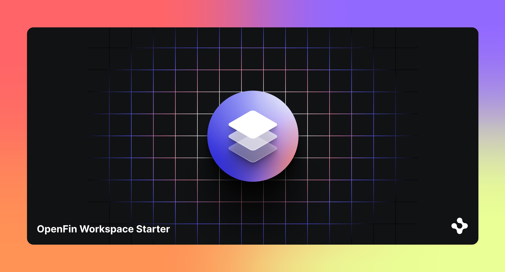
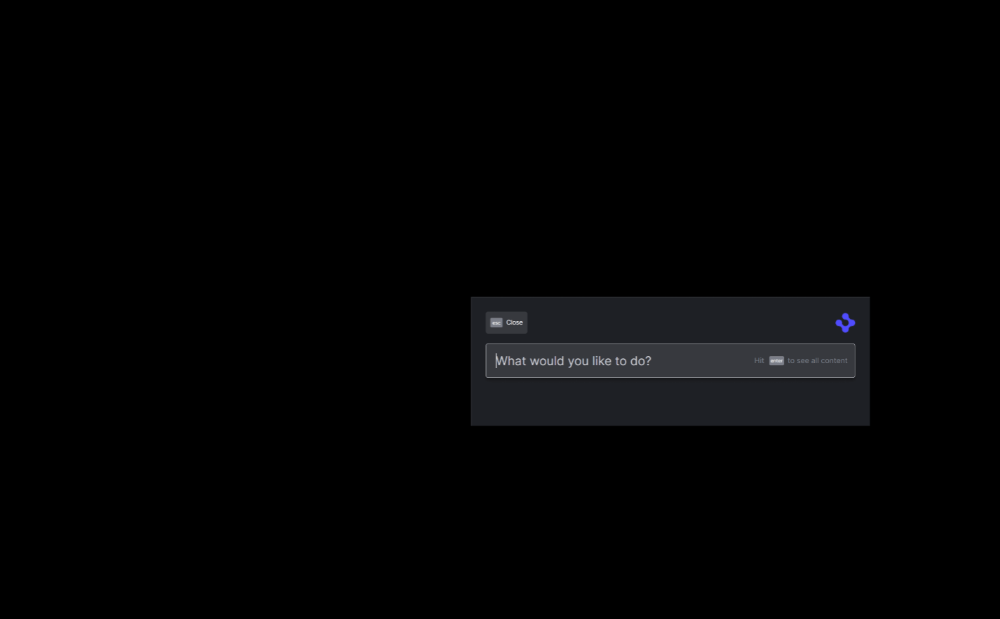

> **_:information_source: OpenFin Workspace:_** [OpenFin Workspace](https://www.openfin.co/workspace/) is a commercial product and this repo is for evaluation purposes (See [LICENSE.MD](LICENSE.MD)). Use of the OpenFin Container and OpenFin Workspace components is only granted pursuant to a license from OpenFin (see [manifest](public/manifest.fin.json)). Please [**contact us**](https://www.openfin.co/workspace/poc/) if you would like to request a developer evaluation key or to discuss a production license.

# Support Context and Intents

This sample covers:

- Supporting Interop/FDC3 Context messages
- Supporting Interop/FDC3 Intents
- Optionally supporting OpenFin Cloud Interop for context sharing: <https://www.npmjs.com/package/@openfin/cloud-interop>
- Using a golden data source (in [apps](./public/common/) apps\*.json) to drive the apps that show up in Home and in intent resolution
- Customization through config (in the [manifest.fin.json](public/manifest.fin.json) file)

This example assumes you have already [set up your development environment](https://developers.openfin.co/of-docs/docs/set-up-your-dev-environment)

## Running the Sample

To run this sample you can:

- Clone this repo and follow the instructions below. This will let you customize the sample to learn more about our APIs.
- Launch the Github hosted version of this sample to interact with it by going to the following link: [Github Workspace Starter Support Context And Intents Example](https://start.openfin.co/?manifest=https%3A%2F%2Fbuilt-on-openfin.github.io%2Fworkspace-starter%2Fworkspace%2Fv19.0.0%2Fsupport-context-and-intents%2Fmanifest.fin.json)
- Launch the Second Github hosted version of this sample to see how OpenFin Workspace can support multiple workspace platforms with their own branding: [Github Workspace Starter Second Support Context And Intents Example](https://start.openfin.co/?manifest=https%3A%2F%2Fbuilt-on-openfin.github.io%2Fworkspace-starter%2Fworkspace%2Fv19.0.0%2Fsupport-context-and-intents%2Fsecond.manifest.fin.json)

## Getting Started

1. Install dependencies and build sample and common folder. Note that these examples assume you are in the sub-directory for the example.

```shell
npm run setup
```

2. Optional (if you wish to pin the version of OpenFin Workspace to version 18.0.0 and you are on Windows) - Set Windows registry key for [Desktop Owner Settings](https://developers.openfin.co/docs/desktop-owner-settings).
   This example runs a utility [dos.mjs](./scripts/dos.mjs) that adds the Windows registry key for you, pointing to a local desktop owner
   settings file so you can test these settings. If you already have a desktop owner settings file, this script prompts to overwrite the location. Be sure to capture the existing location so you can update the key when you are done using this example.

   (**WARNING**: This script kills all open OpenFin processes. **This is not something you should do in production to close apps as force killing processes could kill an application while it's trying to save state/perform an action**).

```shell
npm run dos
```

3. Start the test server in a new window.

```shell
npm start
```

4. Start Your Workspace Platform (this starts Workspace if it isn't already running).

```shell
npm run client
```

If you want to see a second workspace platform run alongside the first you can fire up a copy using the following command:

```shell
npm run secondclient
```

This runs the same code with slightly different settings to show a different theme: [second.manifest.fin.json](public/second.manifest.fin.json)

5. Type any character into the search box to show the default list of applications.
   The [apps](./public/common/) apps\*.json are displayed as described in their respective files. (OpenFin Home does not read this REST endpoint directly. It is read by the Workspace Platform app and passed to Home via our API).

6. To launch your store launch the Home UI and use / to show a list of the available commands and select Store. Storefront will be shown and your store will be listed.
   The [apps](./public/common/) apps\*.json are displayed as described in their respective files alongside a Storefront configuration setting defined in your [manifest](public/manifest.fin.json).

7. If you modify and want to build the code you can run npm run build.

```shell
npm run build
```

8. If you wish to test Cloud Interop so that you can launch the two platforms and see them communicating via the cloud then please contact your OpenFin sales account manager to get your connection information. Once you have that you can update the cloudInteropProvider settings in the [manifest](public/manifest.fin.json) and/or [second.manifest.fin.json](public/second.manifest.fin.json). Once enabled you will be able to share context across user channels between platforms regardless of whether they are running on the same machine or not.

## How it works

The Server in this example provides two sets of content over HTTP GET.

- [A Desktop Owner Settings file](./public/common/dos.json)
- [A list of applications](./public/common/) apps\*.json
- Examples of View and Snapshot Manifest Types

### List of Applications

The [list of applications](../public/common/) apps\*.json contains a number of examples:

- Load views into OpenFin Browser
- Launch an OpenFin application using its manifest file
- Launch a native application
- Launch through an intent: a view (single instance and multi instance) and a page (single instance and multi instance)

These applications are read and transformed in order to be sent to our API.

# How is Intent Support implemented?

Intent support is added to the sample in the following ways:

- An implementation of InteropBroker is provided in [interopbroker.ts](client/src/interopbroker.ts) and it overrides handleInfoForIntentsByContext, handleInfoForIntent, handleFiredIntentForContext and handleFiredIntent
- [provider.ts](client/src/provider.ts) uses this implementation when calling the init function from the @openfin/workspace-platform npm module.
- We have provided a view that demonstrates raising and listening to an intent [fdc3-intent-view.json](./public/common/views/fdc3/intent/fdc3-intent-view.json) and [interop-intent-view.json](./public/common/views/interop/intent/interop-intent-view.json). The intent views have been setup so you can see ones that support a single instance and a version that can be launched multiple times.
- We have provided a view that demonstrates broadcasting/setting context and listening for context [fdc3-broadcast-view.json](./public/common/views/fdc3/context/fdc3-broadcast-view.json) and [interop-broadcast-view.json](./public/common/views/interop/context/interop-broadcast-view.json).
- We have added pages that contain the interop and fdc3 views to show launching a page where multiple views receive the intent. This contains two types of page:
  - singe instance - we only want one instance of this page to be launched and the views within it to be passed the intent context each time. This page is represented as a snapshot: [snapshot-intent-single-instance.json](./public/common/snapshots/snapshot-intent-single-instance.json). To support this approach the example disables the option of closing the views or moving the views outside of the page.
  - multi instance - each time an intent is raised a new copy of this page is launched and the intent is passed to the views within it: [snapshot-intent-multi-instance.json](./public/common/snapshots/snapshot-intent-multi-instance.json). This page doesn't impose any restrictions so you can close or pull out views.
- Provide an example intent/app picker if a context supports more than one intent or an intent supports more than one application: [picker.html](./public/common/windows/intents/picker.html)
- Update [apps.json](./public/common/apps.json) to add the new views/pages and specify that they support intents in their metadata.
- Update [apps.ts](client/src/apps.ts) to support getting apps that support intents or context types.

# Cloud Interop Support implemented?

Adding cloud interop support is very simple.

- We npm install [@openfin/cloud-interop](https://www.npmjs.com/package/@openfin/cloud-interop)
- We provide a way of providing cloud interop configuration through a manifest (in a real application you should be fetching this information from a service).
- We pass the settings to the cloudInteropOverride function provided by the @openfin/cloud-interop library.
- We add the initialized cloudInteropOverride to the interopOverride array that is set as part of your [platform's initialization](./client/src/provider.ts).

## Using the Sample

To run this sample:

- Bring up the Home UI and search for 'Intent' and you will see the intent raising view.
- You have the choice of picking the FDC3 or Interop Intent View.
- You can now pick from a number of options:
  - Do you want to raise an intent by name or by context object
  - What intent do you want to raise
  - What context type do you want to publish
  - What sample data (or custom data) do you want to send
  - App Preference: No preference will result in a list of applications being shown in the app picker if more than one app supports an intent, Non Existent App (to demonstrate what would happen if an incorrect app id was passed when raising an intent), A specific app (this list is built dynamically using the interop or fdc3 apis to query the interop broker)
- Once you are happy with your selections can click the button to raise the intent or context.

## Example of raising intents


## Example of Sharing context with Third Party Websites using preload scripts and fdc3 broadcasting



---

### Read more about [working with Workspace](https://developers.openfin.co/of-docs/docs/overview-of-workspace)
